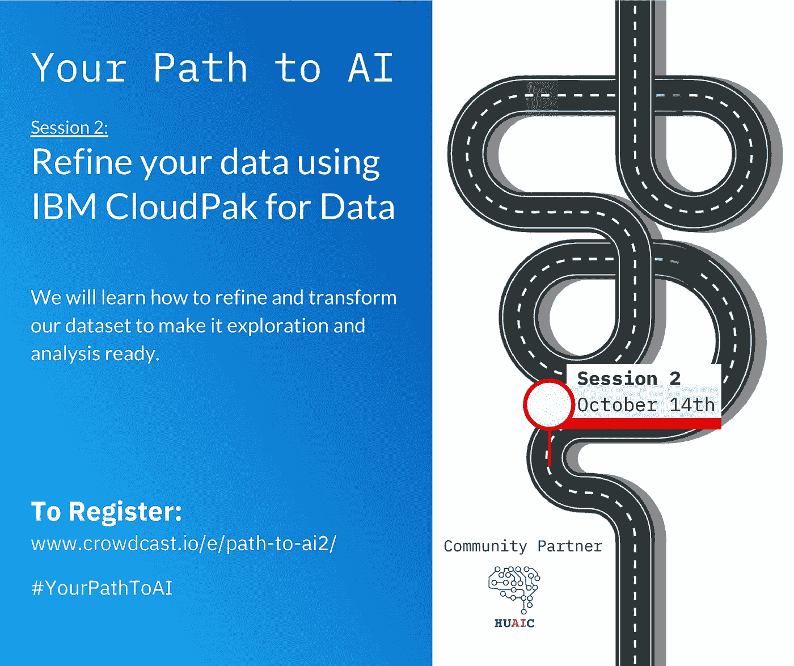
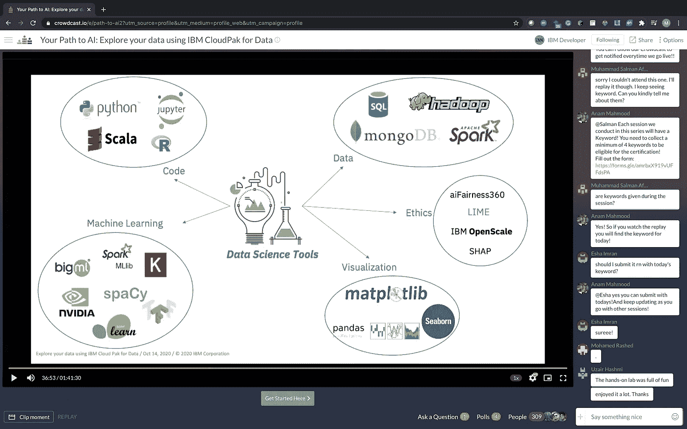

# 你的人工智能之路:使用 IBM CloudPak for Data 探索你的数据(2020 年 10 月 14 日)

> 原文：<https://medium.datadriveninvestor.com/your-path-to-ai-explore-your-data-using-ibm-cloudpak-for-data-14th-october-2020-5e653e9a4e1d?source=collection_archive---------23----------------------->

**你的人工智能之路**是一系列让你开始精通人工智能的研讨会。每个会议都由 Data & AI 方法论中的重要主题组成，以便您可以学习其概念以及 IBM 提供的开源工具，从而使您的 AI 之路更加容易。

 [## 您的人工智能之路:使用 IBM CloudPak for Data - Crowdcast 探索您的数据

### 立即注册参加 IBM 开发人员在 Crowdcast 上的活动，该活动计划于 2020 年 10 月 14 日星期三下午 7:00 PKT 开始。

www.crowdcast.io](https://www.crowdcast.io/e/path-to-ai2) 

第二场会议是**你的 AI 系列之路**的第 2 部分，由 [IBM 开发人员](https://medium.com/u/262975298e3a?source=post_page-----5e653e9a4e1d--------------------------------)倡导者[Mridul Bhandari](https://medium.com/u/843b501ef781?source=post_page-----5e653e9a4e1d--------------------------------)&[Anam Mahmood](https://medium.com/u/60b881d6260d?source=post_page-----5e653e9a4e1d--------------------------------)主持，涵盖了使用 [IBM Cloud](https://medium.com/u/db218f846f6a?source=post_page-----5e653e9a4e1d--------------------------------) Pak 进行数据探索。

共有 171 名与会者，包括来自全球的学生和开发人员。会议以欢迎辞开始，向观众介绍您的 AI 之路系列，并分为两个主要部分，其中一部分向观众介绍数据科学，另一部分是代码模式。

第一部分由 Anam Mahmood[领导，Anam 通过引入数据科学开始。然后，她解释了数据科学方法的第一步——数据收集和数据清理。](https://medium.com/u/60b881d6260d?source=post_page-----5e653e9a4e1d--------------------------------)

第二场会议由姆里杜尔·班达里主持。他向观众介绍了 IBM Cloud，并解释了将用于实践的数据集。然后，他使用 IBM Cloud 上的 Db2 加载数据。之后，他解释了 Cloud Pak for Data as a Service(原名 Watson Studio)。然后，他展示了如何在 Db2&CP 4d as 项目之间创建连接。然后，使用数据提炼工具清理和连接数据，并保存在 Db2 服务中。

在网上研讨会结束时，向与会者介绍了 IBM 开发人员资源。许多与会者对网上研讨会表现出积极的反馈和赞赏。

*   事件记录:[https://www.crowdcast.io/e/path-to-ai2](https://www.crowdcast.io/e/path-to-ai2)
*   GitHub:[https://GitHub . com/mridulrb/Explore-your-Data-using-IBM-cloud pak-for-Data](https://github.com/mridulrb/Explore-your-data-using-IBM-CloudPak-for-Data)
*   演示:[https://mridulrb . github . io/Explore-your-Data-using-IBM-cloud pak-for-Data/#/](https://mridulrb.github.io/Explore-your-data-using-IBM-CloudPak-for-Data/#/)
*   IBM 开发者网站的链接，在那里你可以找到教程、代码模式等:[https://developer.ibm.com/](https://developer.ibm.com/)
*   IBM Champion 现在每个国家接受 1 人以上，所以请随意申请[https://developer.ibm.com/champions/](https://developer.ibm.com/champions/)
*   调查:[https://www.surveymonkey.com/r/QQM3LHM](https://www.surveymonkey.com/r/QQM3LHM)
*   IBM 云注册链接:[http://ibm.biz/aipath2](http://ibm.biz/aipath2)
*   Meetup 页面:[https://www.meetup.com/IBM-Cloud-MEA/events/](https://www.meetup.com/IBM-Cloud-MEA/events/)

