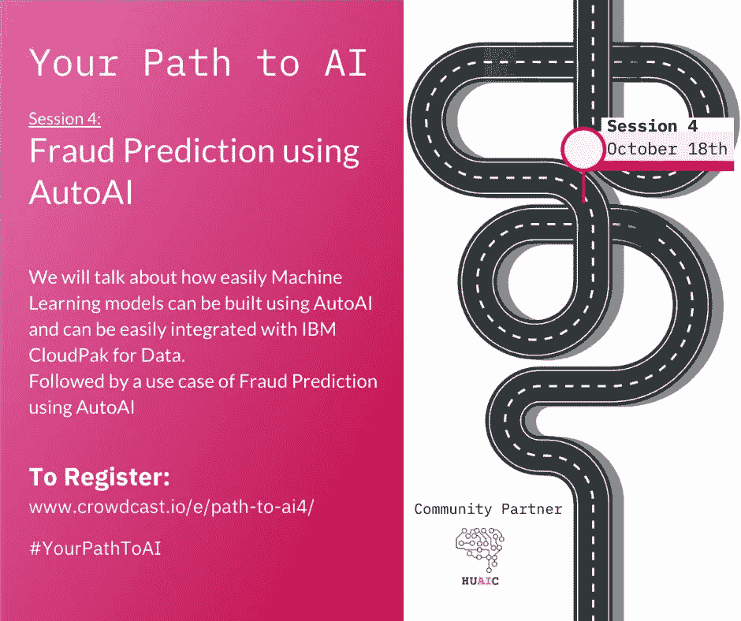
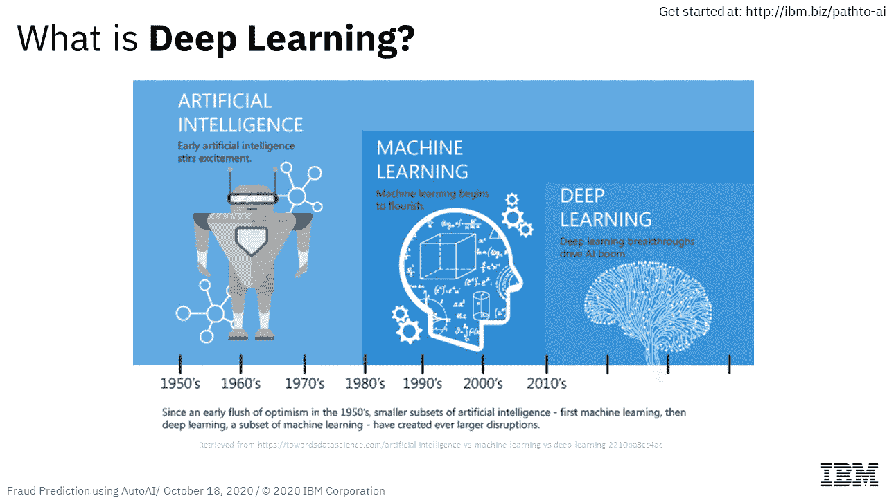
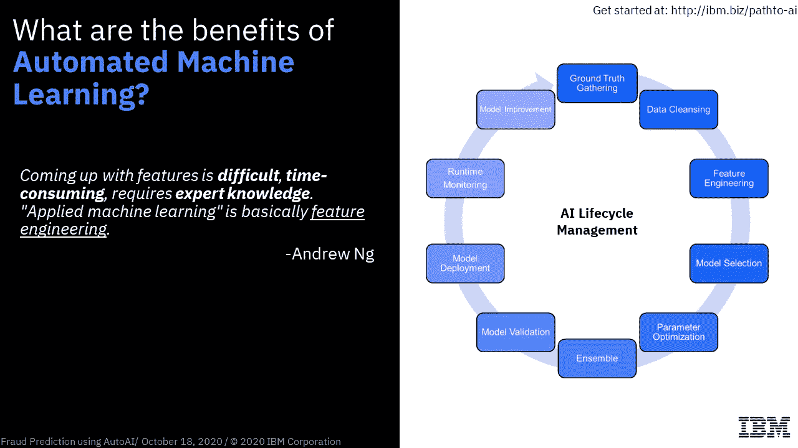
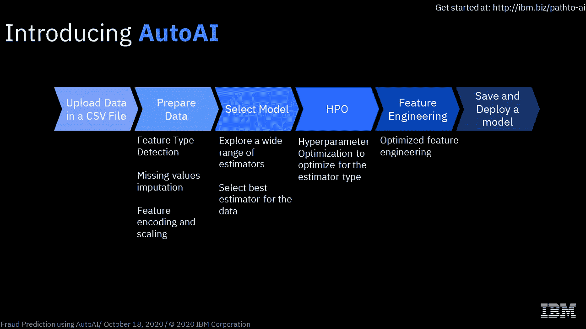
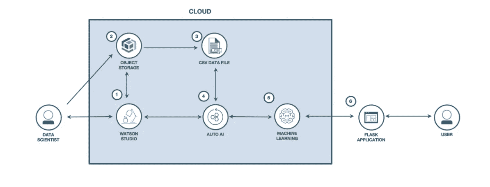

# 你的人工智能之路:使用 AutoAI 的欺诈预测

> 原文：<https://medium.datadriveninvestor.com/your-path-to-ai-fraud-prediction-using-autoai-3b5c5862aafd?source=collection_archive---------9----------------------->

你的人工智能之路是一系列的研讨会，让你开始精通人工智能。每个会议都包括数据和人工智能方法论中的重要主题，以便您可以学习相关概念，并了解 IBM 提供的开源工具，从而使您的人工智能之路更加容易。👩‍💻👨‍💻

🌟 **AutoML** 是一个出现在许多科技行业文章和研究中的流行词，也是许多供应商产品目录中的产品。鉴于所有的嗡嗡声，AutoML 是什么意思？我们为什么选择 AutoML 产品？什么是**IBM Watson AutoAI**，它如何轻松地执行自动化数据准备、应用 ML 算法并构建最适合您的数据集的模型管道？为了解决你所有的疑问，在 PathtoAI 系列的第 4 场会议(10 月 18 日)，IBM 开发者倡导者 [Anam Mahmood](https://medium.com/u/60b881d6260d?source=post_page-----3b5c5862aafd--------------------------------) 和 [Sidra Ahmed](https://medium.com/u/54c4e6d89bb7?source=post_page-----3b5c5862aafd--------------------------------) 举办了一场关于如何使用 AutoAI 构建和部署预测性机器学习模型的研讨会。

研讨会分为两部分，其中第一部分由 Sidra 主持，她通过使用时间轴解释人工智能、机器学习和深度学习背后的基本概念来开始。

她接着介绍了 ***自动化机器学习【AutoML】***背后的基本思想，为什么它如此重要，它的好处和传统机器学习的缺点。

此外，她还介绍了 IBM Cloud 的产品 AutoAI 以及 AutoAI 为我们自动化的数据科学管道的不同阶段。

研讨会的第二部分由 Anam 主持，她使用 AutoAI 自动完成了 ***构建预测 ML 模型以预测保险费成本*** 的所有任务。她创建了一个 AutoAI 实验，让观众参观了 AutoAI 工具，向他们展示了整个过程 ***，从数据摄取到基于不同参数选择最佳管道，再到将部署建模为 web 服务*** 。此外，她还解释了吸烟和身体质量指数等不同因素如何影响模型预测。

以下是研讨会练习的流程和架构:

# 流程描述

1.  用户在 IBM Cloud 上创建一个 IBM Watson Studio 服务。
2.  用户创建一个 IBM 云对象存储服务，并将其添加到 Watson Studio。
3.  用户将保险费数据文件上传到 Watson Studio。
4.  用户在 Watson Studio 上创建了一个 AutoAI 实验来预测保险费
5.  AutoAI 使用 Watson 机器学习来创建几个模型，用户部署性能最好的模型。
6.  用户使用 Flask web 应用程序连接到部署的模型，并预测保险费用。

与会者遵循了代码模式，并且互动得非常好。Anam 和 Sidra 在整个会议过程中解答疑问并回答问题，保持了高度的参与性。许多与会者对此次网络研讨会表现出积极的反馈和赞赏，并对未来更多类似主题的网络研讨会表现出兴趣。

有兴趣自己做这件事吗？

报名 IBM 云[T3 这里](http://ibm.biz/pathto-ai)

在这里 找到动手码模式

**你可以在 这里找到 [**车间材料(幻灯片)**](https://anam-mahmood.github.io/predict-insurance-charges-with-autoai/#/)**