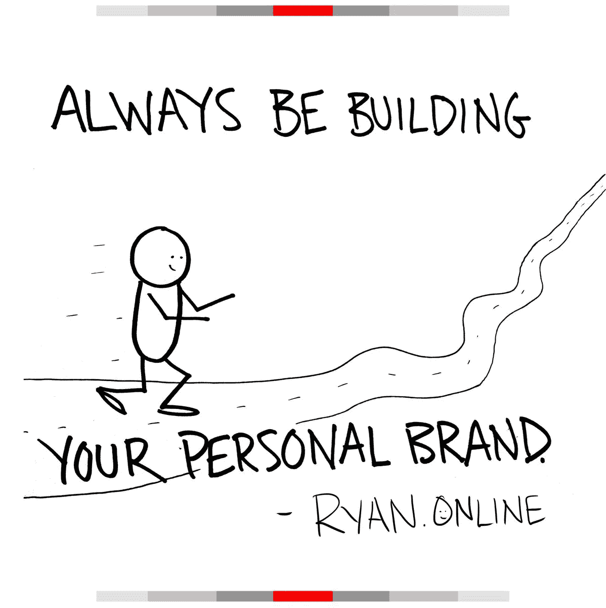
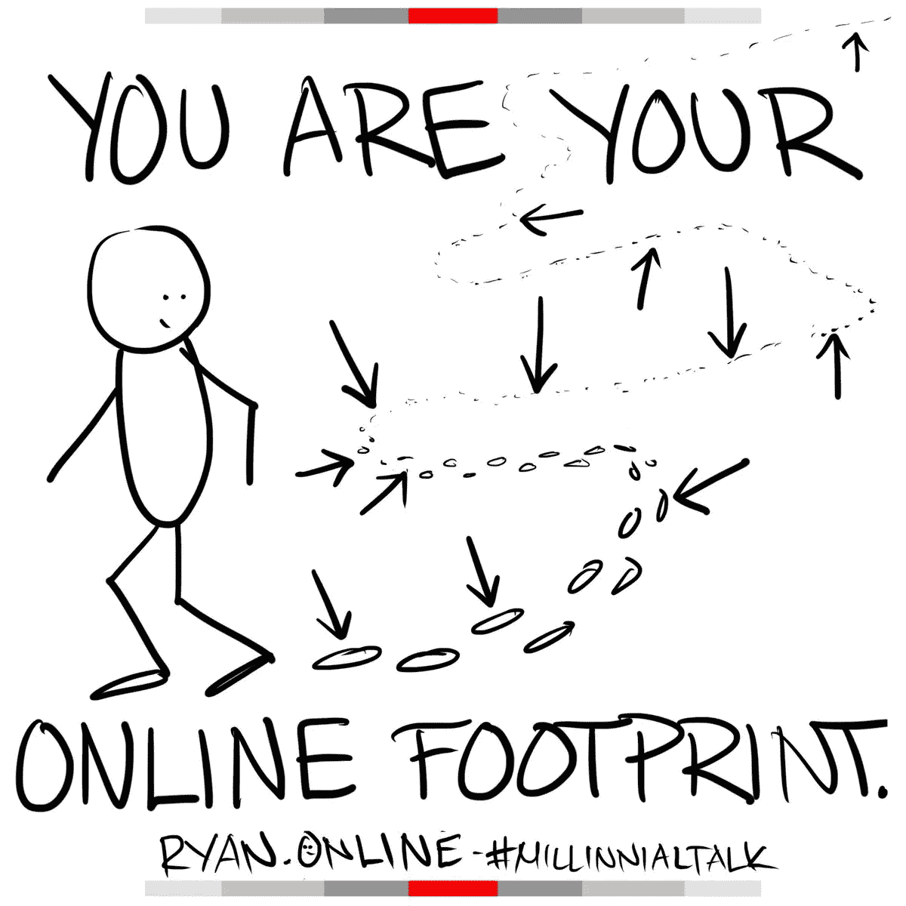
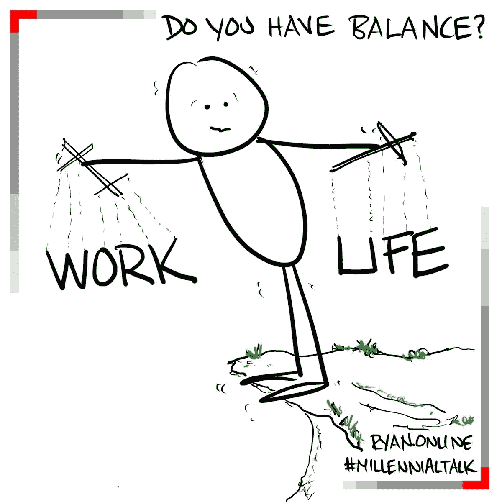
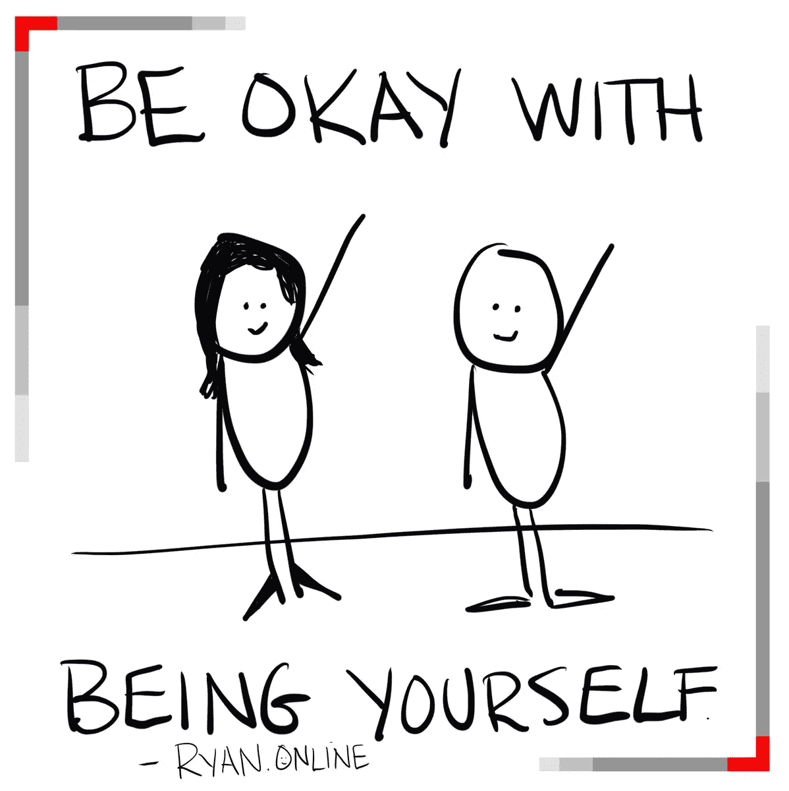
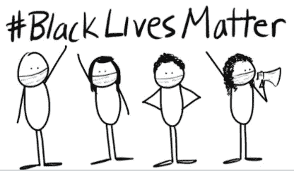
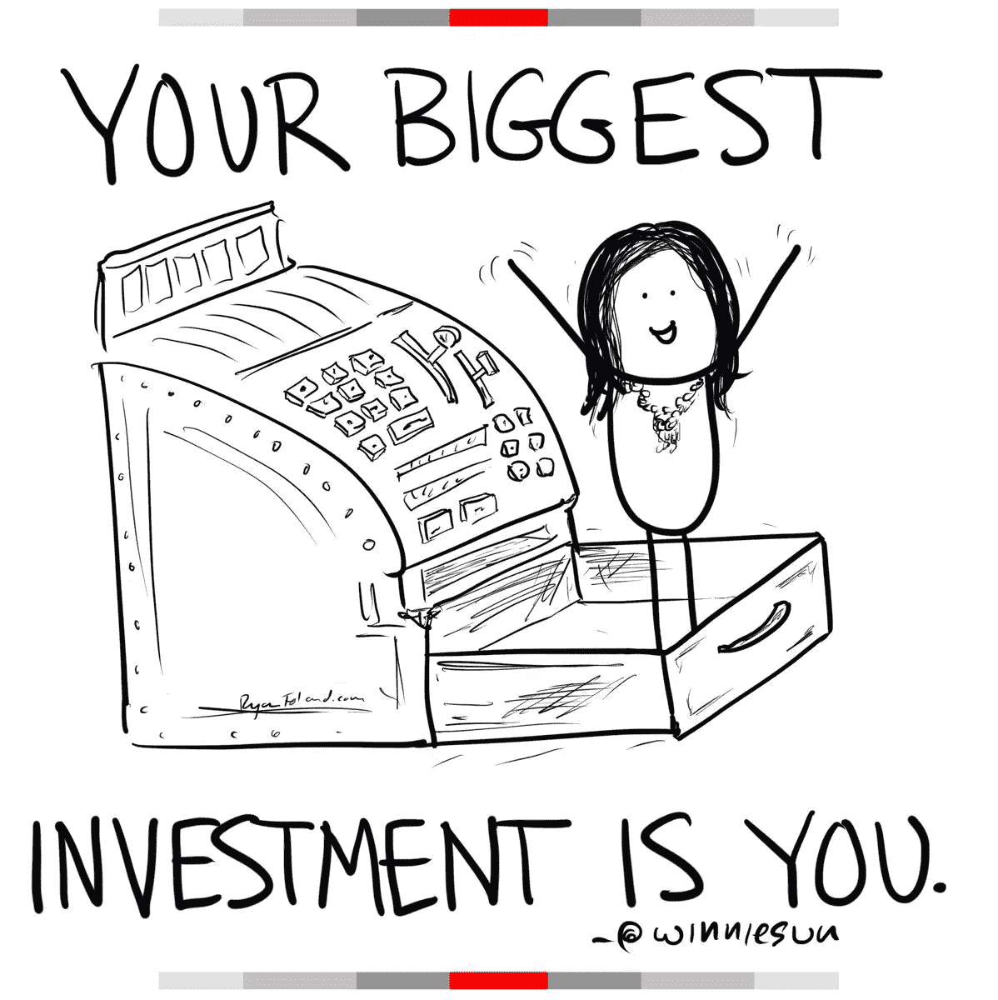
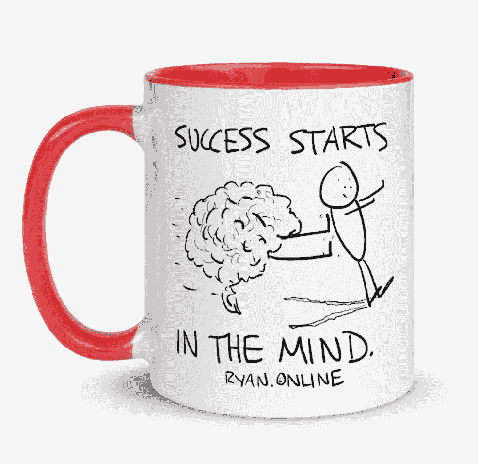
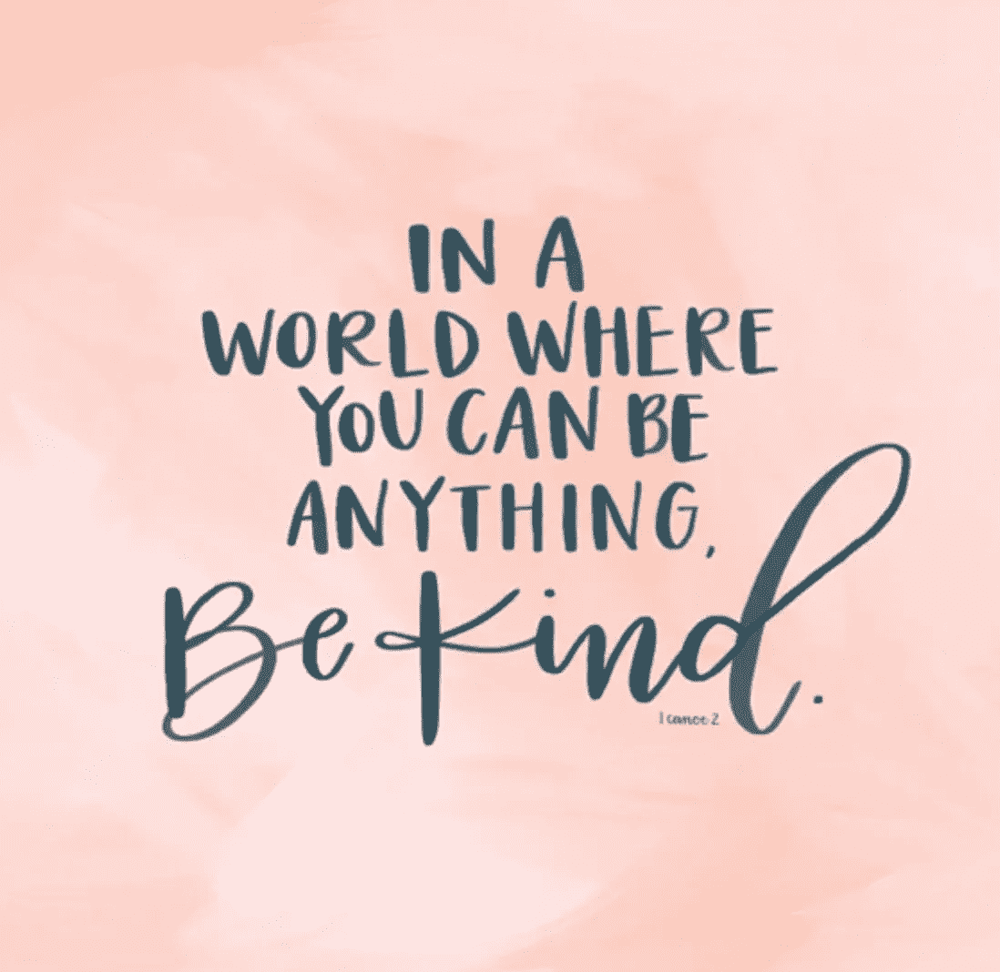
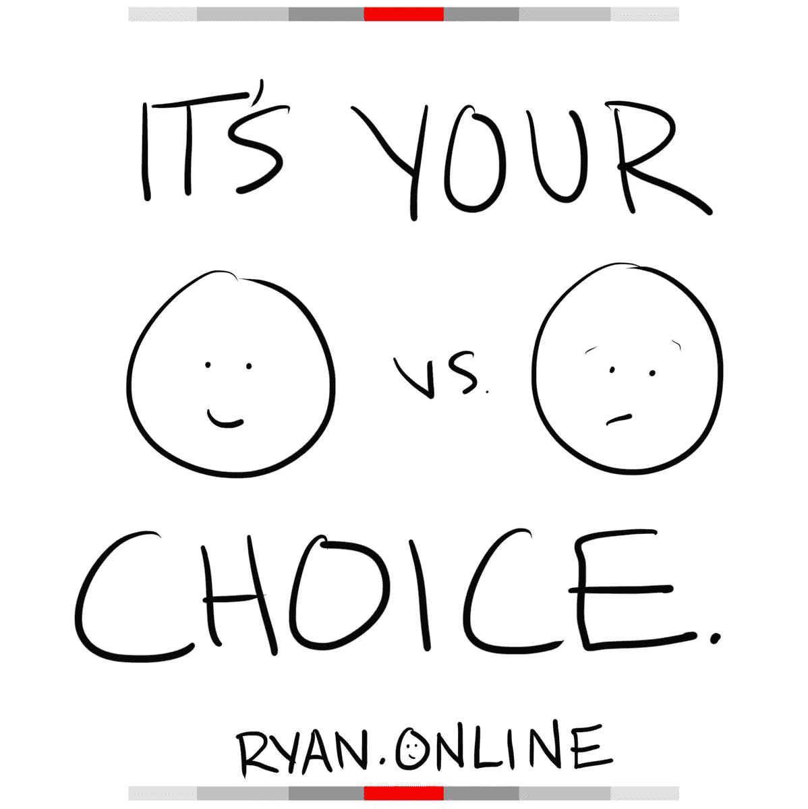

# 你的个人品牌定义了最好的你

> 原文：<https://medium.datadriveninvestor.com/your-personal-brand-defines-the-best-of-you-2f10ce511ea3?source=collection_archive---------4----------------------->

## 坚持出现并兑现你的承诺

Artwork by Ryan Foland

深刻的个人品牌始于了解你是谁，你为什么存在，以及你如何被召唤去为他人服务。

这就是作家、演说家和教练 [Tru Pettigrew](https://twitter.com/truaccess) 如何对待他所认为的“在生活的各个方面，始终如一地在行动、言语和行为中体现这些要素”的本质。

社区桥梁建设者说:“清晰性是通过人们如何出现在所有领域和平台的一致性来显示的。”

佩迪格鲁和温妮·孙、瑞恩·佛兰德、温迪·韦纳、切尔西·克罗斯特在克罗斯特的#MillennialTalk 推特聊天上谈论了正念和个人品牌。

孙是一位著名的“财富语者”，他定期给杂志、杂志、福布斯杂志、好日子杂志投稿。福兰德作为一名演说家、作家和艺术家而声名鹊起。韦纳在《职业与商业》、LinkedIn 上写了关于个人品牌的文章，以及她如何利用自己的法学学位脱离法律。Krost 是千禧一代专家、营销和品牌策略师、全球演讲者和 LinkedIn 讲师。

“当我想到‘用心打造个人品牌’时，我想到的是与你的理想受众分享真实的自我，”孙说。“两个赖以生存的词是真实和一致的。我觉得你的品牌只是放大了你的本来面目。”

深谋远虑已融入定义之中。

“这是理解，你就是你发的微博，”佛兰德说。“因此，你在发微博之前必须思考。

“我们生活在一个时代，你的网络足迹反映了你是谁，”他说。"留意你发布的内容会让你的发布变得有意图."

Artwork by Ryan Foland

# **通过意图聚焦**

韦纳看到了建立意向品牌的两个方面:

*   它考虑了影响你们世界的当前形势。
*   它关注的是你对目标受众的认知。

她说:“明确你的价值观有助于围绕你的个人品牌建立核心。”。“想想*你为什么*，那个*谁*，那个*什么*还有那个*如何*。请记住，品牌随着气候的变化而变化。”

Krost 的品牌让她意识到自己的声音、语言、信息、社区和内容。

“留心个人品牌是我在线上和线下所说的、代表的和相信的一切，”她说。

“虽然正念是我们现在比以往任何时候都更多谈论的东西，但很明显，谁从建立他们的数字足迹的基础起就一直是正念的、多样化的和包容的，”Krost 说。“在生活中更加关注你的个人品牌，只会让你更有机地与志同道合的人联系起来。”

 [## 用领导者的思维把握成功

### 十多年来，正念一直萦绕在杰奎琳·卡特的脑海中。问她关于分心、生产力和——

medium.com](https://medium.com/datadriveninvestor/grasp-success-with-the-mind-of-the-leader-92416c0b5a78) 

由于多重危机和敏感性，人们必须更加警惕，不要在信息中漫不经心。

佩蒂格鲁说:“疫情让我意识到适应力、社会化和优先化的重要性，这让我在个人和职业上都更加注意了。”。“在我的个人和职业生活中，这是真的。

“我已经意识到有些事情可以动摇，有些事情不能动摇，”他说。“能被动摇的东西不是应该消耗我们的东西，而是投资于不能被动摇的遗产和长寿的永恒的东西。”

佩迪格鲁补充说，每个人都有机会和责任去影响变化。

“让它个性化，从本地开始，”他说。“从你现有的开始。”

个人和商业伙伴在佛兰德的正念中扮演着更重要的角色。

“这也让我优先考虑健康的工作生活平衡，”他说。“黑人的命也是命运动让我更加注意自己支持平等机会的言行。我更关心如何支持代表性不足的群体。”

Artwork by Ryan Foland

# **不同的对话**

旧的规范已经让位于新的约定。

“我已经改变了与客户和潜在客户交谈的重点，”韦纳说。“我发现他们如何受到疫情的影响，他们在未来工作机会中的目标是什么——例如长期在家工作——以及他们如何适应新常态。

“作为一名职业专家，我已经开始关注围绕工作场所、会议和演讲机会中的多样性和包容性的更加开放和诚实的对话，”她说。“现在是时候接受黑人的命也是命的教育和授权，并提高认识了。”

韦纳认为，这将是一个重大突破和有力教训的时代，因为“哪里有斗争，哪里就有力量。”

 [## 平等的胜利在于早该获得的机会

### 她的目标很简单:让所有人都生活在一个自由和公平的社会中，不择手段——计划…

medium.com](https://medium.com/datadriveninvestor/triumph-of-equality-lies-in-overdue-access-to-opportunity-939ab5103c96) 

Krost 尤其受到有关医疗体系、系统性种族主义和黑人的命也是命的谈话的影响。

“这些是原始的、真实的、情绪化的、复杂的、多样的、极其重要的讨论，可以在我们的个人和职业网络中进行，”她说。“够了。

“我被我们目睹的疾病、死亡、暴行和悲伤的海啸摧毁了，”克罗斯特说。“我*祈祷*这是*巨大的*突破时刻的彻底崩溃，我们可以从中进化、学习和成长，变得更加强大，更加团结。”

多重危机表明，还需要多少增长。

“在职业上，我们比以往任何时候都更忙，”孙说。“我们每天都在学习如何充分利用我们所处的环境，更重要的是，我们如何在这次危机中变得更加强大，更加清醒，对自己的优势和劣势有更好的认识。”

# **视野开阔**

个人品牌一直是一种专注和回应的练习。今天，我们不再是与顾客一对一，而是与社会一对多。

“我建立个人品牌的方法保持不变，”佩蒂格鲁说。“我专注于利用我的天赋和热情为一项比我更伟大的事业提供服务。改变的是我提供它的平台。现在虚拟化程度更高了。”

孙努力保持真实的自我，并以此为基础。

“我不想改变我的核心价值体系，”她说。“我确实希望更加清醒，更加包容——迈出额外的一步，将它放在首位，尽我所能利用这些平台，让我们成为领导者，而不是跟随者。”

 [## 个人品牌在长期内大获成功|数据驱动的投资者

### 创建个人品牌是营销的基石，尤其是在互联网上。拥有一个角色决定了…

www.datadriveninvestor.com](https://www.datadriveninvestor.com/2019/06/07/personal-brands-strike-gold-in-the-long-run/) 

同样，福兰德认为他今天的个人品牌化方法与疫情之前没有什么不同。

“那时，就像现在一样，我发现品牌建设就是要真实可信，通过内容发自内心地说话，”他说。“如果说有什么不同的话，那就是我受到了启发，去创造更多的内容，在我的博客和播客中注入更多的价值，成为更大的对话的一部分。”

她的法律背景给韦纳壮胆。

“我不害怕在社会问题上表明立场，大声说话，”她说。“作为一名律师，我被训练成一名热情的律师。这是我人格的核心。我们都有能力通过自己的声音做出改变。

“如果我们保持沉默，我们无法改变我们的世界，”韦纳说。“这是活动家、盟友和倡导者的一年。是时候让*响亮*。

# **放开滴答作响的时钟**

Krost 的常用词是停止、放下和思考。

“我们总是倾向于和这个看不见的时间赛跑来完成这个和那个，”她说。*没有更多的*。今天，我们必须给自己留出时间和空间，在我们的个人品牌努力中保持警惕。

“每一个发推文、删除推文、道歉并承诺做得更好的人都没有真正地*真正地*花足够的时间‘在他们发布之前思考’，”Krost 说。

记住，人们的想法、谈吐、行为和外表都与你不同，这都是好的。

“我在 2008 年开始了我的第一个广播节目，青少年脱口秀，”克罗斯特说。“我们总是有一群不同的千禧一代与不同的行业专业人士交谈。我的基金会是建立在多样化的、包容的、开箱即用的对话和思考之上的。我不会很快停下来。

她说:“我很感谢*这么多年来成长起来的美丽的#千禧一代聊天社区。“我将继续履行我的使命，将多样化和赋权的思想领袖聚集在一起，进行强有力的对话。”*

 [## 在董事会中敞开胸怀接受偏见|数据驱动的投资者

### 这是骄傲与快乐基金会的创始人和发言人埃琳娜·乔伊·瑟斯顿提出的前提。她的…

www.datadriveninvestor.com](https://www.datadriveninvestor.com/2020/07/22/open-your-mind-to-bias-in-the-boardroom/) 

虽然相关，但在术语上有区别。

“多样性是‘与众不同的状态’，而包容是‘让某人感到自己是其中一员的行为’”，佩迪格鲁说。“多样性本身不会做任何事情，因为它是一种存在状态。为了享受多元化的礼物，我们必须利用包容的行为。

“多样性是所有人都可以得到的礼物，而包容性是为这份礼物提供动力的电池，”他说。“同样重要的是，我要帮助组织了解不同形式的多样性，以及如何能够和应该利用它们。这包括神经多样性、身份多样性和经验多样性。

# **一个加倍向下的 downer**

在她的个人生活和职业生涯中，孙融入了方方面面。

“我很自豪地说，我一直努力关注多样性和包容性，”她说。

“我记得第一次被贴上‘双少数’的标签是什么感觉，”孙说。“我记得因为这个种族和性别而被欺负。而是知道这一点，然后采取对你来说最舒服的步骤，以积极的方式去行动。”

即使是好的常见实践也可能需要重新审视。

“多样性和包容性一直是我的核心支柱，”福兰德说。“在过去的几个月里，我进行了重新评估，以确保我在播客中纳入了客人，以更好地反映我的听众的多样性。

“我喜欢画简笔画，因为它们代表任何人和每个人——人类经历的时刻，这是我们所有人都分享的东西，”他说。“对话可以梳理出问题，然后找到解决方案。对话必须开始并持续下去，事情才能继续发展。”

Artwork by Ryan Foland

工作场所的问题是常见的挑战。

韦纳说:“我与可能在招聘过程中遭遇歧视的客户进行了坦诚的交谈。“我们一起研究解决方案，以绕过它。”

接下来的步骤是创建一个更加多样化和包容的文化、信息和社区。

“我们都必须对自己非常诚实，”孙说。“每个人在这个世界、这个生命中都有一个角色，只有你才应该决定那个角色是什么。

“我用我的行动来证明我的工作和正直，”她说。“对你今天做的和参与的每件事更加留心比以往任何时候都更重要。我会继续努力变得更好。”

 [## 在争取社会公正的游行中团结一致

### 他们恪守这一誓言:“作为行业专业人士，仅仅团结一致是不够的。我们需要采取行动…

medium.com](https://medium.com/datadriveninvestor/stand-united-in-the-march-for-social-justice-c89b2573f022) 

# **让无声者发声**

艰难的谈判必须克服情感障碍。

韦纳说:“我和朋友、同事、客户以及需要支持者和盟友的同龄人进行了艰难的对话，但他们害怕直言不讳。”“我正在寻求更多的教育和权力来讨论围绕这些话题的问题。”

无论是在本地还是在远方都可以得到帮助。

“我正在与世界各地的组织合作，提供多样性、平等和包容性的讲座、培训和研讨会，”佩蒂格鲁说。“这有助于人们更好地理解如何消除种族主义、种族歧视和种族不平等，变得更加包容。

“我的工作包括进行培训，以更好地理解微观侵略、无意识偏见以及超越多样性的重要性，从而体验跨部门所有领域包容的力量，”他说。“帮助人们和组织了解如何‘倾听以理解’，而不仅仅是‘倾听以回复’，这是建立同理心的地方和方式。”

 [## 给没有被提及的企业家的建议

### 企业家面临着各种各样的挑战，其中许多来自无效的沟通。他们寻找…

medium.com](https://medium.com/datadriveninvestor/tips-for-entrepreneurs-not-spoken-for-9de87df8653) 

克罗斯特更多地使用她的声音。

“张贴和倡导对多样性和包容性的支持是很好的，但你线下、电话上、通过电子邮件、与你的团队、社区和专业网络面对面所做的事情对于改变是必要的，”她说。

“知识就是力量教育，协作就是一切，”Krost 说。“我正在与他人就我们如何合作以结合专业知识，并以经济高效和动态的方式为我们的观众分享更多价值进行交流。”

Artwork by Ryan Foland

佛兰德利用了他的社交媒体渠道。他的播客突出了围绕黑人的命也是命、多样性和包容性发生的重要对话。

“我一直在做的一个重要行动就是打电话给朋友和家人，与他们进行真实的、有时是艰难的对话，”他说。“我们谈论承认黑人的命也是命运动是多么重要。

Foland 说:“正如 Winnie Sun 多次告诉我的那样，你最大的投资就是你自己。”"当我们对自己诚实时，我们可以投资自己."

Artwork by Ryan Foland

# **赢得人心和耳朵**

危机有一种增强意识和情绪的方式。

“我们正处于一个非常激烈的政治气候中，”韦纳说，“现在有很多动荡。我有持不同观点的朋友和家人。关键是要有尊重的对话。有一颗开放的心和一只倾听的耳朵。”

这些会导致令人不安的惊喜。

“这真的很棘手，在某些个人和职业场合真的会让人不舒服，”克罗斯特说。“有时候强硬的对话会暴露别人的真面目。它会揭示谁值得和你在一起，谁不值得。

“我完全赞成进行一次文明、冷静和有意识的对话，”她说。“我们需要这样的对话，每个人都坐在桌前倾听彼此的意见，并虚心学习新的观点。”

Pettigrew 领导并促进勇敢的对话，鼓励他人听取不同的观点。

“我们希望利用集体智慧和生活经验来共同创造思想、想法和解决方案，为我们所有人的更大利益做出贡献，”他说。

谈话的根本基础是集中注意力。

“我是一个倾听者，”孙说。“我更喜欢先坐下来听听，然后再做出回应。我认为我们需要做得更多。重要的是，我们要倾听、倾听和理解他人的感受。

“我们必须意识到，使用我们的声音并不总是重要的，”她说。“我们的行动更重要。少说话，多行动。”

Artwork by Ryan Foland

在可能的情况下，图片或图画胜过一万个单词。

“我用我的简笔画作为一种方式来表达我的观点，同时也顾及到其他人，”佛兰德说。“这是艺术，人们可以随心所欲地诠释它。我也非常兴奋能为慈善事业推出我的简笔画商店。

“这个世界对于戴口罩已经变得政治化了，”他说。“我已经确保我最新的简笔画都戴着面具，以直观地展示我对安全的支持，不仅是对我自己，也是对我周围的人。”

# **挡还是不挡**

话语很重要。当仇恨言论出现时，这就成了一个问题。

克罗斯特说:“对于社交媒体上任何地方的任何攻击性言论，我一直有一个坚定的*零容忍*政策。“有些评论太恶心了，不回复和屏蔽不如火上浇油。

“如果每个人都像关心其他人的个人事务一样关注自己的发展就好了，”她说。“你呢。专注于你。*善良*。”

正确的心态有助于抑制仇恨。

克罗斯特说:“*快乐的人**不会觉得有必要或渴望对他人发表充满仇恨的评论或判断，不管他们的肤色、宗教、性别或性取向如何。”。“社交媒体最大的好处是，当我们善用它时，它可以很容易地将我们所有人聚集在一起。”*

专业人士必须知道底线在哪里。

"我不想被拉下来，也不想周围都是负面的东西，"孙说。“我不回应它。我读它就像读新闻一样。我明白这是作为公众人物的一部分，但我不允许它进入我的生活、我的生意或我的部落。我们总是有选择的。”

容忍仇恨是不值得的。

“我一直在我的社交渠道上大声疾呼，反对种族主义、反犹太主义和其他形式的仇恨，”韦纳说。“我失去了追随者。我收到了下流的评论和直接的信息。我不会让它阻止我站起来。”

# **什么原因？**

当人们说麻木不仁的话时，小矮星想知道为什么。

他说:“我会回应那些散布仇恨、种族主义、反犹太主义、反 LGBTQIA 的评论，或者任何有真正好奇心的群体。”。“我想知道为什么人们会有这样的感觉。

“然后我尽我所能去辨别这是源于无知，基于一个错误还是出于恶意，”佩迪格鲁说。“然后我就按照教育无知，纠正错误，谴责仇恨的过程。”

佛兰德有一顶帽子，上面写着:“语言很重要。”

“语言是如此重要，我们必须明智地选择，”他说。“我更喜欢使用好的和积极的词语，比如‘我们总是有选择的’

“对付巨魔的最好方法是不要助长他们的仇恨或种族主义，”福兰德说。“这只是火上浇油。有时候我会通过直接留言联系他们，向他们解释他们的话有多伤人。有时这有助于他们认识到，他们会道歉。”

Artwork by Ryan Foland

孙发现有许多工作要做。合作是必要的。

“没有一个人能做任何事情。”她说。“我们需要一个团队。我继续与我的团队在太阳集团财富合伙人、美国消费者新闻与商业频道、好日子洛杉矶和许多其他公司一起工作。当我们走到一起时，我们可以产生这样的影响。

“练习正念是一个持续的练习，”孙说。“有孩子仍然是我生命中最大的幸福，还有我的丈夫、家人和朋友。它们让我们保持真实，帮助我们记住我们的优先事项和目标，让我们无限快乐。”

**关于作者**

吉姆·卡扎曼是拉戈金融服务公司的经理，曾在空军和联邦政府的公共事务部门工作。你可以在[推特](https://twitter.com/JKatzaman)、[脸书](https://www.facebook.com/jim.katzaman)和[领英](https://www.linkedin.com/in/jim-katzaman-33641b21/)上和他联系。

## 访问专家视图— [订阅 DDI 英特尔](https://datadriveninvestor.com/ddi-intel)