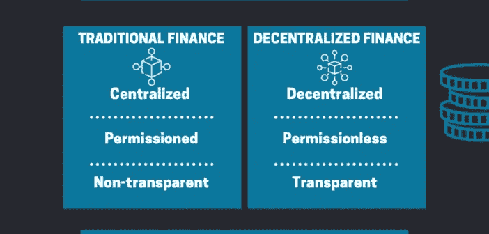

# 你最短的 DeFi 字典

> 原文：<https://medium.datadriveninvestor.com/your-shortest-defi-dictionary-cc521dc15ba1?source=collection_archive---------2----------------------->

Photo by [Markus Winkler](https://unsplash.com/@markuswinkler?utm_source=medium&utm_medium=referral) on [Unsplash](https://unsplash.com?utm_source=medium&utm_medium=referral)

电喷是目前最热门的趋势，但只有少数人真正了解它是怎么回事。本文旨在展示 DeFi 应用程序的外观、感觉和工作原理。

# 首先:什么是 DeFi？

分散金融(DeFi)是指旨在通过消除中介来扰乱金融业的区块链应用。这类产品包括数字资产、智能合约和 dApps，以提供去中心化和无信任的金融系统。协议几乎只在以太坊上开发和使用，但它们也可以在其他具有智能合约功能的平台上工作(如 DAI)。

DeFi 旨在通过一个非托管的开源网络(例如，借贷、购买、销售、投资、交易等)将市场中的日常行为自动化。).与限制速度和其他交易能力的集中式系统不同，DeFi 允许用户通过消除银行、票据交换所和其他金融机构等中介来直接控制他们的资金。

# DeFi dApp 的基本特征

Credits: [101blockchains](https://101blockchains.com/wp-content/uploads/2020/01/decentralized-finance.png)

DeFi 一词用于各种金融应用，每种应用都有其特殊性，并会干扰金融中介。接下来，我将解释 DeFi dApp 的工作原理及其特性。

## **他们建立在一个分散的 P2P 渠道上**

dApp 是一种建立在分散式 P2P 通道上的服务。用户必须将他们的加密钱包连接到网络(例如，如果 dApp 使用以太坊，则必须通过 Metamask 或其他类似服务将他们的钱包连接到区块链)。

## **没有第三方**

DeFi 产品旨在促进自主性。没有第三方(如银行)处理财务流程。所有工作流都由智能合同中编写的代码管理。一旦在区块链部署了智能合约，dApp 就会自行运行，从而创建一个不可信的系统。因此，资产完全由用户自行保管。

## **透明代码**

每个人都可以查看代码，理解契约的功能，并且不受任何管辖区域或地理位置的限制进行调试。DeFi 应用程序是完全没有权限的，这意味着每个人都可以使用它们并创建新的应用程序。此外，可以使用其他 DeFi 产品开发新的 dApps，如 stablecoins、预测市场和分散交易所。

## **可组合性**

可组合性是以不同方式组合各种软件组件以从部件构建应用程序的能力。当一个系统提供了能够以满足特定用户需求的特定组合来组装的组件时，它就是高度可组装的。在密码学中，驱动专有软件栈的主要因素是封闭的数据结构和垄断的商业模式。

收集更多用户数据的应用程序增加了其开发者公司的盈利潜力。因为许多 DeFi 项目是可组合的，依靠区块链的基础层，用户可以在一个单一的智能合同中执行多个操作。

例如，他们可以在复利上获得戴的贷款，并将其中一半放入 DeFi 应用程序，另一半放入另一个 DeFi 平台上 ETH 的杠杆头寸。然后，他们可以在给定的 ETH 价格水平上从两者中提取资金，偿还贷款和复利，最后保留从杠杆头寸中赚取的剩余余额。

# 最常见的 DeFi 产品

Photo by [Austin Distel](https://unsplash.com/@austindistel?utm_source=unsplash&utm_medium=referral&utm_content=creditCopyText) on [Unsplash](https://unsplash.com/s/photos/blockchain?utm_source=unsplash&utm_medium=referral&utm_content=creditCopyText)

## **分散交易所**

他们旨在直接连接用户，并允许他们在不依赖中介的情况下相互交易加密货币。dex 是由开源软件和可编程加密货币构建的自动借贷和交易平台，在以太坊等分布式计算网络上开发。dex 的目的是为银行和传统交易所提供一种效率更高、成本更低的交易方式。例如，IDEX(建立在以太坊)，币安指数，以太三角洲和雷达中继是最受欢迎的指数。Rarebits 和 OpenSea 是专注于不可替代令牌(NFTs)交换的开放市场，帮助购买、销售、发现和探索这种被称为加密收藏品的加密资产。还有其他类型的市场，比如 DistrictoX，它允许创建对治理程序进行投票的市场。

> **dex 与其他集中交易所(如比特币基地)的区别在于 P2P 交易，没有注册协议，没有身份验证，也没有取款费用。**

## **Stablecoins**

这些加密货币旨在提供价格稳定。[稳定账户](https://medium.com/blockchainliteracy/do-we-need-blockchain-based-cbdcs-fd54427fbc25)代表各国央行持有的以外币计价的金融资产。储备资产用于平衡收支，具有四个主要特征:必须是实物资产，货币当局随时可以使用，易于转移，并由政策制定者控制。最主要的储备资产是美元。Stablecoins 因兼具加密货币和法定货币支付的优势而备受关注。[交易](https://medium.com/blockchainliteracy/2-2-do-we-really-need-blockchain-based-cbdcs-e2bc73c24db2)即时处理，受益于加密货币的安全性和隐私性，也是法定货币的无波动稳定估值。

## **借贷平台**

它们允许用户将资金存入智能合约并锁定，其他用户可以从智能合约中借款并支付利息。每笔贷款都由 crypto 担保。目前使用的最流行的 DeFi 平台有:

*   [复合](https://compound.finance/)。它是一个为开发者构建的开源算法自治和去中心化协议。它允许他们访问多个金融应用程序，并通过向他们出借房地产、商品和车辆等现实世界的资产来赚取以太坊数字资产的利息。
*   [Aave](https://aave.com/) ，也是一个开源协议，专注于为去中心化金融创建透明的基础设施。Aave 的算法使用汇集策略来调整利率。他们也有支付利息和借出代币的权利，授予与合同升级和协议参数相关的决策的投票权。
*   [诺网](https://www.nuo.network/)是一个去中心化的债务市场，允许用户通过在其智能合约中设定抵押品来即时借用 ETH 和 ERC20 令牌，并从其加密资产中赚取利息，从而创建债务储备，而不收取任何平台费用。
*   MakerDAO 是一个去中心化的协议，包括一个管理借贷的智能合同服务，使用和戴来调节贷款的价值。马克尔道上没有贷款人，唯一可借的资产就是戴。该协议建立在以太坊区块链之上，允许用户创建货币。项目由世界上任何持有其治理令牌的人管理。MKR 令牌持有者对协议和戴的财务风险进行决策，以确保透明度、稳定性和效率。

## **包裹好的代币**

包装代币是 ERC-20 代币，其价值与它们所代表的资产相同，或者通过智能合约，或者通过与基础资产一对一的支持，同样，美元支持稳定的货币，如 USDT 和 USDC。一个包装好的代币托管在以太坊区块链上，其价格与另一个基础资产相同，即使它根本不在同一个区块链或区块链上。

> 包装加密令牌的开发使得基于以太坊的 BTC 交易能够在 dex 上进行，从而提高了速度。包裹代币帮助以太坊生态系统成长，并为更多投资者打开了 DeFi 的可能性。

## **预测市场**

它们代表交易所交易市场，目的是交易事件的结果(如总统选举结果、交易所平均价格、季度销售结果、商品价格，甚至电影总收入等)。**预测市场押注于未来事件的发生并依赖于规模**；参与市场的人越多，出现的数据就越多，市场预测算法就变得越有效。也被称为博彩市场或信息市场，它们已被用于各种研究领域，如数据分析和人工智能。他们的主要范围是引发对未知和不确定的未来结果的聚合信念。

## **高产养殖&流动资金开采**

**收益农业**是一个最近出现的概念，使用无许可流动性协议获得加密货币持有的回报。更简单地说，产量农业意味着锁定加密货币并获得奖励。有了建立在以太坊(通常使用 ERC-20 代币)上的分散式“金钱乐高”生态系统，**产量农业允许任何人获得被动收入**。这是一个创新的视角，被认为将改变投资者管理其加密货币的方式(拒绝出售，无论价格上涨或下跌)。这个概念也被称为流动性挖掘，因为在许多情况下，它与被称为流动性提供者的用户一起工作。这些用户将资金加入流动性池，流动性池是包含资金的智能合约。

**流动性挖掘**是当一个收益农民收到一个新的代币和预期回报，以换取农民的流动性。它代表了一种网络参与策略，在这种策略中，用户向协议提供资金，以换取该协议的本地令牌。流动性挖掘的特别之处在于网络具有特定的需求，即流动性供应，因此用户不需要购买令牌。取而代之的是，他们被奖励一些代币，这些代币允许他们的持有者对协议参数进行投票，包括价值获取机制。**流动性采矿增压产量农业。**代币的价值受到网络使用的刺激，形成一个吸引用户的正向使用循环。除了是借贷平台，复合也是最受欢迎的流动性挖掘平台。它的目的类似于之前描述的产品:将产品去中心化，将相当数量的所有权给予那些让平台流行的人。所有权将采取补偿令牌的形式。

> **产量农业和流动性挖掘的区别在于，产量农业是人们通过自动移动资金来实现产量最大化的过程。通过流动性挖掘，人们通过给予流动性来赚取代币。**

## 金钱乐高玩具

**Money Legos** 是一个节点包管理器包(发布开源节点的在线资源库。js 项目),为用户提供流行的 DeFi 协议的 mainnet 地址、ABI 和 Solidity 接口。金钱乐高允许 DeFi 生态系统从个人进步中获益。这个概念与每个人的童年玩具乐高联系在一起。当人们参观一大箱随机的乐高积木时，这些积木会以新的、创造性的方式组合在一起。然后，当人们潜入乐高垃圾箱时，他们会发现预先组装好的乐高组合，这些组合可以用来建造更大更好的东西，创造出一个全新的乐高宇宙。与此类似，DeFi 项目不仅被设计为独立的产品，也是创新项目中容易整合的部分。

> **这种滚雪球式的生态系统发展方式，带来了一个全新的去中心化金融产品世界。**

MakerDAO 是一个金钱乐高工具，其中戴和定制智能合同被视为乐高块。MakerDAO 接受 ETH 作为贷款担保。通过这种方式，用户可以在不抛售以太网的情况下在 DAI 中取出资金。因此，他们在使用 Dai 的同时保持对 ETH 价格的敞口。

## 我很想听听你的反馈！您可以在以下网址找到我:

## [领英](https://www.linkedin.com/in/ioanafrincu/)

## [推特](https://twitter.com/frincutz)

## [脸书](https://www.facebook.com/ioanafrincutz)