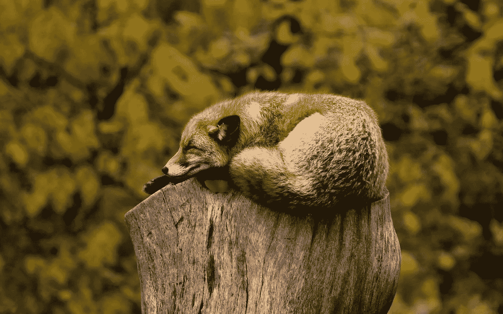

# 你的睡眠不仅仅是让你早上感觉精神焕发

> 原文：<https://medium.datadriveninvestor.com/your-sleep-is-about-more-than-feeling-fresh-in-the-morning-80574c6cb4c5?source=collection_archive---------19----------------------->

有研究支持的让睡眠成为你超能力的方法。

Image by [Pexels](https://pixabay.com/users/Pexels-2286921/?utm_source=link-attribution&utm_medium=referral&utm_campaign=image&utm_content=1284512) from [Pixabay](https://pixabay.com/?utm_source=link-attribution&utm_medium=referral&utm_campaign=image&utm_content=1284512)

你知道吗，根据研究表明，四五个小时的睡眠会使一个男人的睾丸激素水平降低到比他年长 10 或 15 岁的男人(T2)的水平。我想不会。良好的夜间休息与健康的身心健康是一致的。

睡眠虽然对你的身体机能至关重要，但却经常被忽视。我和你一样喜欢晚上睡个好觉，但这并不意味着我不说“哦，好吧”，熬夜到凌晨 2 点完成一项工作，希望第二天通过一系列半心半意的打哈欠和不时的每小时揉眼睛来碰运气。即便如此，第二天我发现自己对这个决定感到后悔。

我们为什么要这么做？我们相信去世界任何地方都可以；你需要牺牲一些基本的东西，比如睡眠。著名的睡眠心理学家马特·沃克说得好:“这是因为人类是唯一一个无缘无故故意剥夺睡眠的物种。”

睡眠是你的超能力；一定要用。

睡眠不足，尤其是酒精的有害影响，会对你的精神表现不利。沃克发现，与整夜的休息相比，当你没有睡觉时，大脑产生新记忆的能力会减少 40%。睡眠充足的大脑中海马体的活动要多得多，而睡眠不足的大脑中却没有——是的，没有。

 [## 定义新冠肺炎时代的“生活”|数据驱动的投资者

### 我和妻子即将进行一个月的自我隔离，以避免感染冠状病毒。我们都 70 多了…

www.datadriveninvestor.com](https://www.datadriveninvestor.com/2020/04/23/defining-life-in-the-time-of-covid-19/) 

现在是时候给出更多的统计数据了。阿拉巴马大学的一项研究得出结论，日光节约与心脏病发作几率增加 10%有关。

它不止于此。4 小时的睡眠意味着免疫杀伤细胞下降 70%。因此，你不仅看起来像是在和一只银背大猩猩搏斗，你生病的几率也会飙升。

你不能低估睡眠的重要性。这很简单。睡眠越短，寿命越短。

如果你上网搜索建议，你会找到大量的建议。毫无疑问，你会发现一些你真的懒得去用的古怪建议。坦白地说，我只是不想用一些数据跟踪应用程序来检查我的睡眠。

谢天谢地，没必要这么难。这里有两条要遵守的规则和一些其他方便的建议。

# 1.调节你的睡眠模式

沃克建议每天在同一时间睡觉和醒来。在禁闭状态下，这对我来说很难。正如我所注意到的，不在同一时间睡觉会导致一个不眠之夜。然而，在过去的两周里，我一直在 11:30 睡觉，8:30 醒来。虽然刚开始很难受，但我觉得早上精力和警觉性明显好转。

[这里还有一些其他要避免的习惯](https://www.youtube.com/watch?v=GFpciGYBELo):

*   [不要打架睡觉。](https://www.helpguide.org/articles/sleep/insomnia-causes-and-cures.htm)如果不行，就休息一下；你需要把床和睡眠联系起来。
*   不要睡得太早，因为你可能会辗转反侧——影响你晚上睡个好觉。
*   抵制睡懒觉的冲动——即使昨晚睡得很差。你的身体有一个 24 小时的时钟，改变你醒着的时间会使它混乱。正如沃克所说:你将“在时间中向前漂移”
*   战胜打盹的需求。虽然 10 分钟的小睡会让你更加清醒，但更长时间的小睡是有害的。沃克说这“就像下午吃零食一样；你就没胃口了。”

# 2.保持冷静

最佳温度是 18 摄氏度——或 64.4 华氏度。在英国，几周来天气一直很热，导致了几个不眠之夜。

躲在羽绒被下比躺在汗水里容易得多，但你不需要我告诉你。

凉爽的温度不仅能让你入睡，还能让你保持睡眠，因为不间断的夜间睡眠能让你更好地迎接新的一天。

要做到这一点，请做以下两件事:

*   睡觉前洗个热水澡。热量对你的皮肤有一种“暖身效果”,并导致你的核心温度下降——适合睡觉时间。
*   移除钟面。每当我睡不着看钟的时候——我当时就生气，想着第二天的后果。所有这些仅仅是为了增加我的体温，并进一步减少睡眠的机会。

# 这一切意味着什么？

糟糕的睡眠不仅会影响你早上的情绪，还会影响你的健康、智力和免疫力。这是你生活中不可或缺的步骤之一，这是有原因的。

你不可能在没有充电的情况下驾驶一辆特斯拉，那么你如何应对？

是的，你可能会有夜间活动的感觉，但这很可能会损害你的大脑。请记住:

*   调节你的睡眠模式
*   保持冷静。

简单吧？

现在别读这个了，去睡觉吧！

## 准备好学习了吗？加入我的每周简讯来促进你的个人发展。

**访问专家视图—** [**订阅 DDI 英特尔**](https://datadriveninvestor.com/ddi-intel)