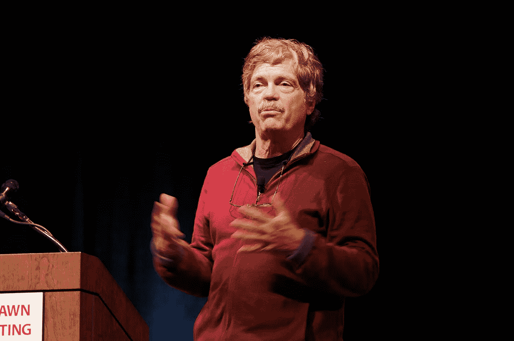
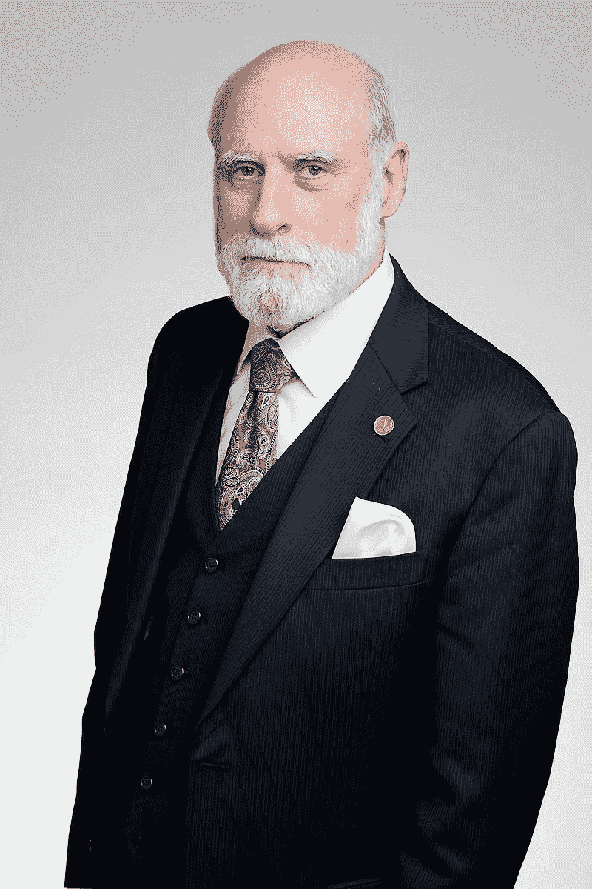
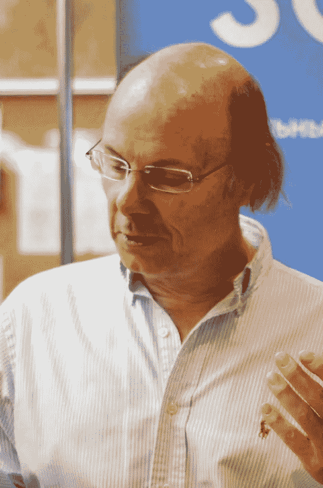
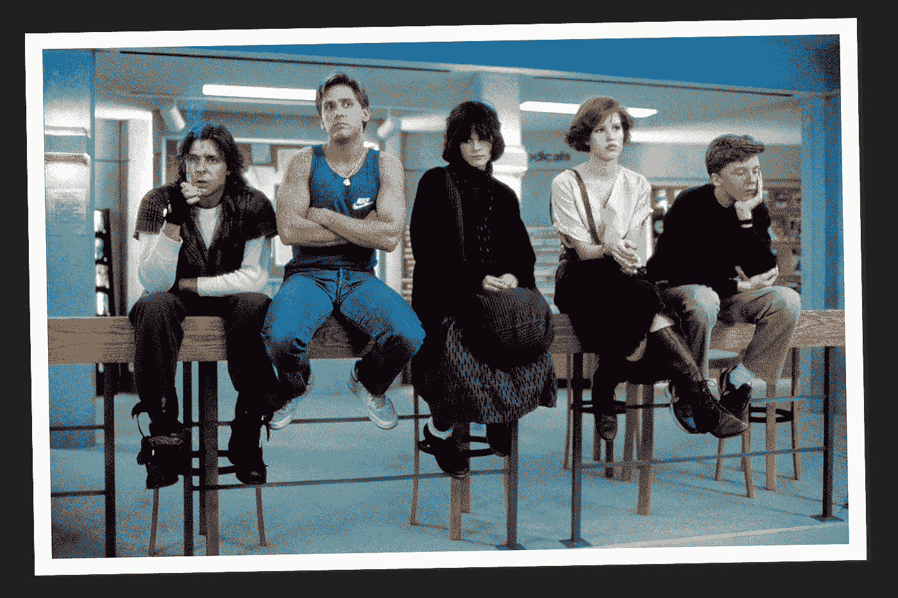

# 你的科技图标烂透了

> 原文：<https://medium.datadriveninvestor.com/your-tech-icons-suck-959d878547ae?source=collection_archive---------6----------------------->

在某些方面，我可以理解人们对埃隆·马斯克这样的人的狂热热爱。如果你把他和最近的“科技巨头”相比，他实际上看起来没那么糟糕。

***我和我这一代人都被*** 宠坏了。不管你宣传的是技术的哪一部分，都有一个绝对令人惊叹的人或两个人——人们实际上是在做*。*创造历史。**

**

*艾伦·凯，面向对象编程之父。*

**

*温顿·瑟夫博士——互联网之父。*

**

*安德斯·赫里斯伯格——特尔斐的首席建筑师、微软 C#的首席建筑师和设计师 Turbo Pascal 写道*

**

*唐纳德·克努特。没什么好说的了。*

**

*丹尼斯·里奇和肯·汤普森——在贝尔实验室创造了 C 编程语言和 UNIX。*

**

*Linus Torvalds —创建了 Linux。我记得几十年前在新闻组问题上和他进行过热烈的辩论。我，一个普通人。*

**

*比雅尼·斯特劳斯特鲁普——c++的创造者*

**

*RMS——GNU 的创始人，也是当时科技界最两极化的人之一*

*这还不包括贝佐斯家族、盖茨家族、松本家族、沃兹尼亚克家族、乔布斯家族以及其他许多在 70 年代和 21 世纪初之间开辟道路的家族。*

*我们有幸在众神中行走。自尊心最低。这份名单中的大多数人都不是为了发明什么而出名的。他们这样做*是因为它需要被完成。*就这样。不仅如此，在很大程度上，他们还邀请了我们，网上的普通书呆子，来获取我们的意见。我们感激不尽。*

* [## 模式和机器人:复杂的现实|数据驱动的投资者

### 哈耶克的著名著作《复杂现象理论》(哈耶克，1964)深入探讨了复杂性的主题，并断言…

www.datadriveninvestor.com](https://www.datadriveninvestor.com/2019/03/04/patterns-and-robotics-a-complex-reality/) 

但是最近呢？

道格·埃文斯。Juicero 的创始人，这款价值 700 美元、始终在线的 DRM 强制榨汁机，事实证明，用手榨果汁比用机器榨要好。

伊丽莎白·霍姆斯。Theranos 公司的首席执行官，该公司设法建立了一个价值 90 亿美元的公司，围绕着一个根本不存在的革命性血液测试机器运转。目前即将开始对 9 项电汇诈骗的审判。

比利·麦克法兰。有会员专用充值卡。Fyre 节创始人。目前因诈骗服刑 6 年。

埃隆·马斯克。彻底改变了公司通过贝宝从客户那里窃取信息的方式。目前展示了许多从未实现的 CGI 剪辑和失败的演示。什么都不做，没有向我们展示实际在做工作的人。有一个 1 千米长的“超环”，到目前为止已经达到每小时 40 英里。

E 资金非常充足的 Kickstarter 违反了物理定律:

*   水兵
*   太阳能该死的道路
*   钍动力汽车
*   空气中的塑料
*   HENDO 气垫板
*   Triton 人造鳃
*   Fontus 自动灌装水瓶
*   以及其他等等

科学文盲在 2020 年将达到历史最高水平。数以亿计的美元从辛勤工作、满怀希望的人们的口袋里流向了撒谎、偷窃、诈骗者的钱柜——他们很乐意拿着你的钱跑路。

属于“零工经济”一部分的每一家公司。

*   uShip
*   优步
*   来福车
*   Handy Pro
*   亚马逊 Flex
*   手推车
*   支持
*   道路管理员
*   翁兹
*   石灰
*   其余的人[咒骂删除]

你什么也没做，只是创造了一个更低的中产阶级。付给某人 75 美元，让他把一个将近 600 磅重的枝形吊灯悬挂在 25 英尺高的空中，实际上你要为此支付将近 1000 美元。

从航运报价中扣除如此大的百分比，你的报酬从体面的 1.50 美元/英里变成毫无意义的 0.75 美元/英里。

让我们看看是什么让你如此值钱。除了协调服务，你什么也不提供，然而你却从那些没有其他选择的人的辛勤工作中获取金钱。

最糟糕的是。我这一代人不仅沾沾自喜，实际上还在鼓励它。这些人:

现在是那些把车停在"上学时间禁止停车"的门前，甚至停在我家车道前的人。强化了规则和法律不适用于小吉米的观念。坚定了小吉米不需要努力的想法，并可能步行一个街区到合法停车的地方。告诉他蓝领不好，说他比'*那些*人好多了。

换句话说，我们这一代人认为你有资格。你应该出名。成为百万富翁——不是亿万富翁！一个**科技奇才！**没有任何想法或技术技能？没问题！你只要登上舞台，连接几个流行语，钱就能进来。越疯狂越好！从 2012 年开始承诺以 760 英里/小时的速度穿越一个只有十分之一大气压的管道，并告诉所有人它将在 2018 年到来。2018 滚来滚去不循环？去他妈的，公之于众。扭曲“开源”的想法，让其他人创造你的发明。

这是怎么回事？

上 YouTube，试着找一个真正*创造*东西的频道，创作者年龄在 35 岁以下。除了戏剧视频的海洋什么都没有。

你喜欢我的咆哮吗？请随意给我买杯咖啡。此外，第一个有见地的评论和第一个有趣的评论(由我判断)将获得 5 美元的亚马逊礼品卡。为什么？好的、吸引人的(或令人捧腹的)评论应该得到奖励。我们需要更多这样的人。

JDP*