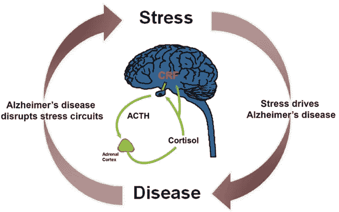

# 你的西方经济企业家哲学是导致老年痴呆症、痴呆症和抑郁症的主要原因

> 原文：<https://medium.datadriveninvestor.com/your-western-economic-entrepreneur-philosophy-contributes-to-a-leading-cause-of-alzheimers-ed012882ddc0?source=collection_archive---------18----------------------->

Source: Self Created Image with Canva

*“每一次压力都会留下不可磨灭的伤疤，而机体在压力环境下为生存付出的代价是变老一点”(* [*汉斯·塞尔耶(1950)*](https://www.ncbi.nlm.nih.gov/pmc/articles/PMC5991350/#bib126) )

我们在社会中学会了在压力下工作。职业企业家可以被视为你所了解的压力最大的职业。

> 企业家职业的特点是:没有有保证的薪水，拿走你所有的一切的诉讼，当你没有钱的时候相信你有几百万，试图不惜一切代价消耗你的激烈竞争，以及对任何有常识的人都能理解的常见失败的诽谤。

我们庆祝不断失败以赢得一次胜利的思想。温斯顿·丘吉尔有句名言:“成功就是从失败走向失败，而不丧失热情。”

奋斗的理念被接受了。

甚至我也有一种负罪感，认为“创业就是像大多数人那样享受几年人生，这样你就可以像大多数人那样度过余生。”

在一个只有对手的环境中，意味着接受不断的失败，鼓励生活在困境中……我们怎么能否认压力最大的职业之一是企业家呢？

压力的恶性循环如下图所示:

来源:神经生物压力。2018 年 2 月；8 第 127-133 页

不需要太多的技术，这个框架显示了升高的压力水平如何导致病理的快速发展和认知功能的丧失。**你压力越大，你的精神意识就越弱。**

> 高度的压力意味着你更有可能智力退化。

西方经济企业家哲学告诉我们，不惜一切代价赚一百万是成功的里程碑。目标是成为战胜所有其他人的创业企业家。我们被告知，赚一百万美元，在游艇上漂浮，享用美味的晚餐就是成功。成为一名著名的励志演说家，挑战他们贫穷的背景，是我们被告知想要讲述的故事。

让我们真正审视普通美国人的灵魂。

我们追求的真正的生活质量是什么？我们真正追求的是什么？有可能实现没有压力诱发疾病吗？为了挣一块钱，你真的需要把自己弄垮吗？

**蓝区文化**

蓝色区域很有趣。这些领域与西方世界不同，因为 1。人活得很长，2。人们很少患慢性病。人们往往很少或没有抑郁症，4。人们倾向于有健康社交生活的目标。

这不正是你在寻找的吗？

企业家先生或小姐你不想活得很长吗？

*企业家先生或小姐*你不想避免慢性病吗？

*企业家先生或小姐*你不是在寻找避免抑郁的答案吗？

企业家先生或小姐难道你不想拥有健康的社会地位吗？

你知道这些问题的答案。

**不用我回答**。

这听起来像天堂。为什么我们避免谈论它？金钱和痛苦不需要相伴而生。

蓝区的概念是由丹·比特纳提出的。丹声称这些地区的人平均寿命要长得多。丹就此写了一本书，试图确定是否有长生不老药。因此，答案出奇的简单。

答案取决于人们的生活方式，他们度过时间的方式以及他们从不感到压力。

 [## 对有商业头脑的投资者有用的行为经济学概念|数据驱动的投资者

### 在美国企业界，高斯统计，对我们周围世界的确定性解释，以及理性…

www.datadriveninvestor.com](https://www.datadriveninvestor.com/2020/07/09/helpful-behavioral-economics-concepts-for-the-business-minded/) 

**生意怎么样了**

蓝区文化中讨论了五(5)个领域。这五个地区是:冲绳(日本)；撒丁岛(意大利)；尼科亚(哥斯达黎加)；伊卡里亚(希腊)；在加州洛马琳达的基督复临安息日会教徒中。

不要太深入，记住每个领域都有商业、贸易和企业家精神。让我们从每个地方的一个引人入胜的事实来总结缺乏压力不会使企业家文化失效。

冲绳被誉为 2014 年杰出科技创业公司的首选之地。

撒丁岛有[B2B 无现金货币系统](https://www.dw.com/en/italys-b2b-cashless-sardex-currency-set-to-take-on-the-world/a-45300395)这是全球鼓舞人心的创新。

哥斯达黎加被 BizLatin Hub 确定为[拉丁美洲创业中心](https://www.bizlatinhub.com/entrepreneurship-costa-rica-2019/#:~:text=According%20to%20The%20Global%20Institute,country's%20%2480.7%20billion%20market%20value.)。该国的市场价值为 807 亿美元。

尽管 2014 年发生了充斥着腐败公共部门的欧元区危机，但希腊继续通过 T2 企业家精神重塑希腊经济。

[洛玛琳达加州](https://www.lomalinda-ca.gov/our_city/about_us)无需介绍。洛马琳达大学医学中心&儿童中心包含加州最大的新生儿重症监护室、癌症治疗中心和婴儿心脏移植中心。像这样的医疗场所因创新、研究和新想法而繁荣。我知道我曾经在一家生物技术公司工作。

正如你所看到的，压力心态的采用并不一定与商业企业家文化相关。

**改变你的想法改变你的生活**

这篇文章的观点很简单。不要过度紧张。不要为了钱而牺牲你的幸福。任何追求激情的人都会获得成功。钱会照顾好自己的。如果你在你的任务中挣扎…你可能没有发挥你的热情。每天我都开心地写作。

我很乐意消磨时光，不考虑金钱。

我找到挣钱的方法了吗？*确定*。

我必须支付我的会费吗？*绝对*。

我是否醒来后发现一切都是地狱？**从不**。

事实上，我享受其中的每一分钟。努力工作并不意味着痛苦和压力。每个人都必须经历“地狱周”。记住这是“地狱周”。

没有所谓的“地狱月”、“地狱年”或“地狱生活方式”。

永无休止的奋斗意味着你在用压力杀死自己。如果你否认我的想法，没关系。生活在永恒的斗争中也有好消息。好消息是你很有可能患有痴呆症。所以，无论如何你都不会记得你的生活…或者你会吗？

祝你知识成功！

关于 Christopher:Christopher Knight Lopez 是一名职业骗子，在他的职业生涯中，他与职业企业家进行了广泛的合作。在他 14 年的职业生涯中，Christopher 已经开了超过 7 家公司。克里斯托弗的目的是利用各种市场驱动的机会。Christopher 是注册项目经理(MPM)和认证财务分析师(AFA)。Christopher 之前通过了 65 系列证券执照考试。克里斯托弗也有他的总路线——人寿、意外、健康和健康维护组织。Christopher 已经管理了总计 2 . 86 亿美元的报告管理资产和建议资产。Christopher 在 29 个国家有工作经验，为各种业务筹集了超过 5000 万美元，在他的个人职业生涯中总收入超过 1300 万美元。Christopher 曾在高科技行业工作:生物技术、金融、证券、制造、房地产和住房抵押贷款。克里斯托弗是一名美国空军老兵。克里斯托弗热爱家庭、竞技体育、钓鱼、武术，并倡导企业家精神。克里斯托弗为崭露头角的企业家提供自助课程。克里斯托弗对导师的热情来自于企业家和骗子需要指导的信念。这个世界充满了关于企业家身份的相互矛盾的信息。在[www.christopherklopez.com 看更多。](http://www.christopherklopez.com.)

免责声明:这些信息并不意味着是一种投资建议或财务建议。不要把这种情况应用到你自己的个人环境中。各种风险包括:商业风险、投资风险、政治风险和其他风险。此信息仅用于信息和教育目的。请不要向作者寻求任何投资策略或哲学。针对自己的情况，请咨询自己的理财顾问或法律顾问。不是任何形式的推荐或认可。

**访问专家视图—** [**订阅 DDI 英特尔**](https://datadriveninvestor.com/ddi-intel)