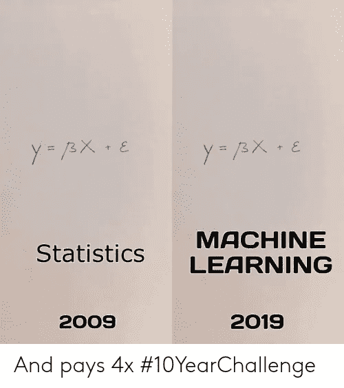
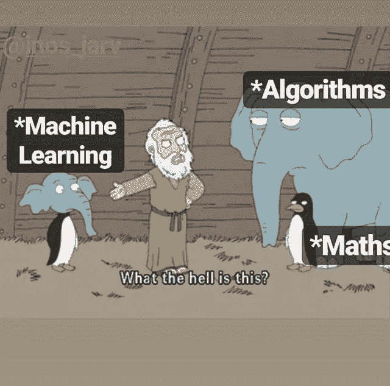

# 你在家工作的数据科学计划

> 原文：<https://medium.datadriveninvestor.com/your-work-from-home-data-science-plan-3766ea5a1541?source=collection_archive---------9----------------------->

这是一份提高您在家工作时的数据科学技能以及实际项目的指南。

Photo by author

冠状病毒的爆发占据了头条。由于新冠肺炎冠状病毒的传播，远程工作突然成为许多人通宵工作的要求。当你阅读这篇文章的时候，你可能正在家里工作。

> 随着数百万人在家工作数周，我们应该抓住这个机会来提高我们所关注领域的技能。

以下是我在家工作时学习数据科学的策略，只有很少的个人实际项目。

“那我们该怎么办？”

“我们应该从哪里开始学习？”

当我向你解释如何坐在家里学习数据科学的过程时，拿起你的咖啡。这个博客面向从业余爱好者到专业人士的每一个人。

Photo by [Nick Morrison](https://unsplash.com/@nickmorrison?utm_source=medium&utm_medium=referral) on [Unsplash](https://unsplash.com?utm_source=medium&utm_medium=referral)

# 先决条件

要开始这个旅程，您需要了解一些先决条件。无论你在哪个具体领域，或者你选择 opt，你都需要学习以下数据科学的先决条件。

以下是您可以从给定的资源中开始学习的先决条件列表:

**逻辑/算法理解:**

在学习它们之前，知道为什么我们需要一个特定的先决条件是很重要的。算法基本上是给计算机完成特定任务的一组指令。

机器学习是由各种复杂的算法构建而成的。所以你需要理解算法和逻辑是如何工作的，以便跳到复杂的算法，我们称之为机器学习。如果你能用正确的步骤为任何给定的难题写一个逻辑，你将很容易理解这个算法是如何工作的，你也能为你自己写一个。

资源:[算法简介，](https://www.geeksforgeeks.org/introduction-to-algorithms/) [算法【可汗学院】](https://www.khanacademy.org/computing/computer-science/algorithms)

**统计:**

统计是一组工具，您可以使用它们来获得有关数据的重要问题的答案。机器学习和统计学是两个紧密相关的研究领域。以至于统计学家将机器学习称为“应用统计学”或“统计学习”。

Image source : [https://me.me/](https://me.me/)

在开始机器学习之前，有抱负的数据科学家应该涵盖以下主题。

*   集中趋势的度量——均值、中值、众数等
*   可变性测量—方差、标准偏差、z 值等
*   概率——概率密度函数、条件概率等
*   准确性——真阳性、假阳性、灵敏度等
*   假设检验和统计显著性— p 值、零假设等

资源:[数据科学所需的基本统计学，](https://towardsdatascience.com/basic-statistics-you-need-to-know-for-data-science-1fdd290f59b5) [数据科学所需的 5 个统计学基本概念](https://towardsdatascience.com/the-5-basic-statistics-concepts-data-scientists-need-to-know-2c96740377ae)

**业务理解:**

这个要看你想专注哪个领域了。它基本上包括在进入数据科学项目之前理解特定领域并获得领域专业知识。这很重要，因为它有助于准确定义我们的问题。

资源:[商业数据科学](https://www.oreilly.com/library/view/data-science-for/9781449374273/)

# 温习你的基础知识

这听起来很容易也很天真，但是我们往往会忘记一些重要的基本概念。如果不夯实基础，学习特定领域的复杂概念和最新技术会变得很困难。

这里有一些你可以开始修改的概念:

python cheat sheet:python 所有重要语法的快速指南。

Image source : *memecrunch.com*

这将有助于您学习 python3 中发布的新语法，并复习常用语法。

资源: [Python3 Cheatsheet，](https://in.pinterest.com/pin/558164947551611259/?autologin=true) [Python 基础数据科学[cheatsheet]](https://www.datasciencecentral.com/profiles/blogs/cheat-sheet-python-basics-for-data-science)

# **数据收集**

现在是我们探索收集数据的所有方法的时候了。您永远不知道您的数据可能会驻留在哪里。以下是收集数据的几种方法。

**Web 抓取:** Web 抓取是从 Web 上下载结构化数据，选择其中的一些数据，并将您选择的数据传递给另一个进程。

你可以开始学习 BeautifulSoup4，它有助于抓取网站并制作我们自己的数据集。

提前提示:您可以使用 [Selenium](https://www.selenium.dev/) 自动化浏览器并从交互式网页(如 Firebase)获取数据。这是自动化网络应用和自动化枯燥的基于网络的管理

云服务器:如果你的数据存储在云服务器上，比如 S3，你可能需要熟悉如何从那里获取数据。以下链接将帮助你理解如何使用亚马逊 S3 实现它们

资源:[亚马逊 S3 入门](https://aws.amazon.com/s3/getting-started/)

有数以百万计的网站通过 API 提供数据，如脸书、推特等。因此，了解它们是如何使用的，并对它们是如何实现的有一个好的想法是很重要的。

资源:[Python API 入门](https://www.dataquest.io/blog/python-api-tutorial/)

# 数据预处理:

本主题包括从数据清理到特征工程的所有内容。这需要花费大量的时间和精力。所以我们需要投入大量的时间去真正的学习它。

Image source : [https://www.pinterest.com/pin/293648838181843463/](https://www.pinterest.com/pin/293648838181843463/)

根据问题和数据类型，数据清理涉及不同的技术。需要清除数据中的无关数据、语法错误、数据不一致和缺失数据。以下指南将帮助您开始数据清理

资源:[数据清理终极指南](https://towardsdatascience.com/the-ultimate-guide-to-data-cleaning-3969843991d4)

数据预处理是一个重要的步骤，在这个步骤中，数据被转换或编码，使其达到机器可以轻松解析的状态。预处理不同类型的数据需要时间和精力，包括数字、文本和图像。

资源:[数据预处理:概念](https://towardsdatascience.com/data-preprocessing-concepts-fa946d11c825)

# 机器学习:

最后，我们到达了数据科学中我们最喜欢的部分“机器学习”。

Image source : [https://in.pinterest.com/pin/536209899383255279/](https://in.pinterest.com/pin/536209899383255279/)

我的建议是——首先复习你的基本算法。

**分类** —逻辑回归、随机森林、SVM、朴素贝叶斯、决策树

资源:[机器学习中的分类算法类型](https://medium.com/@Mandysidana/machine-learning-types-of-classification-9497bd4f2e14)，[机器学习中的分类算法](https://medium.com/datadriveninvestor/classification-algorithms-in-machine-learning-85c0ab65ff4)

**回归** —线性回归、随机森林、多项式回归

资源:[线性回归简介](https://towardsdatascience.com/introduction-to-machine-learning-algorithms-linear-regression-14c4e325882a)，[你应该知道的 7 种回归技术](https://www.analyticsvidhya.com/blog/2015/08/comprehensive-guide-regression/)，[为你的回归问题选择最佳的机器学习算法](https://towardsdatascience.com/selecting-the-best-machine-learning-algorithm-for-your-regression-problem-20c330bad4ef)，

**聚类** — K-Means 聚类、DBSCAN、凝聚层次聚类

资源:[聚类算法](https://towardsdatascience.com/the-5-clustering-algorithms-data-scientists-need-to-know-a36d136ef68)

**梯度增强** — XGBoost，Catboost，AdaBoost

资源:[从零开始渐变助力](https://medium.com/mlreview/gradient-boosting-from-scratch-1e317ae4587d)，[了解渐变助力机器](https://towardsdatascience.com/understanding-gradient-boosting-machines-9be756fe76ab)

我敦促你们理解这些算法背后的数学原理，这样你们就能清楚地知道它实际上是如何工作的。你可以参考我从零开始实现 XGBoost 的博客— [从零开始实现 XGBoost](https://towardsdatascience.com/implementing-xgboost-from-scratch-6b7f2eb593c)

现在你可以转向神经网络，开始你的深度学习之旅。

资源:[深度学习简介](https://towardsdatascience.com/a-gentle-introduction-to-deep-learning-part-1-introduction-43eb199b0b9)，[深度学习 Tensorflow 简介](https://www.udacity.com/course/intro-to-tensorflow-for-deep-learning--ud187)

然后，您可以进一步深入了解 LSTM、暹罗网络、CapsNet 和 BERT 是如何工作的。

# 黑客马拉松:

Image Source : [https://me.me/](https://me.me/)

因为现在我们需要在有竞争力的水平上实现这些算法。你可以开始寻找在线数据科学黑客马拉松。以下是我尝试与其他数据科学家竞争的网站列表。

**分析维德希亚**——[https://datahack.analyticsvidhya.com/contest/all/](https://datahack.analyticsvidhya.com/contest/all/)

**卡格尔**——[https://www.kaggle.com/competitions](https://www.kaggle.com/competitions)

**黑客地球**——[https://www.hackerearth.com/challenges/](https://www.hackerearth.com/challenges/)

**machine hack**——[https://www.machinehack.com/](https://www.machinehack.com/)

**tech gig**——[https://www.techgig.com/challenge](https://www.techgig.com/challenge)

完成——[https://dare2compete.com/e/competitions/latest](https://dare2compete.com/e/competitions/latest)

**Crowdanalytix**——【https://www.crowdanalytix.com/community 

看看获胜的解决方案是什么样的。这里有一个链接，链接到我在分析 Vidhya 上的一个在线黑客马拉松中获胜的解决方案——【https://github.com/Sid11/AnalyticsVidhya_DataSupremacy 

# 项目:

我们看到人们在虚拟数据上工作，但仍然不知道实际数据是什么样的。在我看来，处理现实生活中的数据会让你非常清楚现实生活中的数据是什么样子的。清理现实生活中的数据所需的时间和精力大约占项目时间的 70%。

*   公开政府数据—[https://data.gov.in/](https://data.gov.in/)
*   由全球成千上万的用户和组织提供的有关 real 的数据—[https://data.world/datasets/real](https://data.world/datasets/real)
*   19 数据科学项目公共数据集—[https://www . springboard . com/blog/free-public-Data-sets-Data-Science-Project/](https://www.springboard.com/blog/free-public-data-sets-data-science-project/)

# 商业智能

从项目中获得结果后，现在是时候做出商业决策了。商业智能是一套软件和服务，用于将数据转化为可操作的情报和知识。

这可以通过从我们的模型的输出中创建一个仪表板来完成。 **Tableau** 是一款用于商业智能行业的强大且发展最快的数据可视化工具。它有助于将原始数据简化为非常容易理解的格式。Tableau 的数据分析速度非常快，创建的可视化是仪表板和工作表的形式。

资源:[Tableau 入门](https://www.tableau.com/learn/tutorials/on-demand/getting-started)

Image source : [https://imgflip.com/i/31dvdc](https://imgflip.com/i/31dvdc)

是时候让你在家开始工作来提高你的技能了。如果你开始了这一旅程，并需要我的建议或我上面提到的任何子部分的细节，请随时评论或在 jsiddhesh96@gmail.com 给我发邮件。