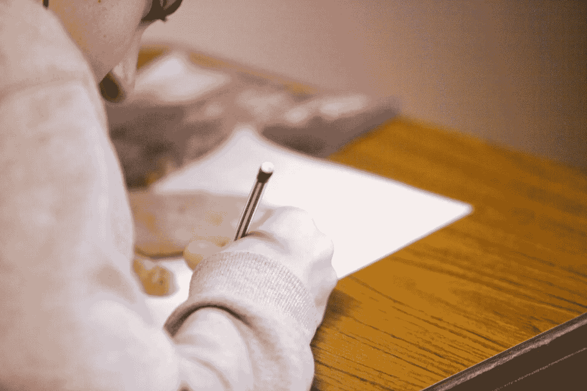

# 你的写作让你看起来很愚蠢

> 原文：<https://medium.datadriveninvestor.com/your-writing-makes-you-look-stupid-165c1a64b502?source=collection_archive---------17----------------------->

所以停下来做点什么吧！

Photo by [Jon Tyson](https://unsplash.com/@jontyson?utm_source=unsplash&utm_medium=referral&utm_content=creditCopyText) on [Unsplash](https://unsplash.com/s/photos/confusion?utm_source=unsplash&utm_medium=referral&utm_content=creditCopyText)

任何花时间在线阅读的人都会很快意识到文盲在成年人口中很普遍。

我是说真的。看看你在社交媒体上的信息流，你会发现大量真实的例子。如果你还没有注意到，你可能是那些写作如此可悲的人之一。

我知道作为一名职业作家和编辑，我可能看起来偏向有文化的人。事实上，我更喜欢阅读社交帖子和其他实际上可以理解的材料。

但事实是，即使许多专业作家也缺乏一些技能，这些技能在中学阶段是基本的英语(至少在我上学的时候，哦，那是很久以前了)。原因可能是这些曾经重要的写作技巧不再被强调。

# 降低一代人的智商

不久前，我从事教育工作，首先是教那些数学不好的中学生，后来是 6-8 年级的写作教练。我亲眼目睹了拼写、标点和语法在课堂上或复习写作作业时很少被提及。

Photo by [Ben Mullins](https://unsplash.com/@benmullins?utm_source=unsplash&utm_medium=referral&utm_content=creditCopyText) on [Unsplash](https://unsplash.com/s/photos/school?utm_source=unsplash&utm_medium=referral&utm_content=creditCopyText)

甚至就在今天，一位身为杰出作家的现任英语教师证实，拼写和标点符号技能并不是英语教师被告知要强调的优先“标准”。值得庆幸的是，他和其他几位优秀的同事确实把这些基本的写作技巧放在了更高的优先位置。

但是，绝大多数学龄儿童使用几乎没有标点符号的短信语言(Yas eye du 2)交作业怎么办？我不敢想象当这些“学生”进入现实世界，必须用文字交流时，未来会是什么样子。

# 写作错误会让你显得愚笨

作为一名数字文案和编辑，我比大多数人阅读更多；尤其是网上文案。很多时候，我读到的(或努力读到的)东西会让我不寒而栗。在你认为我是文学势利小人之前，请听我说完。你知道，我也知道，当你的文章给人的第一印象是，如果充满了拼写错误的单词、不正确的标点符号等等，你会显得很笨拙。你的写作让你看起来很愚蠢。

Photo by [Tim Mossholder](https://unsplash.com/@timmossholder?utm_source=unsplash&utm_medium=referral&utm_content=creditCopyText) on [Unsplash](https://unsplash.com/s/photos/school?utm_source=unsplash&utm_medium=referral&utm_content=creditCopyText)

现在你我都知道，我们的许多熟人、朋友和家人一点也不愚蠢。也许你认为自己的智力高于平均水平。你可能是，你的朋友也是，他们各自领域的专家，被广泛认为是某个行业的顶尖人物。与你或这些人的一次交谈就足以让你知道你和他们至少有几分智慧，如果不是高度智慧的话。

但是…你的，或者他们的，写作技巧是欠缺的。

# 写作中的常见错误

为了帮助那些实际上已经读到这里并真心希望在社交媒体和其他书面交流中不再像穴居人一样出现的人，以下是我在日常写作中看到的一些最常见的错误。

这在社交媒体、电子邮件、聊天对话和其他必须输入和阅读的商务交流中都是如此。学会发现这些错误，并在按下“发送”之前纠正它们，你的智力评级将会上升。

## 拼写错误的单词

看在上帝和一切美好事物的份上，学学怎么拼写吧！大多数在线平台甚至用红色给拼错的单词加下划线，以便于注意和纠正。利用这一点！没有什么比只是不停地打字，让字母掉在它们可能掉的地方更令人困惑和愚蠢的了。

花一点时间，使用正确的拼写。纠正错误。避免在书面交流中使用别人会读到的短信术语。偶尔的拼写错误是可以原谅的；当它是你正常的交流模式时，它会比你预期的交流更多，而且不是积极的。

## 不正确的用词

其他问题是发音相似但拼写不同的单词，意思不同；大多数人就是不知道这两者的区别——这让他们显得不聪明。以下是一些例子:

*   具体(非太平洋；那是一大片海洋):说得够多了。
*   Are 和 our:一个是冠词，一个是所有格代词。
*   熊和裸:一个是动物或者是扛东西，一个是光着身子。
*   称赞和补充:一个是很好的评论，另一个是船上的船员或与其他事物很相配的事物。
*   影响和效果:一个是已经发生的名词，一个是正在发生或将要发生的动词形式。
*   那里，他们的，他们是:一个是地点，一个是所有格，第三个是“他们是”的简称。
*   接受和除外:一个意味着接受或让步，另一个意味着排斥。
*   Its 和 It's:一个是所有格，另一个是“It ' s”的简称。
*   Then 和 than:一个表示一个时间点，另一个区分两个事物。
*   Which and that:一种不加区别地连接单词或表示特定的对象，另一种强调后面的单词，需要使用逗号。
*   Your 和 you 're:一个是所有格，另一个是“you 're”的简称
*   Were 和 We are:一个表示过去的事情，另一个是“We are”的缩写。

## 撇号用法不正确

许多人很难正确使用撇号。这个重要的标记完全改变了一个单词或数字。你可能已经注意到上面的一些问题单词在某种形式上有一个撇号。这里有一些撇号很重要的例子——我经常看到的例子。

*   Kit 的——这使得这个词具有所有格(kit 拥有某些东西:“这是 kit 的话，不是我的”)。Kits 是复数，意思是不止一个工具包(“我们为整个年级订购了许多工具包”)。
*   其他常见的例子有:母亲、母亲的、母亲的——母亲是复数(不止一个母亲)；母亲的是占有欲(属于母亲)；而 mothers '是复数所有格(属于一群母亲)。
*   20 世纪 20 年代——这也让这个数字显得有所有格，好像 1920 年可以拥有某些东西(我猜有人会说，“20 世纪 20 年代的时尚包括 zuit 套装”)。提及一段时间的正确方式是简单地加上一个“s”——在 20 世纪 20 年代，时尚是浮华和讲究的。"

# 用你的写作给人留下更好的印象

在数字时代，越来越多的人通过书面语言交流，你的写作很重要。给主管、客户或同事的工作邮件，给客户或股东的报告，对未来工作的书面评估——所有这些以及更多可能是别人对你的第一印象。你给人留下了什么印象？

花一点额外的时间，集中精力写清楚。玩一些文字游戏，扩大你的词汇量。偶尔读一本好书，注意作者如何使用某些单词。去谷歌搜索“定义:—一个单词”来查看一个不熟悉的单词的正确拼写和用法。

[How to Write Well: 2nd Edition](https://amzn.to/3biYaF5)

最后，如果写作对你所做的事情或你希望成为的人非常重要，那就去拿我的书 [***如何写好:第二版***](https://amzn.to/3biYaF5) 。它包含实用的帮助，将在短短 30 分钟内提高你的写作，加上更正式的写作伟大的参考材料。它有印刷版、数字版和音频版，而且非常便宜。

写得好并不难，而且它能让别人如何看待和接受你产生巨大的差异。

*欲了解更多关于我的书籍或数字文案和编辑业务，请访问*[*www.michaeldstover.com。*](http://www.michaeldstover.com.)