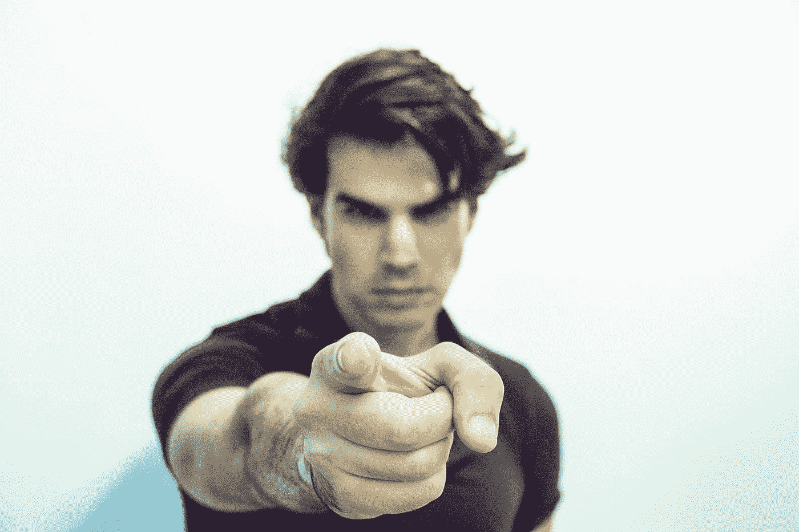

# 你是个伪君子，这正在摧毁民主。原因如下。

> 原文：<https://medium.datadriveninvestor.com/youre-a-hypocrite-here-s-why-7f92a28cd9b0?source=collection_archive---------30----------------------->

我也是。

Photo by [Adi Goldstein](https://unsplash.com/@adigold1?utm_source=medium&utm_medium=referral) on [Unsplash](https://unsplash.com?utm_source=medium&utm_medium=referral)

想象你几周前参加了第一次关于“认知训练”的心理学实验。今天是后续会议。你刚刚到达，被带进一个小等候室。在里面，你发现两个人已经坐好了。有一把空椅子，你坐下。

一分钟后，一个拄着拐杖、脚上穿着靴子的人走进了房间。她注意到没有空位了，叹了一口气，然后靠在墙上，显然很不舒服。

你迅速看了一眼另外两个人。他们都不理她。

你是做什么的？

你会把你的椅子让给这个明显需要的人吗？或者，你会模仿其他人的做法，假装这个问题不存在吗？

如果你认为你会把你的椅子让给她，那你可能错了。这项研究发现，只有 14%的参与者把他们的椅子让给了明显需要的人。我们先说清楚，那只是七分之一的人！

当然，这个场景是一个诡计。另外两个坐着的人是演员，那个“处于困境”的人也是演员。测试也不太公平。有种东西叫做 [*旁观者效应*](https://en.wikipedia.org/wiki/Bystander_effect#Variables_affecting_bystanders) ，如果有其他人在场，你就不太可能去帮助别人。

但是，从外面看，86%的人看起来像混蛋，不是吗？

你可能会忍不住说，“是啊，大多数人类*都是*混蛋！”，但我们尽量不要妄下结论。毕竟，你可能不认为自己是个混蛋。也许你做过混蛋的事情，但这并不意味着你的灵魂上烙上了“混蛋”的印记，对吗？

但是，有趣的是，我们更倾向于给其他人贴上“混蛋”的标签，而不是我们自己或我们感觉相似的人。难道我们不喜欢对他人道德上的虚伪感到愤怒，同时对发生在自己身上或我们认同的人身上的虚伪视而不见吗？

这说明了我们什么？为什么我们每个人都认为自己不会道德沦丧？最重要的是，我们该怎么办？

 [## 全民或跨州的国营保险私人医疗保险:经济学…

### 我们目前生活在一个所有非医疗行业都痴迷于…

www.datadriveninvestor.com](https://www.datadriveninvestor.com/2020/05/21/state-run-insurance-for-all-or-across-the-state-lines-private-healthcare-coverage-economics-politics-social-mix-up/) 

# 我们都是道德伪君子

想象你正在参与另一项研究。你被带进一个房间，坐在电脑前。研究者告诉你有两个任务。“绿色”任务大约需要 10 分钟，包括一次拍照。“红色”任务大约需要 45 分钟，由逻辑问题组成。你可以根据自己的喜好给自己分配一个任务，或者用电脑随机给你分配一个。有什么问题吗？如果你执行“绿色”任务，下一个参与者将执行“红色”任务，反之亦然。

然后，研究人员离开房间。

你会怎么做？

更重要的是，你觉得怎样才算公平？

研究人员让一些参与者做决定，另一些参与者看着演员为自己选择“绿色”。然后，参与者按照从 1(“非常不公平”)到 7(“非常公平”)的等级，对他们的行为公平程度或演员的行为公平程度进行评级。选择“红色”或者让电脑给他们分配任务的参与者被排除在结果之外。

当给自己的行为打分时，也就是选择“绿色”任务时，参与者给自己的公平性打了大约 4 分。然而，当给其他人的行为评级时——也就是选择“绿色”任务的演员——参与者给他们的公平性评级约为 3。

有趣的是，如果参与者感觉与他们正在观察的演员相似，他们会给演员的行为评分略高于 4。另一方面，如果参与者被要求感觉与演员不同，他们会给演员的行为打 3 分以下的分数。

因此，作者[得出结论](https://static1.squarespace.com/static/52853b8ae4b0a6c35d3f8e9d/t/528d2625e4b059766439b916/1384982053230/moral-hypocrisy-social-groups-and-the-flexibility-of-virtue.pdf):

> 在基本层面上，保持积极的自我形象似乎胜过使用更客观的道德原则。然而，同样令人不安的是，虚伪的污点积极地蔓延到群体层面的社会认同，这样做可能会加剧群体间的不和。

这意味着我们如何评估道德行为取决于我们与实施这些行为的人的关系。我们倾向于认为自己拥有永恒不变的道德准则。我们错了。

为什么会这样呢？

相同的作者进行了一项后续研究来回答这个问题。他们怀疑的是人们*合理化*——也就是说，为自己的行为找借口，而不是其他人的行为。

因此，当参与者再次被要求评价相同行为的公平性时，研究人员让参与者的理性思维专注于他们所谓的*认知负荷*。在这种情况下，这意味着参与者被要求在回答问题时记住并报告一系列 7 位数的数字。

研究人员发现，在认知负荷下，参与者对自己的行为与其他人的行为没有任何不同。他们得出结论:

> 在正常加工条件下，伪善很容易出现，但在认知约束条件下，伪善会消失。

那不是很有趣吗？我们对道德和公平的直觉是一致的——但正是我们的理性思维扭曲和歪曲了环境，把我们变成了伪君子。

# 对抗我们内心的道德虚伪

我们到处都能看到伪君子。新闻和社交媒体充斥着人们自以为是地声称一件事，而实际上却做了相反的事情的故事。令人惊讶的是，我们对道德是如此敏感，除了对我们自己最重要的地方。

如果你从这篇文章中有所收获的话，我希望你不能从这个令人不安的事实中解脱出来。不相信我？下次你判断自己或他人的行为时，只需观察你的思维。你将看到的是你的大脑争先恐后地以一种支持你已经相信的方式解释信息——那就是你和你同意的人是“好人”，而所有其他人都是“坏人”。

问题是，它不会奇迹般地自我修复。社会的两极分化是因为我们没有人认识到自己的虚伪。这里事关重大。甚至可能是民主本身。

所以，下次你看到有人行为不道德时，不要急于做出判断。退一步，问问你自己，如果你过去没有类似的行为。你可能会意识到他们和你没什么不同。

*感谢阅读！*

## 访问专家视图— [订阅 DDI 英特尔](https://datadriveninvestor.com/ddi-intel)