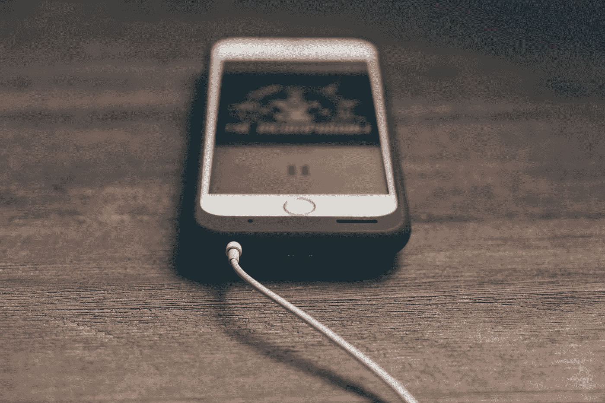

# 作为作家，你还不到 1%

> 原文：<https://medium.datadriveninvestor.com/youre-not-even-at-1-yet-as-a-writer-ec07de51ea8?source=collection_archive---------43----------------------->

## 你还没有发掘出你真正的才华。

Photo by [Álvaro Serrano](https://unsplash.com/@alvaroserrano?utm_source=medium&utm_medium=referral) on [Unsplash](https://unsplash.com?utm_source=medium&utm_medium=referral)

作为一名作家，你还不到 1%。

让它深入人心。

这么久以来，你一直在写作游戏中努力尝试，但都以失败告终。每一关都在吞噬你，之后就没有生命了。你胆怯地等待一个大的“游戏结束”的标志出现在你的屏幕上，确认你的写作水平有多糟糕。

好吧，让我告诉你:那个屏幕认为你是一个机器人。

# 我认为你还没有充分认识到自己作为一名作家的潜力，所以现在是时候给自己加点油了。

我过去一直对我的写作感到沮丧。

我认真对待我的写作生涯已经有六个月了，我每天都在写作。到目前为止，似乎没有任何回报。我的意思是，我知道我现在是个糟糕的作家，但我想六个月会给我一盎司的体面。有时候我觉得一个从来没有写过博客的三岁小孩可以写五个字然后当场杀了我。

每当我对自己的博客生涯感到恶心的时候，我都会得到一些有意义的建议:选出你最喜欢的作家。从头开始，挑选任何你欣赏的有大量追随者的内容创建者，然后浏览他们的档案。

你可能会滚动很长时间。他们持续工作的时间之长会让你大吃一惊。

也许我对自己太苛刻了，但证据就在布丁里。我没有发挥出作为作家的全部潜力。

但问题是。

# 人类不是 iPhones。

在互联网上成名让我们变成了我们最害怕的东西——机器人。

在过去的十年里，我们有幸目睹了技术的突破性进展。对世界来说，iPhone 已经成为一块巨大的宝石。人们持续使用它们，通过与朋友快速聊天和观看网飞来耗尽电池寿命，然后他们拿出方便的充电器，希望在一小时内恢复到 100%的电量。

好消息是什么？iPhone 充电到 100%通常需要一个小时。

坏消息呢？这不是真实的生活。

如今，我们期望一切都变得如此之快，以至于我们忘记了人类是如何工作的。人类不是技术。我们生来不是完美的。我们有缺点，而人类生活的美正在克服这些缺点。

我知道这句话已经被滥用到骨子里了，但是“罗马不是一天建成的”。然而，重要的是要注意到**人类建造了罗马，而不是科技**。尽管他们有很多缺点，但他们从不放弃。这不仅创造了有史以来最有影响力的文明之一。[它创造了延续 1000 多年的文明](https://www.google.com/search?safe=strict&sxsrf=ALeKk01APmQQ9aROMMWBO_NaHHFjiC9jbA%3A1610085333729&ei=1fP3X8T_K4_Y5gKxq634CA&q=how+long+did+rome+last&oq=how+long+did+rome&gs_lcp=CgZwc3ktYWIQARgAMgoIABDJAxAUEIcCMgcIABAUEIcCMgIIADICCAAyBAgAEEMyAggAMgIIADICCAAyAggAMgIIADoHCCMQ6gIQJzoECCMQJzoECC4QQzoLCC4QsQMQxwEQowI6CgguEMcBEK8BEEM6CAgAELEDEIMBOgcIABDJAxBDOgIILjoICAAQyQMQkQI6BQgAEJECUJsiWLMzYNs_aAFwAXgAgAGNAYgB1g6SAQQzLjE0mAEAoAEBqgEHZ3dzLXdperABCsABAQ&sclient=psy-ab)。

# 克服你的缺点，创造一个漫长的写作生涯。

iPhones 最糟糕的一点就是只能用几个小时就没电了。

非常坦率地说，iPhone 越早充电，它就会越早死亡(我以前也遇到过这个问题)。就像那些流行作家一样，在网上疯传 2.5 秒钟，然后渐渐被遗忘。当然，他们的个人资料现在比你的快得多，但很快他们就会感到沮丧，他们不能再像病毒一样传播，在没有意识到他们的全部潜力之前就放弃了。他们想要快速充电插头的好处，然后当他们烧坏了它，它不能像以前那样快速达到 100%时，他们会感到不安。

你的充电时间肯定会更长。比你想象的要长得多。但是你只是一个普通人，要达到 100%需要很多年。这并不是要打击你，而是要让你对未来充满信心。

你可以像罗马人一样建立自己的帝国。想想很疯狂，但它确实发生了。你可以建立一个经得起时间考验的成功的写作生涯。想想还是很疯狂，但它发生了，为什么不是你呢？

# 最后的想法

你又不是快充 iPhone。你是一个有缺点的人。这样做只会让旅程更加甜蜜。

每当你看到那个可怕的“游戏结束”标志时，把你的眼睛移到屏幕的底部，看到“再玩一次”选项就在你面前。继续玩下去，这样无论需要多长时间，你都可以累积电量。

然后也许，你可能会达到 100%。