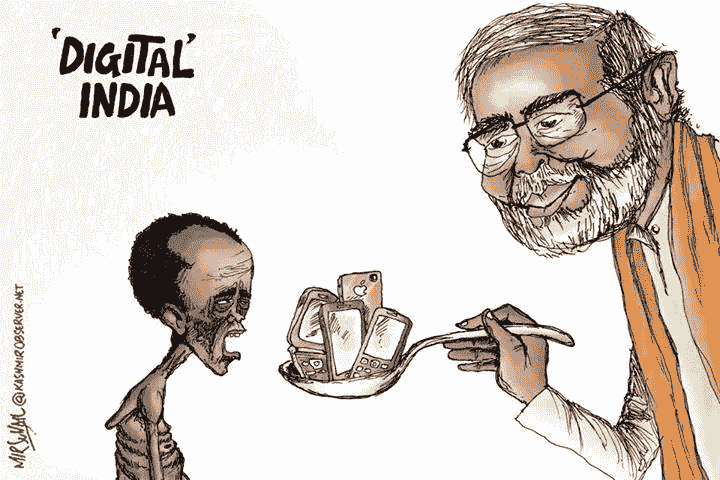
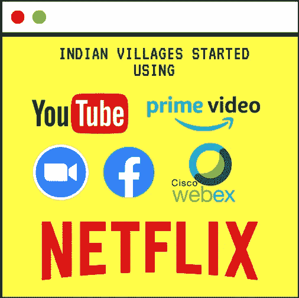
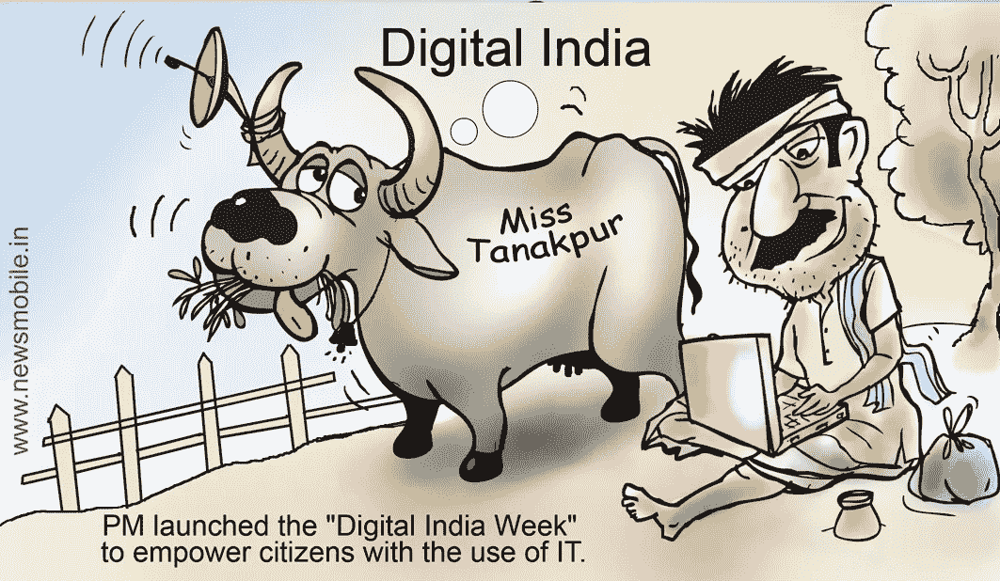

# Youtube、脸书和网飞推动印度农村的互联网使用

> 原文：<https://medium.datadriveninvestor.com/youtube-facebook-netflix-drive-rural-indias-internet-usage-5673d41d6889?source=collection_archive---------15----------------------->

印度的村庄开始使用互联网。在农村地区，他们采用技术和采用互联网的人数日益增加。Youtube、脸书和网飞的大部分在线内容也能在农村看到。政府采取了各种方案，使农村能够接入互联网。

我的朋友巴布·雷迪(Babu Reddy)是一名村级企业家，他经营着一家数字信息亭****(一种技术服务自动售货机)或[**公共服务中心**，](https://csc.gov.in/)现在正在利用 [**BharatNet**](http://www.bbnl.nic.in/) 光纤主干网为市民提供高速光纤到户连接，这正在改变村民的生活，尤其是他们的年轻人。****

****三月份，超过 30 万名用户注册了从 [**到**](http://www.bbnl.nic.in/) 的**光纤到户**连接，而迄今为止**120 万**用户已经订阅了其 **Wi-Fi** 服务。****

********

## ****安得拉邦 Chittoor 区的 Nandanam 村以前从未体验过互联网连接。****

# ****新冠肺炎疫情加快了互联网在农村地区的渗透。****

****根据来自 [CSC 电子治理服务](https://csc.gov.in/)的数据，连接到 [**BharatNet**](http://www.bbnl.nic.in/) 光纤主干网的 [**行政区的数据消耗已经从 1 月份的每月约**55tb**增加到 5 月份的每月**150 TB**，该服务自 2011 年 7 月以来一直通过 BharatNet 网络向 gram 行政区提供最后一英里的连接**](https://chittoor.ap.gov.in/)****

****

# **“随着市民通过公共服务中心访问 BharatNet，农村地区的互联网消费显著增加。由于新冠肺炎封锁而施加的限制也导致了需求激增，这表明农村地区有大量被压抑的需求，而这些需求在早些时候没有得到满足，”**

**自 [CSC 电子政务服务](https://csc.gov.in/)成为最后一英里运营问题的监管者以来，它帮助了服务的快速推出和维护。**

**就消费趋势而言， **YouTube** 使用最多，其次是**脸书**和**网飞**。与一月份相比，三月份 YouTube 的使用率增长了 38%。

脸书等社交平台同期增长 30%，而网飞为 42%。

亚马逊的内容流媒体平台**[**Prime**](https://www.primevideo.com/)， **Instagram** ，视频会议工具 **Zoom** ，以及 **Webex** ，连同 **Twitter** ，都是前 10 榜单中的其他热门应用。总理纳伦德拉·莫迪在他的政府完成第二个任期一年的前夕写了一封公开信，他说:“政府的政策缩小了城乡生活的差距。农村地区的互联网用户数量首次超过城市地区 10%。”

2019 年**7 月**，当 **CSC 电子政务服务**专用车辆接管时，只有大约**22000 克的村务委员会**实现了互联网接入。现在，随着近 **100，000 个运行中的村务委员会**，通过其 [Wi-Fi Choupal 计划](https://www.wifichoupal.in/)，农村地区的最后一英里互联网连接运动得到了加速。****

# ****“这将不仅有助于创建一个数字包容性社会，而且有助于获得政府和非政府服务，如远程医疗、银行、远程农业、远程法律等”。****

# ****感谢您阅读这篇文章。随时欢迎反馈。如果你喜欢它，请点击拍手按钮，并分享这篇文章。****

****你可以在 [LinkedIn](http://www.linkedin.com/in/tejmaddimsetty) 上和我联系****

****[Tej Maddimsetty](https://medium.com/@tejmaddimsetty)****