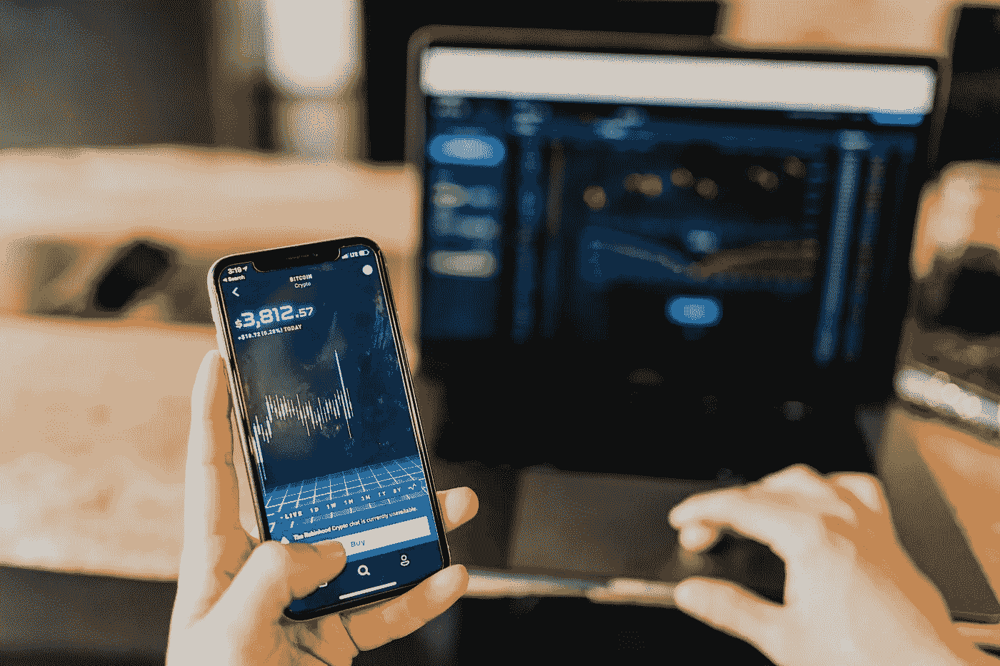
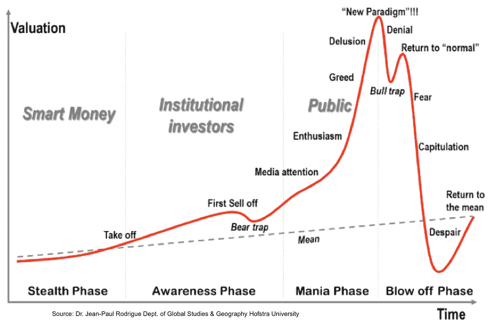

# 订阅区块链新闻和市场分析的 YouTubers

> 原文：<https://medium.datadriveninvestor.com/youtubers-to-subscribe-to-for-blockchain-news-market-analysis-c217b0c11782?source=collection_archive---------18----------------------->

## 产生一致新闻、市场更新和分析的渠道

Photo by [Austin Distel](https://unsplash.com/@austindistel?utm_source=unsplash&utm_medium=referral&utm_content=creditCopyText) on [Unsplash](https://unsplash.com/s/photos/cryptocurrency?utm_source=unsplash&utm_medium=referral&utm_content=creditCopyText)

我是一名区块链开发者，但几年前我第一次被疯狂的市场运动吸引到这个行业。很难不被价格行为冲昏头脑。大起大落，如果你在正确的时间出现在正确的地方，真正有可能赚到大钱。

2018 年的大泡沫破裂对我来说是一个可教的时刻。我控制住了自己的情绪，以为价格会永远上涨，就像很多人一样。我被烧伤了。不像很多人那么糟糕，但我还是被烧伤了。

Market cycles

尽管经济低迷，我仍然对区块链感兴趣。因此，我花了大约一年时间不去看价格，一头扎进学习区块链开发。无论如何，我是一名专业的软件工程师，所以它是技能和兴趣的完美结合。

 [## 科罗拉多州正在成为亲加密法规|数据驱动投资者的领导者

### 科罗拉多州已经成为区块链公司的滋生地和避风港。新任命的…

www.datadriveninvestor.com](https://www.datadriveninvestor.com/2019/03/22/colorado-is-emerging-as-a-leader-in-pro-crypto-regulations/) 

价格回归均值后，媒体不再提及比特币，我接受了前一年的亏损。我对新项目的兴趣又开始增长了。

Crypto 就像一个兄弟会。一旦你进去了，你就永远不会真正出来。你内心深处总是有那种不安。“我想知道自从 *y* 发生后 *x* 的价格走势如何”，“负责 *x* 的团队现在肯定已经发布了他们对 *y* 的更新，我最好仔细阅读一下”。

在 2017 年泡沫期间，有很多专门向粉丝宣传某些硬币的抽水转储频道，让他们获得巨额利润。**我不推荐那些类型的渠道。**

在价格下跌期间我去上班的路上，我发现有几个 Youtubers 用户每天都在发布来自 crypto 的最新消息。以下是我发现的最有用的频道列表，至今我仍在观看和收听。

**注:** *我，也不是这些渠道的人，都是理财顾问。所有提供的信息都是基于观点的。*

# [现代投资者(TMI)](https://www.youtube.com/channel/UC-5HLi3buMzdxjdTdic3Aig)

TMI 的目标是让普通人更容易理解加密技术。他通过浏览无止境的加密新闻网站的标题来制作新兴行业的每日新闻内容。

他的背景是传统金融。他经常回忆起自己已经着手的其他投资策略，比如艺术品和房地产。就他的秘密投资哲学而言，他倾向于坚持大盘股，因为它们比小盘股更安全。

# [数据破折号](https://www.youtube.com/channel/UCCatR7nWbYrkVXdxXb4cGXw)

尼古拉斯是一个数据驱动的市场分析师，因此得名。他专注于从技术上分析较大硬币的价格行为，以及在像 Coin Market Cap 这样的大市场网站上不容易找到的指标。他用简单的语言解释策略的能力让学习技术分析变得不那么令人畏惧。

他是一名出色的研究员，深入研究项目白皮书。你会不时看到他介绍刚进入这个领域的新项目。

# [地穴 0](https://www.youtube.com/user/obham001)

Crypt0 类似于 TMI，因为他每天都制作关于加密领域最新消息的内容。有时你会在直播中看到他播报新闻、价格走势，并与观众互动。

他还采访了一些大型加密项目的有影响力的成员和行业专家，了解他们正在从事的工作，对区块链世界的见解以及未来的预测和期望。

# [年轻而投资](https://www.youtube.com/channel/UCczMw5XzxxVks7sNaC-QxwQ)

Quinten 审查加密项目，并对它们在市场上的可信度和寿命做出判断。他还制作关于最新新闻和市场趋势的视频。

年轻人和投资者倾向于发布不太正规的视频，而不是日常内容，但它们的质量总是很好。

# [山寨币嗡嗡声](https://www.youtube.com/channel/UCGyqEtcGQQtXyUwvcy7Gmyg)

这是这份名单中唯一一个由组织而非个人运营的频道。Altcoin Buzz 涵盖了 crypto 大玩家的每日新闻和技术分析。它们是由社区领导的，由密码领域的热心成员推动。

# 进一步阅读

如果你对区块链开发感兴趣，我会写一些关于如何开始和建立投资组合的教程、演练、提示和技巧。查看以下资源:

 [## 区块链开发资源马上跟进

### 学习区块链、以太坊和 DApp 开发的资源列表

medium.com](https://medium.com/blockcentric/blockchain-development-resources-b44b752f3248)