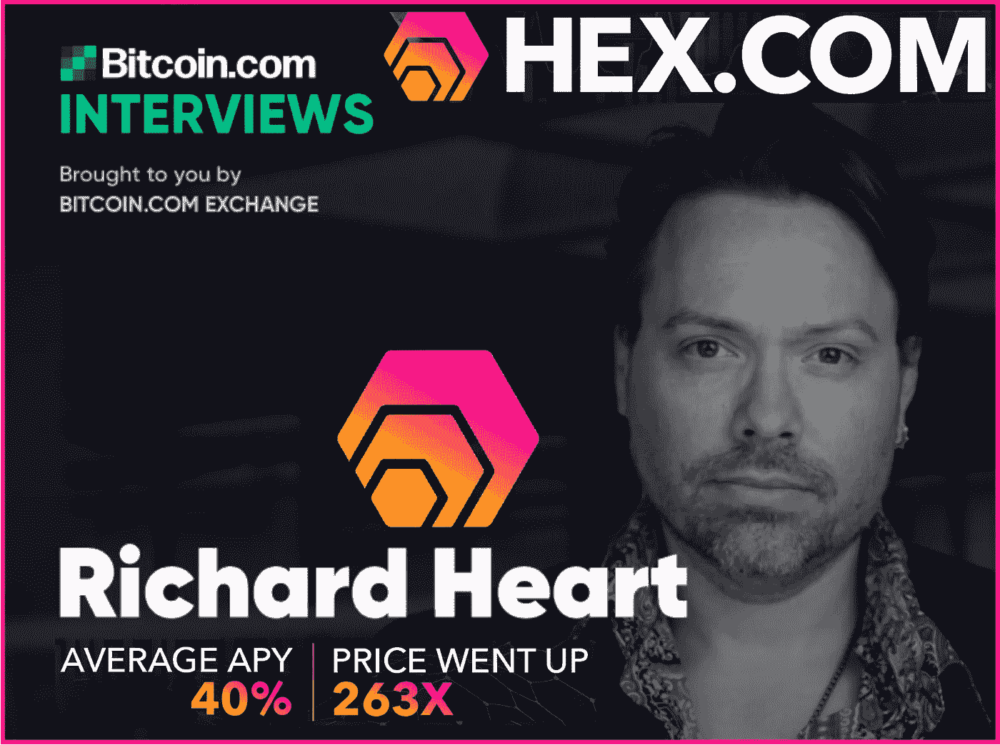
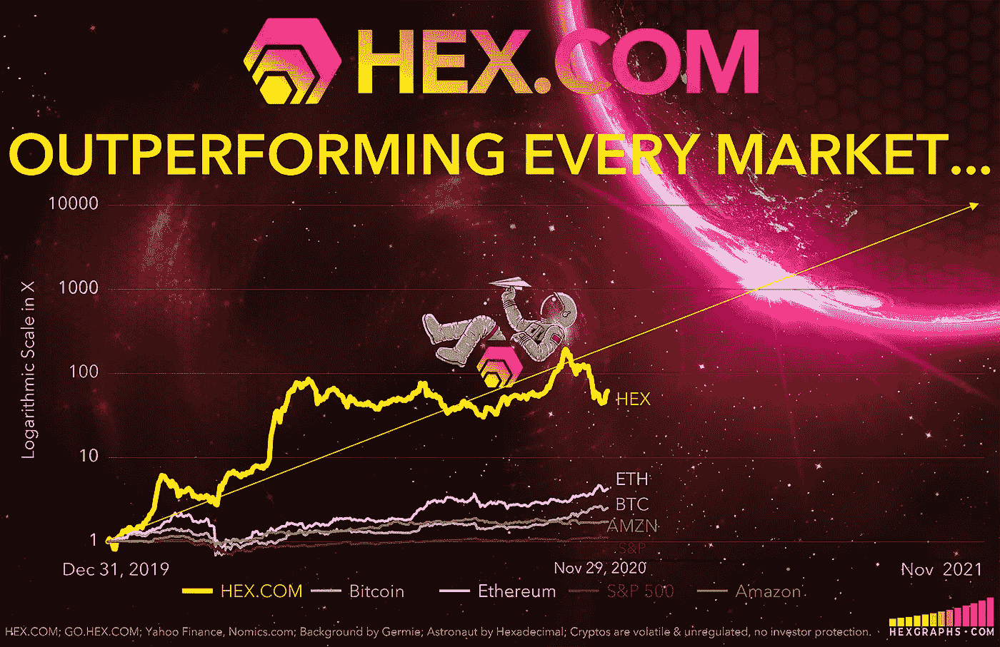
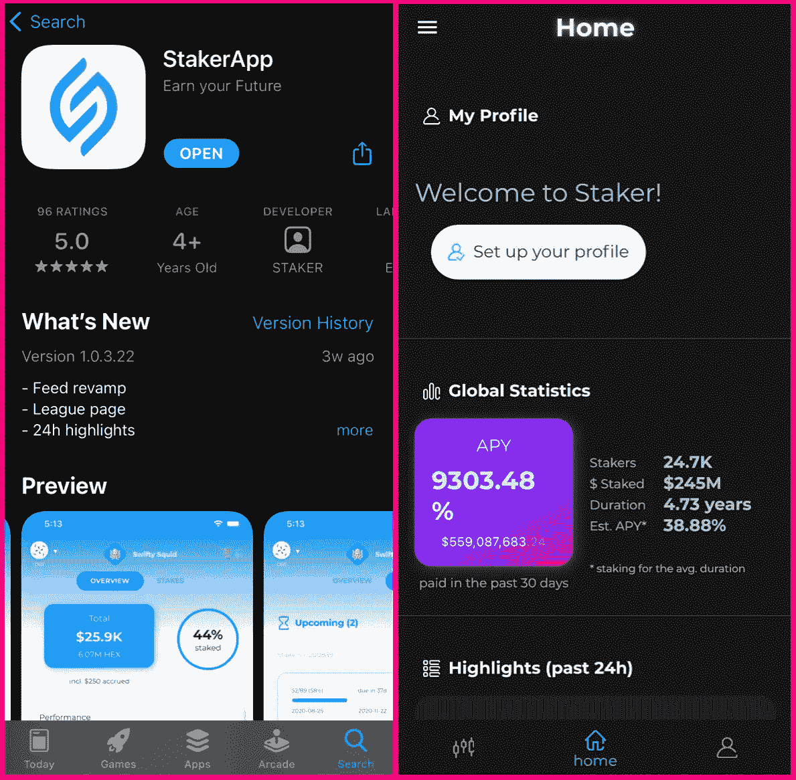
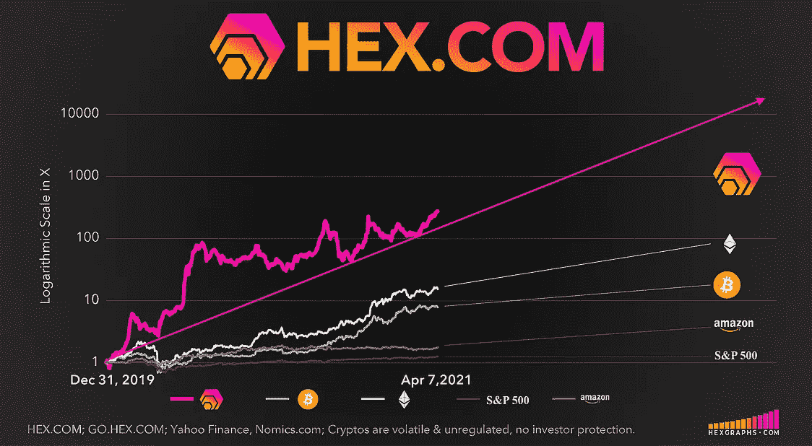
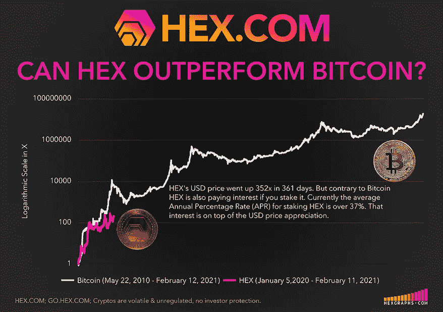
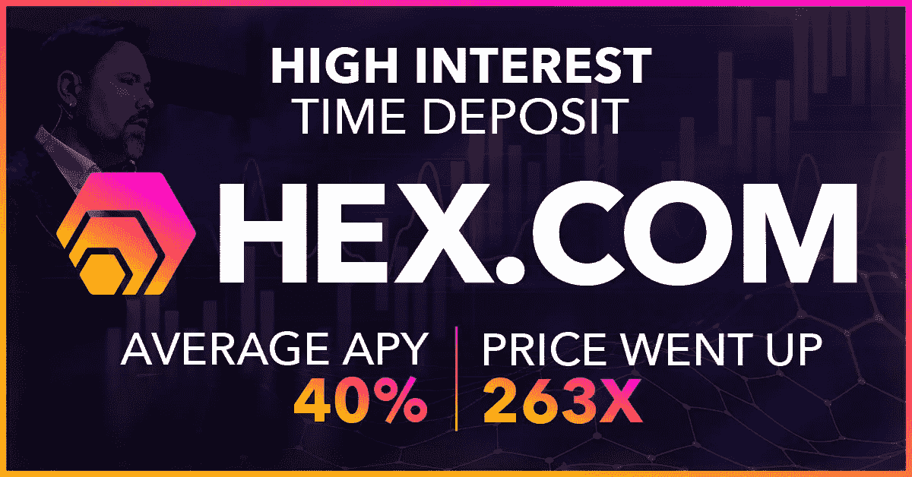
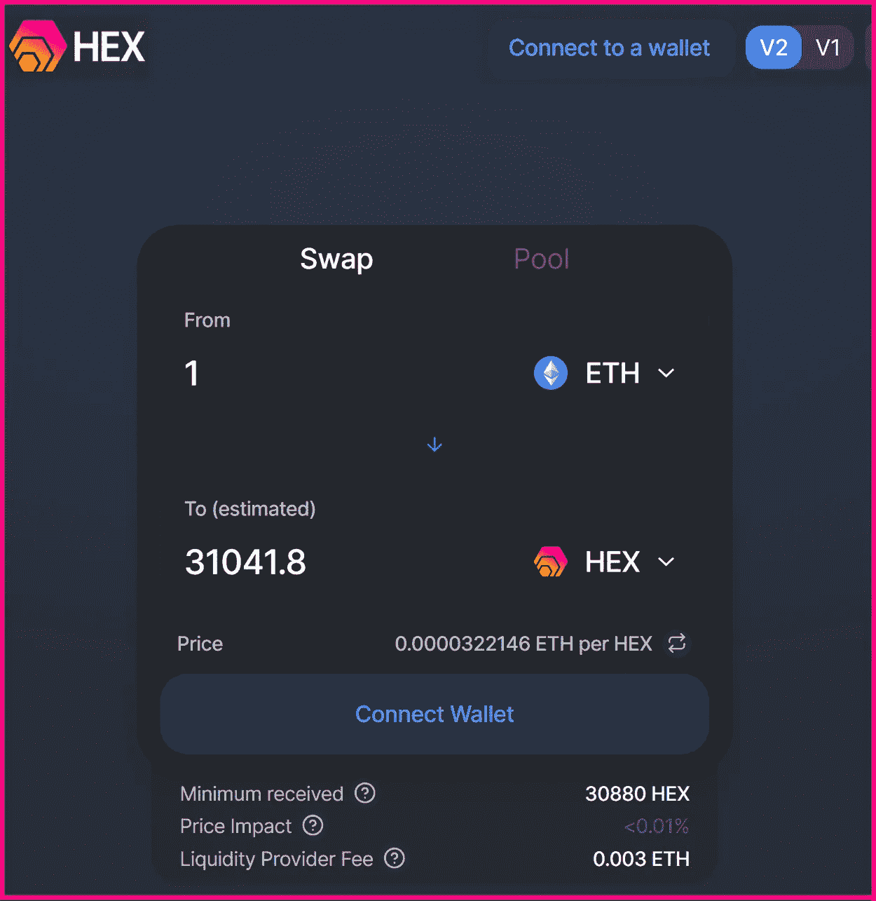
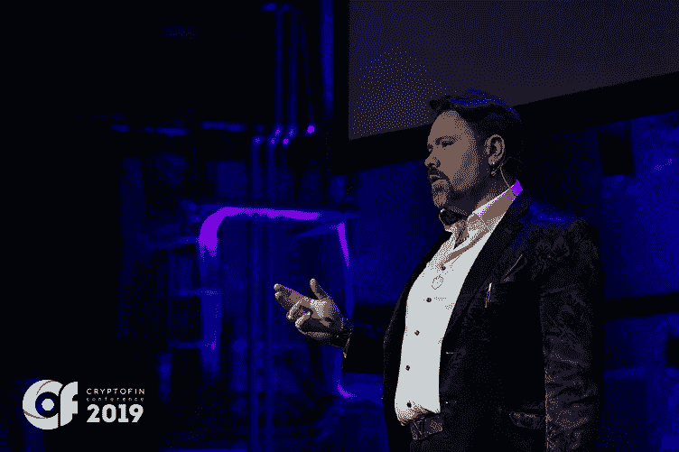
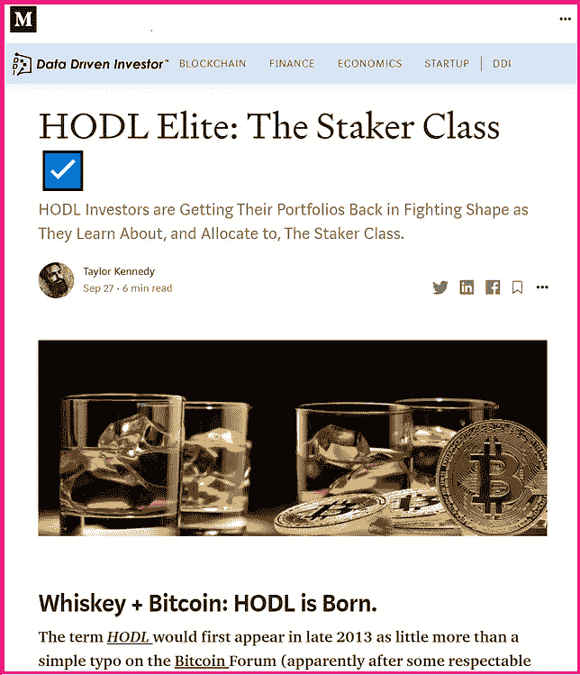
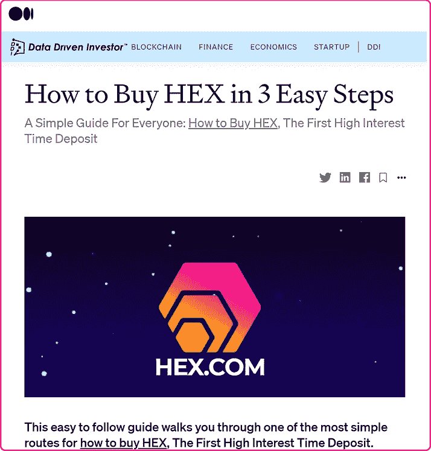

# “你完成了不可能的事情，”HEX 的创始人理查德·哈特在 Bitcoin.com 主持的节目中说

> 原文：<https://medium.datadriveninvestor.com/youve-done-the-impossible-declares-bitcoin-com-host-to-richard-heart-founder-of-hex-dd95a3526063?source=collection_archive---------0----------------------->

## 高度知识性、刺激性:Bitcoin.com 播客主持人 Dustin Plantholt 与 HEX 的创始人 Richard Heart 坐在一起

以下是原文的摘录。完整的采访请查看 Bitcoin.com 播客网[*。*](https://podcast.bitcoin.com/e943-Richard-Heart-Founder-of-HEX-Coin)

## 达斯汀·普兰霍尔特:

**你怎么会有这个想法，什么是 HEX？**

## [理心](https://wikitia.com/wiki/Richard_Heart):

我从 2011 年初就开始研究比特币了。我自己开采过完整的区块，当时有 50 个比特币区块奖励。我是一个连续创业者。2003 年我退役了；开始环游世界；拥有 150 名员工；我是一个白手起家的人，成功地做了很多事情，而巫术是其中的一个。

如果你想取代银行，你必须取代它们所有的产品。最受欢迎的产品是什么，或者说是其中之一:定期存款。美国和中国有 7.2 万亿美元的定期存款；只有 5 万亿美元的印钞。因此，这是一个比现金大 50%的市场，而这正是比特币旨在取代的市场。HEX 面向更大的市场，而且意外的是现金部分比比特币做得更好。

> 如果你想取代银行，你必须取代他们所有的产品，最受欢迎的产品是什么，或者是其中之一:定期存款。

HEX 通过 zkSync.io 每秒可以做 2000 笔交易；可以通过[t.me/HEXnado](https://t.me/hexnado)匿名，零知识证明；你也有 13 秒的区块，这意味着你可以在 13 秒内完成一笔交易，而不是比特币需要的 10 分钟——一切都更好。

所以更快，更安全，更便宜，吞吐量更高，性价比更好。到 2020 年，HEX 是比特币的 70 或 80 倍。今年以来，它已经高达我认为的 140 倍(相对于比特币)。

如果你在 1 月 5 日买入并持有到现在，你可以回购 50 倍于你开始时的比特币，并且仍然有相当数量的 HEX 剩余。这只是一个非常优秀的产品。

## Plantholt:

你认为这是什么原因？那是纯粹的推测，还是那是效用？

## [理心](https://wikitia.com/wiki/Richard_Heart):

HEX 具有优越特性的原因是:1)它比比特币晚 10 年被发明，所以我们有学习的优势，并且看到了他们犯的错误；2)开始时更加雄心勃勃。

人们没有意识到比特币网络有多简单。它只有两个功能。你可以通过做一些消耗电力的事情来开采通货膨胀；或者你可以寄你从某个挖掘通货膨胀的人那里买的硬币。就是这样。有两个按钮:我的和发送。没有其他按钮了。

> 当矿工们拿到他们的比特币奖励时，你认为他们会怎么做？他们卖掉它们，然后倾销价格。在比特币中，矿工们拿走了回报，污染了环境，并压低了价格。

## **Plantholt:**

**所以你也认为会有很多激励矿工继续持有？**

## 心脏:

他们别无选择。矿业背后的经济模式是它不应该盈利，因为它是一种商品。在经济学中，开采一种资源的成本随着利润的减少而趋向于该资源的价值。因此，当比特币升值时，矿商会浪费更多的钱去购买它；当比特币价格下跌时，矿工们会关掉机器，因为他们不想赔钱。因此，只要它是一个高效的、商品化的系统，它就不应该那么有利可图。历史上并没有。任何持有硬币的人都比矿工表现好。矿工们四处破产，而且一直如此。

## Plantholt:

**你仍然长期看好比特币吗？**

## 心脏:

当然可以！我看好这个价格。我认为价格会上涨，但是技术是垃圾。它甚至不安全。人们认为比特币是安全的，因为它有很高的散列率，但他们很笨，我可以教育他们:加密货币的缺陷主要是软件缺陷；加密货币中的少数错误是散列率错误，顺便说一下，这也是一种保护诈骗。

当你付钱给一个矿工时，你认为你是在保护自己免受谁的伤害？你在保护自己不受他和他的伙伴的伤害，因为他们是唯一会攻击你的人。就像如果你在一个糟糕的地区开了一家餐馆，一些强壮的暴徒进来说，“如果今晚这里发生火灾，那将是一件可怕的事情。你应该付钱让我们保护你。”这是一回事。你付钱的人会攻击你。没有其他政党坐在一堆 SHA-256 哈希利率，你保护自己。这是保护费，而且很恶心。

所以在十六进制中，我们不支付矿工块奖励。我们不会付钱给污染环境的矿工。当你开始下注时，你开了 1 笔交易；1 交易当你结束你的股份。在此期间，没有管理费用，成本从几便士到一美元不等。

## Plantholt:

听起来这就是你创建 HEX 时想要解决的问题。

## 心脏:

其中一些。我想设计世界上升值最快的资产。为了做到这一点，我必须找到一个没有人涉足的未开发市场。我们是世界上第一家[区块链]定期存款银行。还有人做定期存款吗？没有。只有我们。怎么解决的？菲亚特的价格今年上涨了 263 倍。告诉我比特币什么时候会给你 263 倍的回报。不会发生的。在你有生之年不会。我们做到了。今年。我们准备做得更多。

> 我想设计世界上升值最快的资产。为了做到这一点，我必须找到一个没有人涉足的未开发市场。

人们没有意识到加密货币可以有多高。比特币从 1 美分涨到 2 万美元，涨了 200 万倍。以太坊从 0.15 美元涨到了 1，500 美元——两年内涨了 10，000 倍。所以比特币做了 200 万倍，以太坊做了 1 万倍，现在 HEX 只涨了 263 倍。这些是实数。

> 告诉我比特币什么时候会给你 263 倍的回报。它不会发生…好吧，我们做到了。今年。我们准备做得更多。

这是现实，当比特币上涨 10%时，人们很高兴，并希望比特币创下历史新高。谁在乎呢。你有百分之十的密码吗？我百分之一百的时间都在做加密，就像过去的好时光一样。就像我在比特币 30 美元的时候买回来，把它压到 2 美元。糟透了。但后来涨到了 1300 美元。我真幸运，对吗？

## Plantholt:

**那么这次跑步对你来说感觉如何？我是说，你很早就参与其中了。你是 OG 的一员。突然之间，从木匠到水管工，人们开始谈论“你拥有很多比特币吗？”对你来说，这是什么感觉？现在世界各地的人们都在谈论它，但在早期，只有几百或几千人。**

## 心脏:

现在完全不同了。当时，我们正在决定(比特币)的标志会是什么样子。我们正在决定比特币符号的 ISO 代码应该是什么；它应该向左倾斜，还是向右倾斜？这些都是关心隐私的人。

今天完全不同了。我相信所有比特币的 2%由一家只从美国合格投资者那里拿钱的公司所有，那么你实际上有什么？

## Plantholt:

**你认为那是为什么？当他们做出这样的声明时，却又加上限制，这是为什么呢？**

## 心脏:

他们对你控制自己的钱不感兴趣；他们对你有用自己的钱做自己想做的事情的自由不感兴趣。当权者对此不感兴趣。他们想巩固自己，留在中间，寻租。这是他们几十年来习惯做的事情。

我所了解和喜爱的比特币应该取代这些人，而不是赋予他们权力。你知道，现在当你购买比特币时，银行家拥有的比你多得多；这也是我喜欢 HEX 的部分原因，银行家不拥有它。人民拥有它。也许有一天会改变，但今天它很美。

## Plantholt:

**展望 HEX，你们近期和长期都在做什么，你们认为最终会推动价格上涨吗？**

## 心脏:

嗯，你看，妖术是一种有趣的动物。当你与其他项目的创始人交谈时，他们会用流行词汇和单词沙拉、希望和梦想、伙伴关系以及所有这些垃圾来打击你。这不是真的。在 HEX 中，我们做的正好相反。我们不期望从他人的工作中获利。没有路线图。没有中央实体。

HEX 中发生的好事我可以事后告诉你。
⠀
我不会对将要发生的事情做前瞻性的陈述。所以我可以告诉你*发生了什么*，也许这给了你一些可能会继续发生什么的提示。

# ⠀⠀

> 当你与其他项目的创始人交谈时，他们会用流行词汇和单词沙拉、希望和梦想、伙伴关系以及所有这些垃圾来打击你。这不是真的。在 HEX 中，我们做的正好相反。我们不期望从他人的工作中获利。

现在手机上有个 app，iOS 和 Android，叫 [Staker.app](https://staker.app/) 。你可以实时看到谁在买，谁在卖，谁在下注，持续多长时间，谁在赚钱，谁在赔钱，谁在紧急情况下下注，你和其他下注者的排名，这里面有联盟。几周前刚出版的。

Staker.app for iOS and Android

使用第二层每秒 2000 笔交易:我们是世界上第一个在第二层进行 250，000 人空投的公司。从来没有人这样做过。如果你想用 zkSync.io，就叫它 zksync . io。如果你想让你的硬币更加私有化，我们可以在 t.me/hexnado 匿名；它们从一开始就是伪匿名的，但如果你除了匿名还想要真正的隐私——你可以谷歌一下这两个词之间的区别，隐私只是更强。

我们有一个 3 个字母的字典单词. com，你不会拼错；我们有最好的标志；最佳品牌名称；全英国都有广告。出租车、公交车、广告牌、杂志、*《经济学人》*杂志有过妖术广告，*汽车和司机*有过妖术广告，目前我相信*纸牌玩家*杂志广告。还有什么？301 天性价比 263 倍。

## Plantholt:

**你正在建造一些最终变得可持续的东西，不是吗？**

## 心脏:

它拥有卓越的功能，因此我们的参与度更高；更好的博弈论；更多您可以观察的指标。在比特币中，你能看到的只有两件事:散列率和价格。仅此而已。还有什么？没什么，就这样。如果你想让人们保持参与，他们会觉得很无聊。

在十六进制中，我们得到了平均桩长；紧急结束赌注——当有人退出并没有做他们说过要做的事并提前取出他们的钱时——所有诚实并做了他们说过要做的事的赌注者都会因此得到奖励。我们[在发布阶段]有一个推荐计划；我们给比特币持有者免费的硬币，价值超过 50 亿美元的比特币已经铸造了他们的魔法。很多:超过 30 万比特币。

 [## 面向开发者的区块链；API 提供商的重要性|数据驱动的投资者

### 在过去的几年里，区块链突然成为这个领域最热门的新技术。每一个…

www.datadriveninvestor.com](https://www.datadriveninvestor.com/2020/11/25/blockchain-for-developers-the-importance-of-api-providers/) 

## Plantholt:

你完成了不可能的事！在很短的时间内，当你与歌利亚竞争，然后有六千多名[密码]在那里，我的意思是，这是了不起的！你对此感到惊讶吗？或者你认为你会走得更远吗？

## 心脏:

我习惯了做一个胜利者，我们还没有做到我们能做到的最好。世界上所有其他企业都在使用的搭载用户的基本原则，crypto 基本上缺失了。我的意思是有一个推荐计划。比特币有推荐计划吗？不。我以前免费开采的。但是现在你不能了——它消失了。

> **你完成了不可能的事！在很短的时间内，当你与歌利亚竞争，然后有六千多名[密码]在那里，我的意思是，这是了不起的！**

你还没见过妖术在网上传播。因为我们谈论价格，所以仍然有人把关，大多数其他谈论价格的事情都是骗局，这很遗憾，因为价格是人们唯一关心的事情。你去 Bitcoin.org，他们假装价格不存在；没有价格图表，他们不谈论下跌，不谈论波动，根本不警告你——让你上吊。

在十六进制中，就在主页上我们说:是的，这是世界上升值最高的资产类别，而且非常不稳定。在从 1 便士到 2 万美元的过程中，比特币三次下跌 85%，一次下跌 95%，根据你所在的交易所，闪存崩溃到零。因此，如果你是比特币，你是加密货币，在某个时候，除了稳定的硬币，它都会下跌 85%至 95%。根据监管的进展，它们随时都可能归零。

HEX.COM 是一个更诚实的网站，它讲述了潜在的现实和风险，当人们访问该网站并说，“哦，我的上帝，它是为了升值而设计的？！一定是骗局。”你可能会想，哇，什么业务不是为了增加价值而设计的？所有的企业都是为了增值而设计的。所有加密货币的设计都是为了增值，否则它们就没用；人们不会采用它们，人们不会买一枚价格下跌的硬币。他们试过了。

> 十六进制。COM 是一个更诚实的网站，它讲述了潜在的现实和风险，当人们访问该网站并说:“哦，我的上帝，它是为了升值而设计的？！一定是骗局。”你可能会想:哇，那么什么业务不是为了增加价值而设计的呢？

因此，我们诚实地对待设计意图、性能、波动性，就在主页上——交易对手风险，一切——我们就贴在那里。然后人们攻击，大喊，“骗局！”我们就像真的吗？是骗局？那么，为什么我们比比特币更安全，为什么当我们做得很好的时候，我们周围的一切都失败了？还有为什么我们的性价比优越，为什么我们有优越的功能，为什么我们有优越的社区？我们只是浏览列表，就像听着伙计们，我知道你们想逃避现实，这通常很好。外面有很多骗局。我明白。但每隔一段时间就会有真正创新的东西出现，而且往往来自像我这样的人，一个一生都在努力的赢家。

去我的 YouTube 频道，[youtube.com/richardheart](https://www.youtube.com/channel/UCta3TYFhzfpPvOtKBDifYJA)，看看我以前的视频。我提倡人们停止赌博，停止电子游戏，过更好的生活，并提供免费的自助建议，因为我已经退休了。我写了自助书籍——t.me/sciVive——你可以免费阅读。我就是从那里来的，这就是我要做的。

这些不看白皮书的人说我坏话，这太疯狂了。我是那个在我的频道上没有广告的人；我是免费提供一切的人。免费的硬币，免费的书，免费的聊天，免费的一切。然后所有这些人，他们做了什么？他们想让你交易，毁了你的生活。

## Plantholt:

**那么是什么给了你动力？你已经到达了许多人所说的成功的顶峰。什么进一步激励了你？**

## **心:**

对我来说，这就是荣耀。当我们达到病毒式传播，数十亿数十亿的增长，然后我想过渡到 sciVive，这是我的自助书，让人们投资于医学研究，这将拯救他们的生命和他们所爱的人的生命。因为其他的都不重要，对吗？…对我来说，这不是钱的问题，而是荣耀:我想向所有这些人展示可以做什么，可以做得多好，到目前为止，它的工作令人惊讶。

> 分散金融取代集中金融的突破只有几个月的时间，它绝对是美丽的，因为现在你已经有了 HEX，这是世界上第一张区块链 CD，今年增长了 263 倍，100%正常运行时间，没有关闭开关。

HEX 和 [Uniswap](https://uniswap.org/) 都没有关闭开关，没有管理密钥，没有交易对手风险，没有中央机构——这太神奇了。你拥有你想要的一切。如果你想交易，你可以看到人们什么时候买，什么时候卖，这是世界上最公开透明的交易。所以现在你可以得到以太坊，去 ethHEX.com 的，你可以在那里用数千枚硬币兑换妖术，反之亦然。

Buying HEX is easy. HEX gets its own front-end at Uniswap: [ethHEX.com](https://ethhex.com/swap)

如果你能远离集中交易，那就更好了。我宁愿看到你去 Bitstamp.net 买一些以太坊，因为你不太可能得到 rekt，因为他们有更少的垃圾硬币和更少的保证金交易。这对你这个使用者来说更安全，然后你就可以使用魔法了。但是如果你去其他地方，他们会试图说服你做一些对你不健康的事情。

## Plantholt:

**那么带我们看看购买 HEX 的过程吧。我们怎么买？我们在哪里找到它？**

## 心脏:

最简单的购买方法是先买以太坊，因为以太坊已经有了流动市场；这是加密货币中流动性第二高的市场，而且随处可见。流动性最强的市场被称为[ethHEX.com](https://ethhex.com/swap)，这里没有注册、没有反洗钱、没有 KYC、没有交易对手风险:在整个过程中，你完全保管自己的硬币和钥匙。你不能退出骗局。交易所不断地偷你的钱，赔你的钱，被黑客攻击。对于 Uniswap 的前端,[ethHEX.com](https://ethhex.com/swap)不会发生这种情况。Uniswap 拥有世界上最厚的以太币-USDC 币或任何稳定币订单，出价方的以太币价值超过 15 亿美元。那太多了。太神奇了。

## Plantholt:

**Richard，再次感谢你在 Bitcoin.com 播客上与我们分享你的故事。**

## 心脏:

我很乐意。

Richard Heart speaking at CryptoFin and Malta Blockchain Summit

# 赌注十六进制&看它倍增

[打桩工。App](https://staker.app/invite/PQn8) 允许您安全可靠地在链上积累 100%的财富，并实时观察其增长:

标签:[理心](https://wikitia.com/wiki/Richard_Heart)

# 相关文章:

HEX.COM**更多信息:**[⬣](https://hex.com/)

⬣ **新闻和更新:** [关注 Twitter @HEXcrypto](https://twitter.com/hexcrypto)

https://t.me/HEXcrypto⬣**社区:参与，Q & A，玩得开心:**t14】

**📺每天在 Twitch 上看 HEX 每日新闻直播，太平洋时间下午 3:40**:[HEX ologist](https://www.twitch.tv/thehexologist)

**📺每周一、三、五(*周五晚间聚会)*晚上 7 点(太平洋标准时间)在 Twitch 上观看直播话语联盟:** [话语联盟](https://www.twitch.tv/discourse__syndicate) ( **话语联盟仅面向成熟观众)**