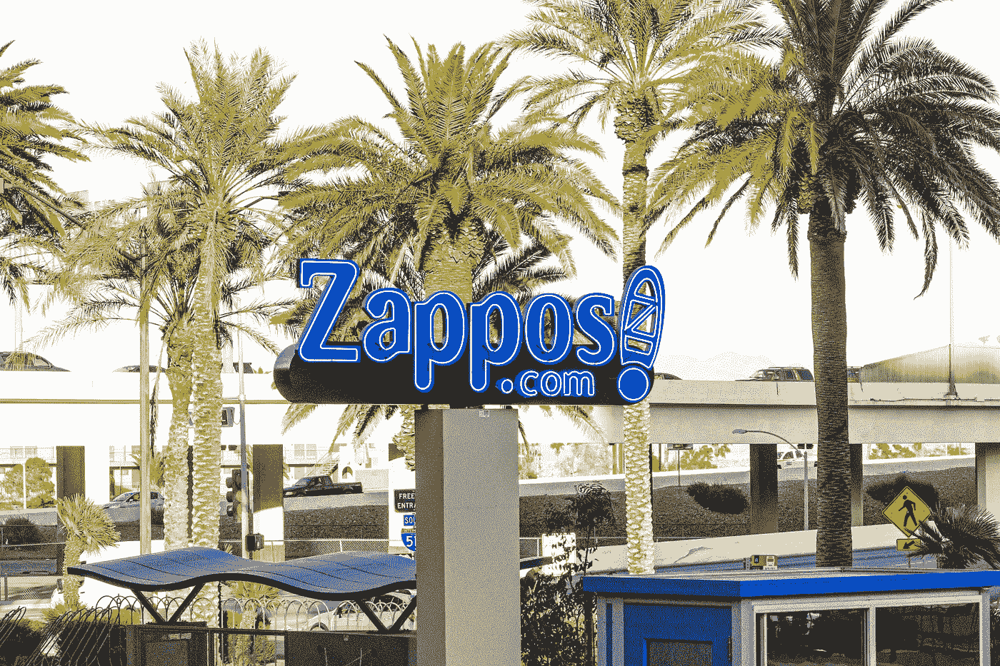

# 捷步达康——打造激情品牌

> 原文：<https://medium.datadriveninvestor.com/zappos-building-a-passion-brand-77c20dd48123?source=collection_archive---------24----------------------->

## 从搬迁到拉斯维加斯的故事中吸取领导力的教训。

Photo on Zappos.com

听到退休的捷步达康首席执行官[谢家华](https://www.washingtonpost.com/local/obituaries/tony-hsieh-dead/2020/11/28/9669a22a-3197-11eb-bae0-50bb17126614_story.html)去世的消息，让我想起了在商学院学习组织行为时读到的关于捷步达康的案例研究。

我尤其记得谢家华在案例研究中引用的一句话:

> 如果我们真的想围绕成为最好的客户服务来建立我们的品牌，客户服务必须是整个公司，而不仅仅是一个部门。

为此，托尼将 Zappos 的总部从旧金山搬到了拉斯维加斯，这样他就可以找到合适的人来为 Zappos 建立一个呼叫中心。由于过去在外包方面的糟糕经历，Zappos 不外包托尼认为是其核心竞争力的东西——提供世界级的客户服务——是很重要的。

Zappos 以“zapatos”命名，在西班牙语中是鞋的意思，在扩张到服装和配饰之前，它成为了美国最大的网上鞋店。为了给顾客创造一个热情的品牌，托尼必须维持一种热情的文化[如此强烈，如此巨大，如此富有表演性](https://hbr.org/2020/11/the-leadership-and-artistry-of-tony-hsieh)。

那么，托尼是如何带领 Zappos 成为一个激情品牌的呢？

**首先，托尼明白如何打造一个品牌。作为一家互联网公司，只有 5%的销售额是通过电话实现的。那么，为什么要专注于建立呼叫中心呢？早在 2004 年，Zappos 最大的问题是客户服务。托尼意识到通过电话有机会建立品牌的情感影响力。每次客户打电话来，“*你能让客户全神贯注五到十分钟，如果你的互动做得好，客户会在很长一段时间内记住这种体验，并把它告诉他或她的朋友。他建立呼叫中心的决定是基于品牌而非成本的战略决策。***

 [## 女性领导给你的企业带来的五大优势|数据驱动型投资者

### 从通用汽车和好时到 Ulta Beauty 和百思买，世界各地的大型企业都在证明…

www.datadriveninvestor.com](https://www.datadriveninvestor.com/2020/11/20/five-advantages-female-leadership-brings-to-your-business/) 

其次，托尼和他的团队做了他们的研究。不，不是因为税收原因，拉斯维加斯也不是最便宜的选择。该团队对不同城市的房地产、工资和生活成本进行了广泛的研究，以确定 Zappos 可以找到大量渴望在客户服务领域发展的员工的最佳地点，管理现有员工的重新安置成本，并支持 Zappos 的文化。回到旧金山，Zappos 面临的挑战之一是为呼叫中心找到合适的员工。客户服务在硅谷不是一个受欢迎的职业，湾区的高生活成本使得呼叫中心代表的薪水没有吸引力。该团队还认为，拉斯维加斯以好客为中心的通宵城市文化将有助于他们找到敬业和高素质的客户服务代表。

**第三，托尼致力于他的愿景，并授权他的员工实现他的愿景。**他让顾客服务成为捷步达康的重中之重。通过专注于为顾客带来快乐，Zappos 的团队实施了以顾客为导向的计划和绩效措施。该公司致力于为客户提供无风险的购物体验，例如，慷慨的退货政策，双向免费送货，以及方便联系客户服务代表。Zappos 还鼓励员工自己处理客户问题，更喜欢他们与客户建立个人情感联系，而不是遵循脚本或衡量客户代表员工一天应该接听的电话数量。

这个案例研究让我们观察到托尼是如何带着信念和对 Zappos 所需要的东西的透彻理解来领导团队的。大多数人没有意识到拥有一个好团队的重要性。托尼知道在哪里可以找到他们，也知道他们需要什么来帮助他建立品牌。他有“整个公司”做后盾。

## 获得专家观点— [订阅 DDI 英特尔](https://datadriveninvestor.com/ddi-intel)