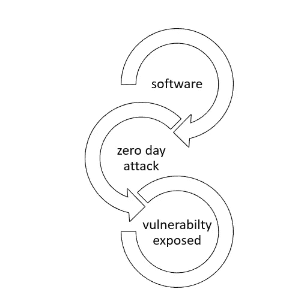

# 零日攻击—一种闪电般的攻击。

> 原文：<https://medium.datadriveninvestor.com/zero-day-attack-an-attack-that-is-lighting-fast-eeaab27b978e?source=collection_archive---------14----------------------->

**Source:** [**Norton**](https://us.norton.com/internetsecurity-emerging-threats-how-do-zero-day-vulnerabilities-work-30sectech.html)

软件专业人士称 [**零日攻击**](https://www.fireeye.com/current-threats/what-is-a-zero-day-exploit.html) 为漏洞，这可能暴露软件和硬件中的漏洞。由于攻击的响应时间如此之快，作为公司所有者，在网络罪犯造成损害之前，您可能甚至不知道您的系统暴露于漏洞之下。本文的主要亮点是:

**亮点**

1.  什么是零日攻击以及解释它的例子
2.  袭击的时间表
3.  攻击的恢复状态
4.  防止攻击的建议

**例子**

假设您正在尝试构建一个软件，一个 [**网络罪犯** h](https://medium.com/@hellogouravdas/enterprise-risk-management-what-is-it-and-why-you-need-it-fe98f53fd007) 侵入了您的系统并发起了一次零日攻击。几秒钟之内，你就会知道你的系统被黑了。

这个网络罪犯需要几分钟时间来发现你软件中的漏洞，因此你的整个软件变得无关紧要。当你想出解决办法的时候，窃取你最机密信息的危害已经造成了。

**时间线**

**Figure showing the timeline of the attack**

软件的开发者甚至没有时间去修复这个漏洞。当问题得到控制时，系统中已经安装了恶意代码。因此被称为零日攻击。表示您有 0 秒钟的时间来修复补丁。

**时间线 1:** 你开发软件存储客户信息。

**时间线 2:** 网络罪犯利用零日攻击定位漏洞，并用他们的恶意代码替换原始代码。

时间线 3: 你从报告数据被盗的客户那里了解到存在安全问题。

**恢复**

要修复零日攻击，没有立竿见影的解决方案。网络安全专家需要几个月或几天来修补一个补丁。因此，从上述信息来看，很明显，这种攻击是一种现代病毒，没有立即恢复的模式。

**建议**

像诺顿这样的顶级防病毒公司推荐了一些建议，可以帮助你防止零日攻击发生在你的系统上。其中一些可以列举如下:

1.用最新的安全补丁保持您的系统最新。

2.养成安全习惯，比如不时地修改密码，不回复垃圾邮件。

3.几天后，配置您的互联网设置、安全软件和操作系统。

4.安装一个好的防火墙来阻止安全威胁。