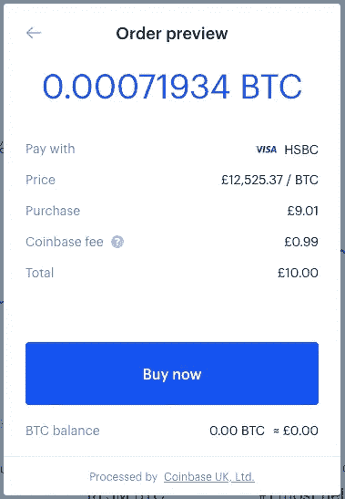
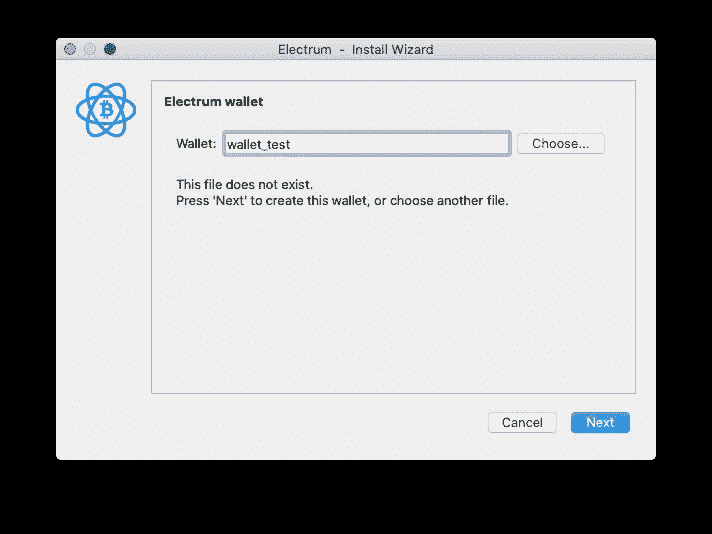
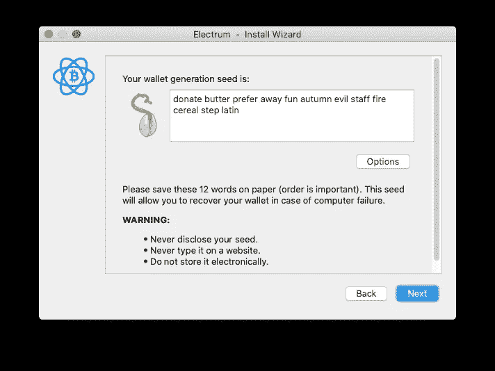
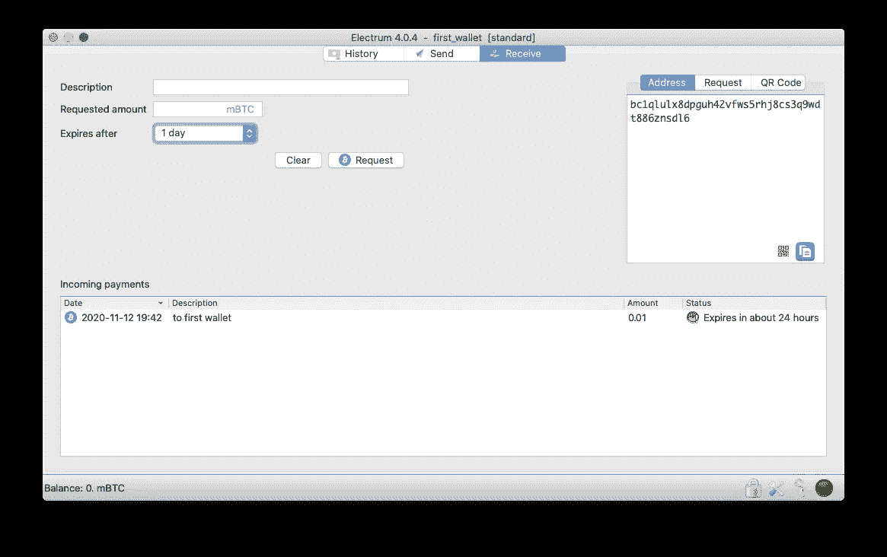
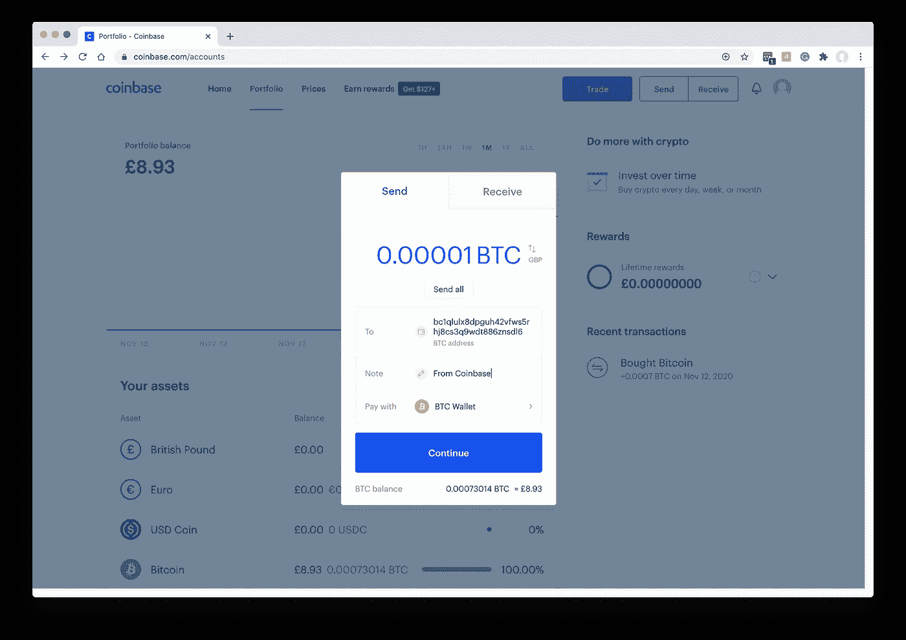
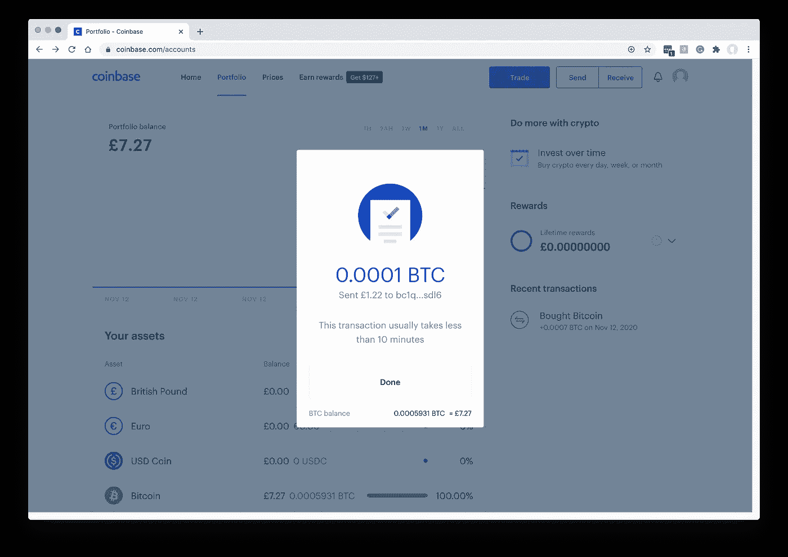
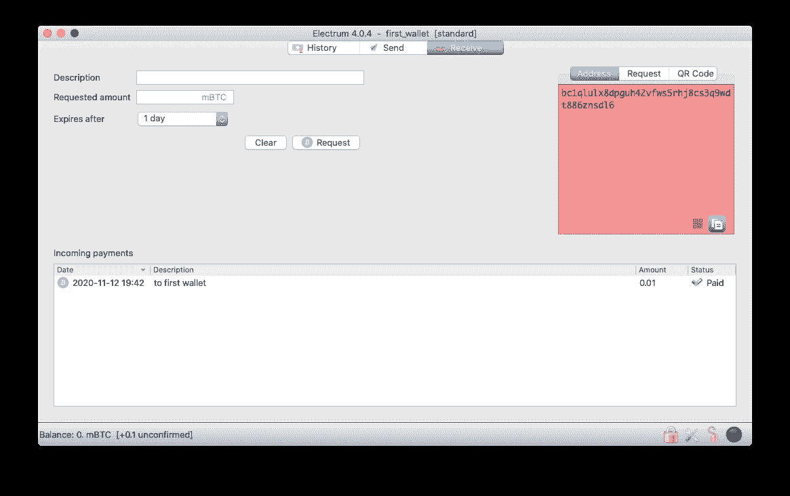
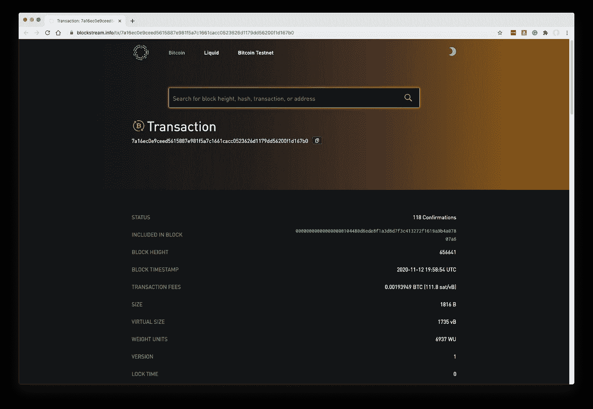
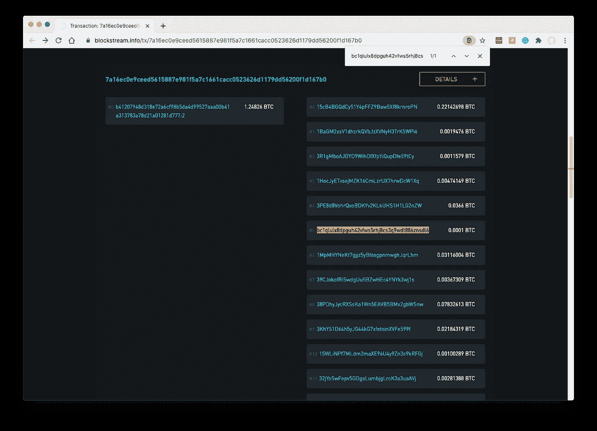

# 在一个下午成为比特币大亨

> 原文：<https://medium.datadriveninvestor.com/zero-to-bitcoin-mogul-in-one-afternoon-7e5ed14273?source=collection_archive---------5----------------------->

## 购买你的第一种加密货币。你所需要的只是一张信用卡和一张驾驶执照。

作为一名技术企业家，也许你会希望我在投资时更有企业家精神。

我喜欢认为我已经读了足够多的书，从概念上理解了“区块链”,过去我偶尔会漫不经心地考虑拥有一些加密货币。问题一直是，写这个话题的爱好者往往太深入兔子洞了——他们不禁警告说，你绝对需要一个“冷藏硬件钱包”，并讨论不同加密货币的历史和优点(更不用说这些货币的不同“分叉”)。

因此，我将保持简单，只是通过购买一些加密货币的第一次尝试。我会马上把它写下来，这样任何其他初学者都可以遵循同样的步骤，而不必费力地阅读令人印象深刻的术语，一旦我有了更多的经验，我将不可避免地坚持使用这些术语。

Photo by [Dmitry Demidko](https://unsplash.com/@wildbook?utm_source=medium&utm_medium=referral) on [Unsplash](https://unsplash.com?utm_source=medium&utm_medium=referral)

我大概知道一些其他的加密货币，但我们都听说过比特币(人们认为是最原始和最好的)，所以让我们买一些吧。我们在这个实验中的投资不会超过 10 美元，所以我们不需要太担心安全性。如果黑客拿走了全部，我们首先可以假装这是我们学习经历中有意的一部分。

我将使用一个受欢迎的、看起来值得信赖的名为比特币基地的交易所(我肯定在主流媒体上读到过)来购买我的第一批比特币——我们不会担心第一次尝试的高昂交易费用。

然而，我将提出一个略带哲学意味的反对意见。我很确定在比特币基地持有加密货币意味着你根本没有真正持有它。事实上，比特币基地现在也允许你持有美元和其他主要货币的余额，所以它开始听起来像一个银行…这是分散加密革命的有效部分吗？听起来似乎不是，所以作为我们迈向高科技未来的最后一步，我们将把我们的(一小部分)比特币提取到我们自己的电脑上，并为我们自己保管它。谢谢。

这听起来好像我正在被吸进去……当你读到这篇文章时，我很有可能已经回来编辑了这篇文章，添加了加密内幕警告，并坚持认为进入加密货币世界的唯一真正方式是在云中“开采”你自己定制的货币。我们真的需要抓紧时间，否则就太晚了。

## 为什么？

我相信人们进入加密货币有许多不同的原因。交易者可能试图在价格上下波动时赚钱；罪犯可能想要一种洗钱的方式；越来越多的普通人把它作为投资工具，从通常的储蓄账户、股票和债券中进行多样化投资。

有一篇关于加密货币概念和历史的精彩介绍，作者是一家名为 BitLift 的公司。它解释了历史上使用黄金或美元作为货币的基本原理，并给出了一些关于为什么你可能不完全想无限期依赖美国美联储的论点。我强烈推荐阅读，但他们最后的建议是简单地尝试购买一些加密货币，看看它会把你带到哪里……这就是线索变冷的地方，让我们自己照顾自己。

就我们的目的而言，我们不会试图提出购买比特币的理由，而是作为一种实验，对拥有一些加密货币的想法感到更舒服一些。然后，如果有人建议在未来进行加密投资，我们可以诚实地考虑，而不是拖拖拉拉，觉得有太多东西需要学习才能安全地参与。

我们将深入到足够的技术细节，以便能够相信我们最终确实拥有完全独立和安全的比特币所有权。

需要明确的是，这篇文章并不代表你的 10 美元的任何形式的投资建议。恰恰相反:准备好为了学习某样东西而浪费它。

# 像普通消费者一样购物

正如我所建议的，从比特币基地购买我们的第一种加密货币非常容易，我们几乎没有参与其中。就像银行一样。我们提供一张信用卡，他们以某种方式将一美元金额转换成比特币，然后在他们的网站上为我们保留它。

如果我们知道有人已经拥有一些比特币，并且愿意转移一些给我们，我们可以跳过这一步。但是，我们将使用比特币基地作为一个简单的起点，并作为硬币的来源，我们可以在下一步以某种方式转移到我们的计算机。

几年前，政府普遍收紧了对加密货币的监管——这就是为什么比特币基地就像一家银行。您需要一些身份证件，如驾驶执照或护照，以便他们可以验证您的身份，就像任何银行需要“了解您的客户”以遵守反洗钱和反恐怖主义法律一样。

去 coinbase.com[建立一个账户(这是一个会员链接——如果你交易足够多，我们都会得到 10 美元！).我不会带你经历这些—这很简单。只要坚持到你似乎准备好点击“购买”按钮的时候(它已经要求你输入你的 ID)，我会在下面见你。](https://www.coinbase.com/join/lester_ds)

点击比特币基地蓝色的交易按钮。在“购买”标签中，确保选择了“比特币”,并在“金额”栏中输入 10 或 10 美元，或者适合您当地货币的金额。

我选择了“10 ”,因为它优化了交易费用。似乎有一个固定的 0.99 美元的费用，直到 10 美元，然后它会上涨一点点，所以在最低的范围内用完我们所有的 10 美元津贴是有意义的。我相信如果你用美元工作的话，阈值是一样的。

点击“预览购买”:

点击“立即购买”就大功告成了！你现在是 0.0007 比特币的骄傲拥有者！实际上，这可能不会马上发生…我的信用卡公司拒绝了我的交易几次，我不得不让他们知道，是的，我最终屈服了，变得完全革命性了。我应该把这篇文章发给我与之交谈过的客服代表——他听起来很感兴趣。

以下是我在投资组合中新发现的财富:

你们当中眼尖的人可能会注意到比特币的数量与之前的截图不太匹配——这是因为在比特币价格略有变化后，我不得不在稍后的时间重新创建早期的截图。

不管怎样，现在我们发财了！目前，我们将把我们广泛的加密组合留在比特币基地，当我们想从银行巨头的眼皮底下把这些资金抢到我们自己的计算机上时，我们将在本文的后面返回。

# 财务独立

这有点太主流了。展望未来，我们希望找到自己的方式潜入比特币网络，并存储某种数字密钥，这意味着我们，只有我们，拥有和控制我们的比特币持有。

我们需要从根本上创建一个安全的方法来持有和交易比特币，只需要生成一个随机的 256 位数字，并对其保密。我们可以用它来生成公共地址，其他人可以在那里发送比特币。如果他们在交易中发送到这些地址中的一个，交易被公开存储在“区块链”上。它不会直接到达我们这里。

但因为我们知道生成地址的私钥，我们能够用该地址附带的任何“余额”发起其他交易——所以比特币属于我们，因为我们能够将它发送到其他地方。我们还可以查看地址附带的余额，其他人也可以。区块链是完全公开的，为了通过协商一致来维持，它需要这样。

正如你可能知道的，比特币的去中心化本质依赖于多个“节点”(运行核心比特币软件的计算机)，每个节点都被激励忠实地维护迄今为止的区块链——其想法是，如果网络由足够多的独立节点组成，他们就不可能勾结并谎报区块链的状态，因为仍将有大多数节点呈现真实的真相。

我们不需要在这个网络上运行我们自己的节点，但是我们需要在我们的笔记本电脑上安装一个软件，它将:

1.  帮助我们创建和使用我们的私钥
2.  连接到比特币网络，查找发送给我们的任何比特币，如果我们想发送给其他人，还可以创建交易

这个软件被称为“钱包”。我会选择开源的 Electrum 软件，适用于所有主要的操作系统。

## 安装 Electrum 钱包

从 [Electrum 网站](https://electrum.org/#download)下载并安装适用于您的操作系统的应用程序。他们非常希望你验证他们下载页面上描述的下载。

当您启动 Electrum 时，它将引导您完成设置新钱包的过程。基本上，钱包只是一个新的私钥，允许 Electrum 生成它需要与该密钥交互的所有其他内容:主要是比特币地址。为钱包选择一个文件名:

接下来的几个步骤将带您了解一些选项:

*   选择“标准钱包”
*   创造新的种子
*   选择“传统”种子类型

最后，您将看到您的“种子”:

这个短语*就是*你的私钥！你需要把它记在安全的地方。建议是把它写在一张纸上，并且**而不是**到**永远不要**以电子方式存储它——这有点虚伪，因为在你点击下一步之后，Electrum 本身就要把它写到你的硬盘上。

## 钥匙的种子

那么这个种子短语如何成为您的新私钥呢？为了简单起见，假设 Electrum 有一个 2048 个单词的标准列表。这意味着任何 11 位数字(0–2，047)都可以用其中一个字来表示。因此，按顺序排列的 12 个这样的字可以对应 12*11 = 132 位数。

虽然这似乎没有达到我们预期的 256 位密钥，但它被 Electrum“拉伸”了。这是以这样一种方式完成的，就进行暴力攻击的难度而言，它与随机的 256 位密钥一样强。更多的细节在这里，阅读 Electrum 事实上(不再)依赖于一个固定的单词列表也很有趣。

## 钱包文件

在 Electrum 向你展示了你的种子短语之后，下一步是让它问你那个短语是什么。它会要求你再次输入，以确保你写的是正确的。

之后会询问你是否要输入密码。这是为了加密您磁盘上的钱包文件，以保护它不被您计算机上的其他用户使用，或者以防有人能够以某种方式从备份中获取钱包文件。

一般来说，这是一个明智的举动，但是对于我们的实验，我建议不要使用密码。这样，更容易检查钱包文件以了解发生了什么。

无论哪种方式，密码从根本上说都不是“比特币的事情”。即使在这个阶段有密码保护，你仍然可以只根据你写下的种子短语来恢复钱包；并且密码与比特币发送/接收过程的任何部分都不相关。

理解这一点很有用——所有重要的东西都可以从你的种子短语中重新创建，或许可以在新电脑上输入到 Electrum 中，同时 Electrum 还可以在比特币网络上查找最新状态。Electrum 还将在你的钱包文件中存储额外的信息，例如你为自己的目的而写的笔记和描述，这些信息不能单独从 seed 短语中恢复。但关键是，这些根本没有价值。

# 支付你自己的电脑

是时候把你的比特币转出比特币基地了！要做到这一点，你只需要从钱包里拿出一个比特币地址。基于你的比特币私钥，Electrum 会生成多个地址，其中任何一个都可以用来接收交易。建议不要多次使用同一个地址，但事实上，一个地址完全有可能收到多笔捐款。

单击接收选项卡。输入您的交易描述(例如，“到第一个钱包”)，以及您打算在 mBTC 发送的比特币数量(0.001 个比特币)——也许输入“0.01”mBTC。

实际上，这些细节并不重要。它们只是为了你自己在 Electrum 中的跟踪目的，所以你知道你什么时候已经把一个特定的地址给了某人，并且想要监视它，看看什么时候已经进行了传送。

有可能用所有这些额外的信息来构建一个“签名请求”,这样某人就可以知道是真正的你在请求进行这次转移，但这不是我们这里需要的东西。

我们需要的只是地址，所以从右边的“地址”框中复制地址——一长串字母和数字。

## 回到比特币基地

在比特币基地，单击交易，然后发送。

将比特币地址粘贴到“To”框中，并在顶部的框中输入比特币的数量(0.0001 BTC 是一个足够小的数量，但在撰写本文时足以被接受)。

确保“付款方式”显示“BTC 钱包”。

点击“继续”,资金应该已经到位了！

比特币基地还会收取小额交易费，不是为了自己的目的，而是为了提供给整个比特币网络。这刺激了运行节点的“比特币矿工”实际上选择将其纳入区块链的下一个区块。

## 检查是否到达

大约十分钟后，您应该会在 Electrum 的“接收”选项卡中看到“已支付”状态:

事实上，如果你在 Electrum 的“历史”标签中仔细观察，该交易将首先显示为“未确认”，然后解析为“已支付”。请记住，比特币网络是基于共识的。Electrum 希望看到事务通过多个节点包含在新的区块链块中，并希望看到其父块用作区块链中后续块的输入块。随着越来越多的区块被添加到你的区块之上，并且这被越来越多的节点所证实，你就越能确定你的交易牢牢地嵌入了比特币的区块链历史。在经过一个相对较小的检查门槛后，Electrum 向您发出信号，表明交易已经完成。

# 你在历史上的地位

在历史选项卡中，您可以右键单击已完成的事务并选择“在块浏览器上查看”。这将带你到一个网站(blockstream.info 似乎是 Electrum 的选择，但还有其他浏览器网站，包括 blockchain.com 和 explorer.bitcoin.com)。在那里，你可以看到你的交易在比特币区块链上公开显示:

这显示了关于已完成事务的一些元数据。

让我们在事务页面上再往下看一点。你可能认为交易很简单:一边是我们的比特币基地账户，另一边是我们的 Electrum 钱包。也许还应该有和交易费有关的东西。但正如你所看到的，我的目的地比特币地址(突出显示)是这笔交易中的许多地址之一，我以为这些地址只是我发给我自己的:

回想起来，原因是显而易见的:比特币基地是一家服务于众多客户的大型运营商。它自己持有大量比特币，并把在大约同一时间要求汇款的多个客户聚集在一起。因此，他们输入端大约 20，000 美元的比特币被分割成数百个更小的输出。我们可能永远不会知道谁拥有我们交易中的其他地址，但在这种情况下，我们可以相当肯定他们是比特币基地的客户或合作伙伴。

页面顶部的元数据包括一个到包含我们事务的块的链接，我们可以点击查看更多信息。该区块本身将包含约 2000 笔交易:我们的交易只是其中之一。许多其他事务更明显是平衡的——一个输入被发送到一个或两个输出地址(有时第二个地址实际上属于发送方，用于收集事务中的变化)。

如果你比我更高级，你可以尝试在 Electrum 中创建第二个钱包，并从一个钱包向另一个钱包汇款。我想在这种情况下，你会看到一个更简单的交易。

# 恭喜你！

干得好——您现在已经完全沉浸在加密货币的世界中了。最起码，当朋友在晚宴上谈论比特币时，你可以会心一笑。如果他们注意到并问你这个问题，就告诉他们，作为一个加密内幕匿名是一个非常重要的价值，你不想留下任何线索，暴露你的大量加密知识给初学者。