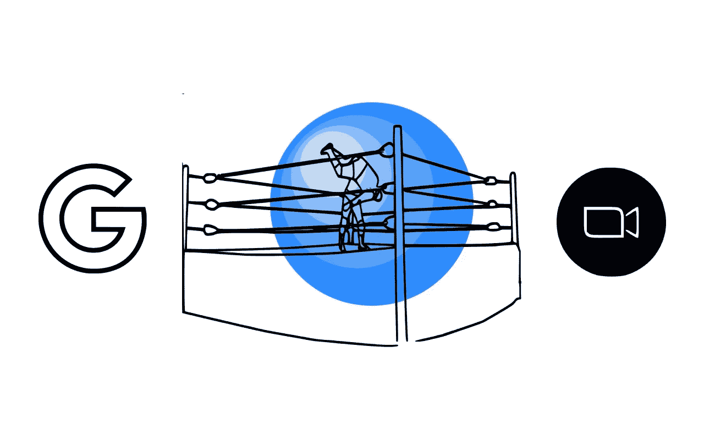
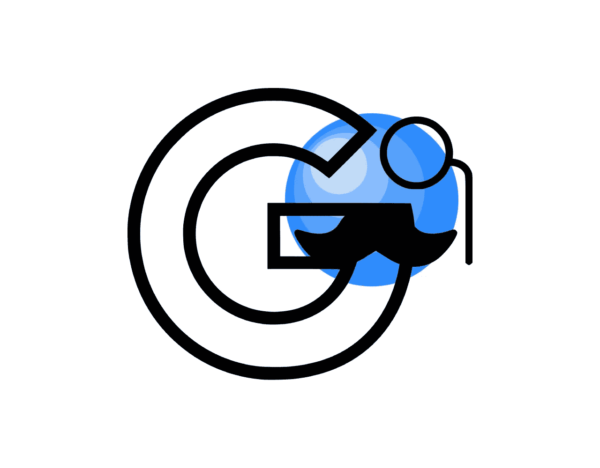
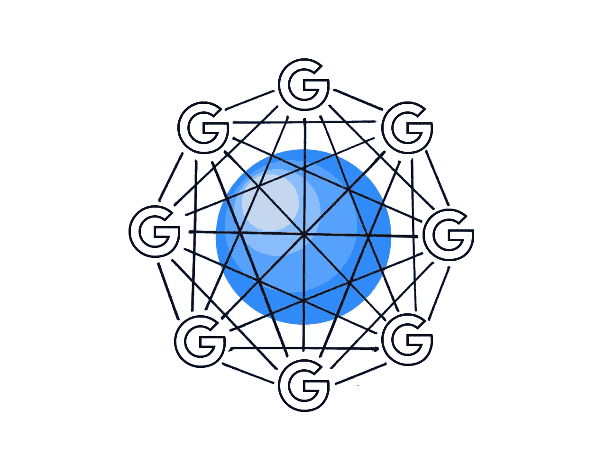
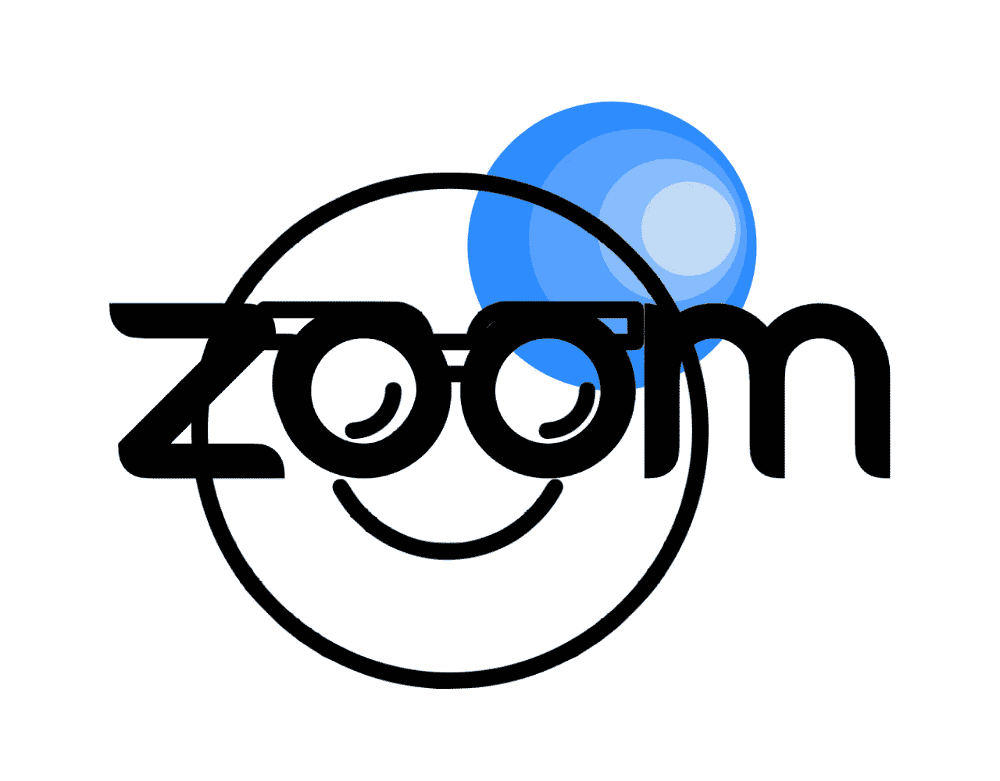
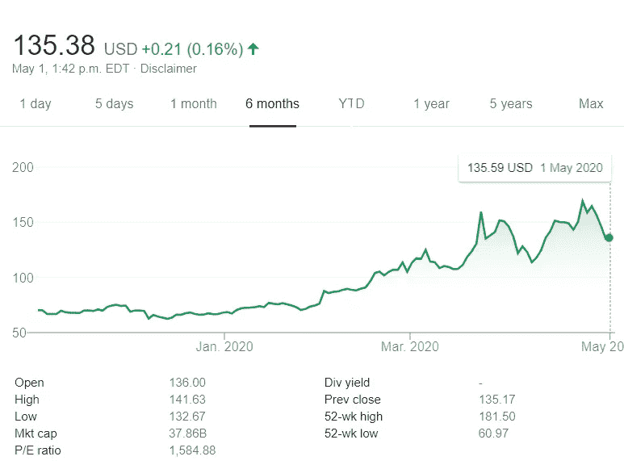
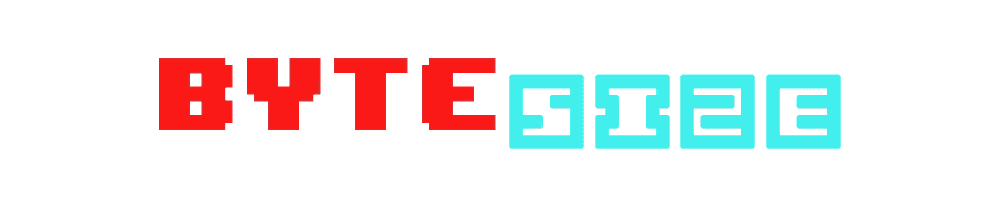

# Zoom vs. Goliath(又名 Google)——谁会胜出？

> 原文：<https://medium.datadriveninvestor.com/zoom-vs-goliath-aka-google-who-comes-out-on-top-344f18016252?source=collection_archive---------13----------------------->

## 字节/大小

## 谷歌已经加入了视频会议的行列，在 9 月份之前免费提供 Meet



在幼儿园的时候，我无可救药地爱上了一个女同学，我从来没有真正见过她的脸(她戴着面纱)。我可以自信地说，14 年后的今天，我已经完全忘记她了

我的观点？脸对人类来说很重要，我们需要看到它们，这样我们才能建立真正的联系。

出于这个原因，企业和家庭的视频会议在过去的两个月里爆炸式增长，其中 **Zoom** 及其**380 亿美元的估值**位居前列。

[](https://www.datadriveninvestor.com/2020/03/28/handpicked-resources-for-the-best-short-term-investment-options-of-2020/) [## 2020 年最佳短期投资选择精选资源|数据驱动型投资者

### 投资是增加你净财富的一个好方法。如果你通过遵循一个严格的…

www.datadriveninvestor.com](https://www.datadriveninvestor.com/2020/03/28/handpicked-resources-for-the-best-short-term-investment-options-of-2020/) 

谷歌想要分一杯羹，并提供**与**见面，这是它自己的选择，因为[](https://www.washingtonpost.com/technology/2020/04/29/google-meet-zoom-competitor/)****免费，直到九月。**我们来点名，看看谁会在视频会议领域胜出。**

# **谷歌的第一点:垄断力量**

****

**像谷歌这样的垄断公司如此强大，如果利润意味着市场份额的增长，他们可以放弃利润。你可以称之为**收入最大化**或**掠夺性定价**这取决于它的合法性。**

**当亚马逊还只是一个小的巨型企业集团时，Diapers.com 拒绝出售 T21。亚马逊亏本出售尿布，削弱了 Diapers.com 的收入，直到他们最终同意被收购。**

> **亚马逊可以承担亏本销售，因为他们的其他收入来源弥补了这一点——出于同样的原因，谷歌可以免费提供 Meet。**

**市场份额是有价值的，因为一旦足够多的人开始使用 Meet，谷歌就可以打开收入开关。**

**总的来说，谷歌说这样做是为了在隔离期间帮助家庭/企业联系，我对此表示支持。我想人们(像我一样)现在会在谷歌上花更多的时间也无妨。**

# **谷歌的第二点:网络效应**

****

**随着越来越多的人加入网络，它对每个用户都变得越来越有用。由于每个用户的平均值上升，更多的人加入网络。**

**简单地说，这就是**网络效应**，这也是为什么今天如此多的垄断企业都是数字化的——它们越大，就越好。**

**谷歌通过搜索(更多用户=更好的算法/更好的结果=更多用户)和 AdSense 建立了 NFX，从而产生了数十亿的谷歌服务用户。他们可以利用其庞大的用户群加入 Meet。最好的方法是什么？**

# **谷歌的第三点:捆绑销售**

****

**Slack 是一款基于云的团队协作软件，在世界上一些最大的公司中迅速流行起来——然后微软将团队与 Office 的其他部分免费捆绑在一起，正在榨干 Slack 的血汗。**

> **Zoom 已经与谷歌服务很好地整合在一起，但它很难与一个专有产品竞争。**

**Meet is **将**与 Gmail、日历、教室和其他 G Suite 服务捆绑在一起，这些服务被超过[600 万](https://www.cnbc.com/2020/04/07/google-g-suite-passes-6-million-customers.html)付费企业和[1.2 亿](https://blog.google/outreach-initiatives/education/meet-for-edu/)学生/教育工作者使用——这是一个隐喻性的无限挑战，旨在抹去 Zoom 的面孔。**

# **Zoom 的第一点:品牌资产**

****

**在这场危机中，Zoom 出现了爆炸性增长，本月每日会议参与者超过 3 亿，股价飙升。Zoom 已经成为视频会议的代名词，只有 Cisco Webex 能与之匹敌。**

****

**这项服务正在建立强大的品牌知名度，并很快被视为默认的视频会议平台。然而，品牌身份并不是一个非常强大的经济护城河，谷歌是效率之王。**

**我们将不得不看看 Zoom 的早期采用浪潮是否足以抵挡 Google meet 的死星激光。**

# **变焦的第二点:专业化**

****

**谷歌的母公司叫 Alphabet 也许是因为人类字母表是“人类最重要的创新之一”，也许是因为他们正在建立足够多的公司，以字母表中的每个字母命名。**

> **谷歌的优势之一是它无所不能。它的弱点之一是它并不总是做得很好。**

**对 Meet 的评论大多是正面的，(除了一些涉及大型团体音频质量问题的批评)，但它比不上 **Zoom 的多样化功能集，**包括会议、网络研讨会功能。**

**当公司**专业化时，**他们可以在他们的领域中出类拔萃。视频会议是 Zoom 的全部，他们已经做得很好了——除了那些讨厌的[安全问题](https://www.cnet.com/news/zoom-security-issues-zoom-could-be-vulnerable-to-foreign-surveillance-intel-report-says/)。**

# **现在说还为时过早。**

**Zoom 经历了惊人的增长，专注于它正在做的事情，并迅速成为一个家喻户晓的名字——谷歌可以利用其垄断力量、服务捆绑和网络效应来扫除它们。**

**在接下来的几个月里，谷歌将有时间改进 Meet，但我们可以对 Zoom 在该领域的前景保持乐观。**

**你知道吗，我已经很久没和我幼儿园的暗恋对象说过话了。也许我会打电话给她——你知道，只是想看看她怎么样了。没有其他原因。**

****

```
A **byte-sized deep dive** into the world of **tech** and **business**.
```

**[](https://medium.com/swlh/netflix-next-move-9ea44b42150f) [## 网飞现在比迪斯尼更有价值——他们的下一步是什么？

### 四个 3D 棋步可以让网飞成为冠军

medium.com](https://medium.com/swlh/netflix-next-move-9ea44b42150f) [](https://towardsdatascience.com/amazon-video-games-fb85f147519a) [## 亚马逊能利用电子游戏实现统治世界吗？

### 这家市值万亿美元的企业集团即将推出被业界称为“史诗级游戏玩家之举”的游戏。

towardsdatascience.com](https://towardsdatascience.com/amazon-video-games-fb85f147519a) 

大家好，我是 Murto，是加拿大多伦多的一名 18 岁的企业家和学生。如果你想聊天，请通过 [LinkedIn](https://www.linkedin.com/in/murtohilali/) 联系我！后续步骤:

*   征服你的敌人
*   解开一个谜
*   祝你愉快

谢谢！**