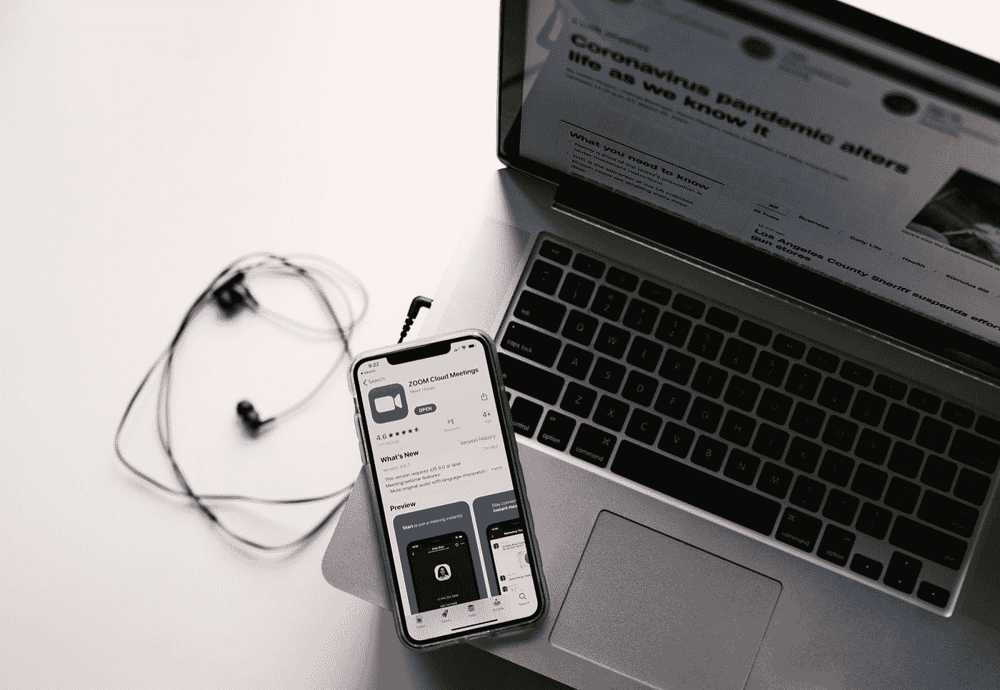
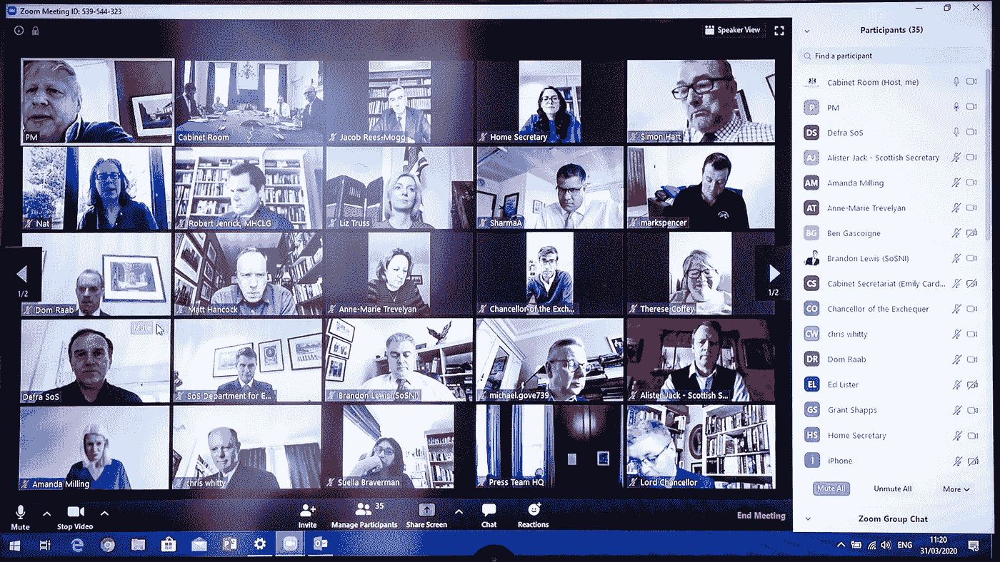

# “zoom bombing”——一种夸张的现象，而不是一种脆弱性。

> 原文：<https://medium.datadriveninvestor.com/zoombombing-an-overblown-phenomenon-not-a-vulnerability-9a3331536c54?source=collection_archive---------15----------------------->

## 当同样的“缺陷”影响几乎所有流行的视频会议应用程序时，为什么只关注 Zoom？

Photo by [Allie](https://unsplash.com/@acreativegangster?utm_source=medium&utm_medium=referral) on [Unsplash](https://unsplash.com?utm_source=medium&utm_medium=referral)

在这个冠状病毒时代，似乎每天关于大流行相关死亡的新闻还不够，新一波的[“动物组合”故事已经占据了头条](https://www.myrecordjournal.com/News/Wallingford/Wallingford-News/Pornographic-Zoombombing-interrupts-Wallingford-Town-Council-remote-meeting.html)。在美国，[政客们甚至敦促联邦当局(比如美国联邦贸易委员会)对 Zoom](https://www.npr.org/2020/04/03/826968159/senator-zoom-deceived-users-over-its-security-claims) 采取严厉措施，指责该公司对用户隐私和安全做出高调声明。作为一名安全研究员，我不得不深入研究这个问题！

维基百科将 [*Zoombombing*](https://en.wikipedia.org/wiki/Zoombombing) 或 *Zoom raiding* 定义为“*个人对视频电话会议的不必要入侵，导致中断。”这个绰号在新冠肺炎危机期间声名狼藉，当时许多人依赖 Zoom 进行会议、远程教育和在家办公。*

# 是怎么做到的？

概念很简单。视频会议应用依靠数字会议 id 让参与者加入——这是几乎所有应用的惯例: [GoToMeeting](https://www.gotomeeting.com/en-gb/meeting/join-meeting) 、 [Webex](https://help.webex.com/en-us/nrbgeodb/Join-a-Webex-Meeting) 、 [Skype](https://docs.microsoft.com/en-us/skypeforbusiness/audio-conferencing-in-office-365/start-an-audio-conference-over-the-phone-without-a-pin) 、Joinme、Google Meet，而不是 Zoom 独有的东西。一些应用程序可能允许组织者创建会议，而不要求参与者在加入时输入额外的安全参数(例如 PIN 或密码)。对于参与者来说，键入会议 ID 已经是一件多么令人沮丧的事情了——尤其是在拨入的时候，更不用说还要处理顶部的 PIN 了。

能够连续猜测(列举)几个会议 id 或者具有先验知识的恶意参与者简单地加入正在进行的活动缩放会议，并且在会议中张贴淫秽内容:色情、淫秽声音、垃圾邮件等。

这个想法是*诱骗*与会者，并邀请与会者嘲笑，而其他一些 blackhat 黑客可能会选择这样做来*教育*人们他们日常工作流程中的安全缺陷，尽管这是不道德的。

[Sky News](https://news.sky.com/story/coronavirus-fbi-investigating-after-pornography-used-to-zoombomb-video-conferences-11966712): Boris Johnson’s Twitter feed shows the prime minister taking part in a virtual cabinet Zoom meeting with the meeting ID (**539–544–323**) atop the window raising security and privacy concerns.

英国首相约翰逊[在 Zoom 上发布了一张虚拟内阁会议的截图](https://twitter.com/BorisJohnson/status/1244985949534199808)(仍未关闭)，这引起了一些人的进一步关注，称该推文为“[安全风险](https://twitter.com/StefSimanowitz/status/1244994273457602561)”，因为它暴露了会议 ID。

# 替罪羊缩放

然而，在所有这些由 press 带来的“噪音”和[安全中，Zoom 成为替罪羊是因为它在多个领域的绝对受欢迎程度和广泛的用户偏好*:商业、教育、社交团体——而不是因为 *zoombombing* 本身就是一个可利用的安全漏洞或 Zoom 独有的风险。让与会者通过会议 id 加入视频会议的习惯，通常没有 PIN 要求，并不新奇，已经实行了几十年…*](https://medium.com/@_ax/the-economics-of-making-security-a-pr-issue-94105947867)

Zoom 甚至有安全功能来阻止或防止“zoombombing ”,例如在让参与者加入之前对他们进行筛选，或者[将会议仅限于某些登录用户](https://support.zoom.us/hc/en-us/articles/360037117472-Authentication-Profiles-for-meetings-and-webinars)。那么，是懒惰的或者技术拙劣的会议组织者没有利用 Zoom 的全套功能，而不是产品本身有缺陷。

 [## 为什么加密对日常生活至关重要？数据驱动的投资者

### 你几乎每天都要输入密码，这是你生活中最基本的加密方式。然而问题是…

www.datadriveninvestor.com](https://www.datadriveninvestor.com/2020/02/10/why-encryption-is-critical-to-everyday-life/) 

最近将人们的注意力引向 Zoom 的标题闻起来更像是 Zoom 的竞争对手设计的诽谤活动，而不是主要的关注原因。

我的专业意见是，严格地说，从网络安全的角度来看,“zoombombing”甚至不是一个可利用的安全漏洞。这被外行人误解了。

这类似于使用任何开箱即用的数字产品——比如你的 WiFi 路由器，但没有正确配置它，然后后来抱怨说你因为没有设置密码而被黑客攻击。在这种情况下，简单地更换你的 WiFi 路由器品牌，对保护你没有任何好处，如果你继续沾沾自喜地不设置 WiFi 密码的话！

# 保护你自己

始终确保您的会议 id 和链接只与被授权加入的参与者共享。为了额外的预防措施，可以考虑在顶部使用 pin 或密码。这样，即使恶意方能够猜出会议 ID，PIN 也可以起到额外的威慑作用。视频会议组织者还应该考虑在让参与者加入会议之前对他们进行筛选——这也可以通过将会议限制在少数人范围内来无缝完成([登录用户](https://support.zoom.us/hc/en-us/articles/360037117472-Authentication-Profiles-for-meetings-and-webinars))。

总之，一个影响几乎所有视频会议应用程序的“缺陷”,或者在某个时候已经存在，现在被唯一地归因于缩放，这是对用户的误导，因为它产生了一种虚假的安全感。除非会议组织者实施常识性的安全措施，否则转移到*不同的*会议应用程序不会保护你免受“zoombombing”。

2020. [Ax Sharma](http://axsharma.com/) ( [Twitter](https://twitter.com/ax_sharma) )。保留所有权利。