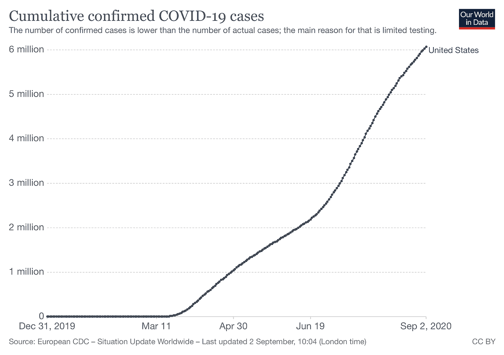
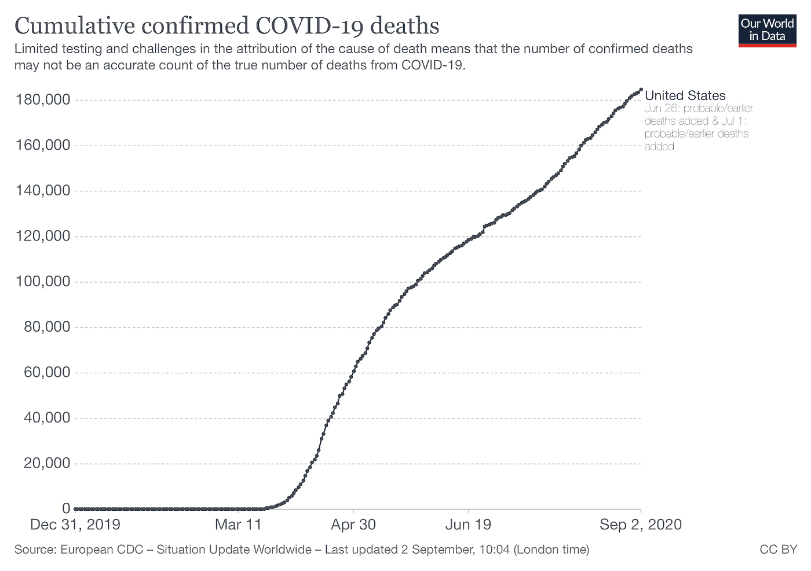
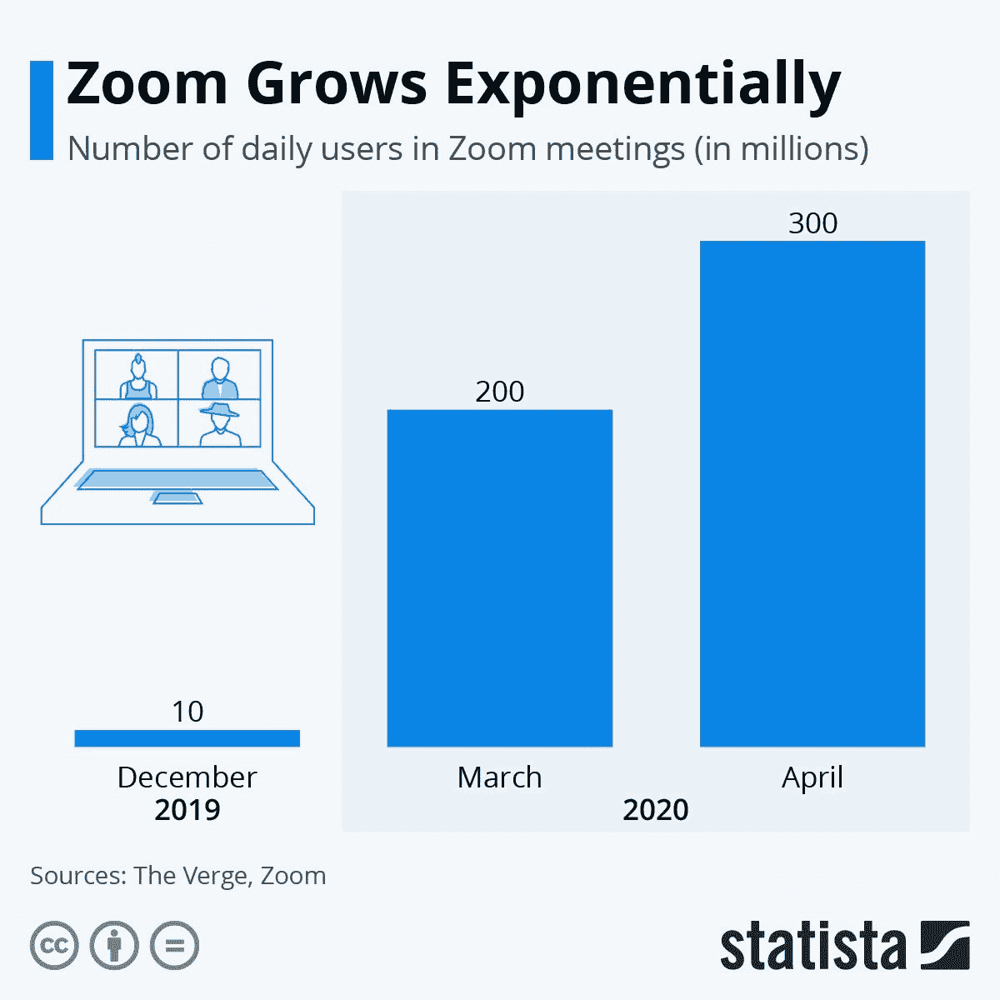
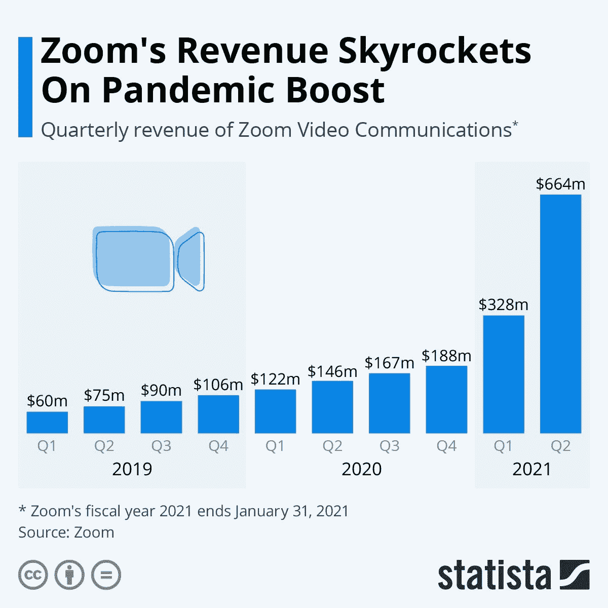
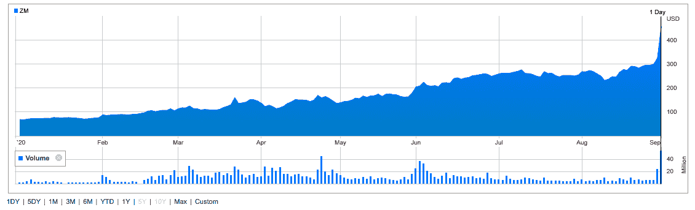

# 奔向不确定的未来

> 原文：<https://medium.datadriveninvestor.com/zooming-into-an-uncertain-future-77024545cd40?source=collection_archive---------5----------------------->

## 对许多个人和小企业来说，新冠肺炎疫情是个悲剧。然而，有一家公司拥有独一无二的定位，拥有适合时代的技术。现在，Zoom 的前景如何？

Photo by [Chris Montgomery](https://unsplash.com/@cwmonty?utm_source=medium&utm_medium=referral) on [Unsplash](https://unsplash.com?utm_source=medium&utm_medium=referral)

# 介绍

不久前，我为数据驱动的投资者写了一篇文章。这篇文章谈到了一个人们可能会说今天不应该公开讨论的话题，文章的标题相当简单，提出了一个简单的问题:“(T2)疫情对公司来说能有积极的一面吗？。”从表面上看，这是一个似乎被禁止的、不体面的、不道德的、完全错误的话题。然而，这个问题在今天是一个非常现实、非常重要的问题。更重要的是，这个话题可能会为你的投资、职业生涯，甚至你自己的生意提供一些见解。

冠状病毒疫情确实正在肆虐——T4 仍在肆虐——整个社会。在这里，2020 年 9 月初，仅美国就已经达到了严峻的里程碑，现在已有超过 600 万确诊新冠肺炎病例(*见图 1:* *截至 2020 年 9 月*美国确诊新冠肺炎感染病例，以及超过 18 万人死于冠状病毒(*见图 2:截至 2020 年 9 月*美国确诊新冠肺炎死亡病例)。小企业主每天都在认输，无法应对疫情带来的变化，然而，疫情对某些企业来说不是真的很好吗？

**图 1——截至 2020 年 9 月美国确诊的新冠肺炎感染病例**

**Source:** [Our World in Data](https://ourworldindata.org/) ([https://ourworldindata.org/covid-cases?country=~USA](https://ourworldindata.org/covid-cases?country=~USA)); Used with permission.

**图 2——截至 2020 年 9 月美国确诊的新冠肺炎死亡病例**

**Source:** [Our World in Data](https://ourworldindata.org/) ([https://ourworldindata.org/covid-deaths?country=~USA](https://ourworldindata.org/covid-deaths?country=~USA)); Used with permission.

是的，我们都可以确定某些产品和服务在 2020 年表现良好，有些*非常好*，这要归功于在疫情期间他们向美国公众出售的产品和服务的需求增加。我们都变得“恐菌”，所以每一种消毒湿巾和洗手液的销量都一飞冲天！餐馆已经关闭和/或开放很长时间了。即使是现在，那些开放的餐厅也只能在有限的座位上用餐。这意味着食品配送服务做得非常好，在过去的六个月里创下了记录。由于需要所有的标志来引导每个公共空间的交通，并警告我们要远离社交场所和洗手，大大小小的印刷企业出现了大量的新业务。如果你认为你的职业是制作面具，那么，疫情让你的事业蒸蒸日上！最后，有机玻璃是一个平凡的项目，直到大约六个月前，现在，它无处不在，背后的公司字面上不能制造，切割，安装它不够快！

Photo by [Gabriel Benois](https://unsplash.com/@gabrielbenois?utm_source=medium&utm_medium=referral) on [Unsplash](https://unsplash.com?utm_source=medium&utm_medium=referral)

# 这一瞬间的放大

然而，如果有一件事、一个领域、一家公司从疫情中获益最多，那就只有一个选择了。那家公司叫 Zoom,“Zoom”已经迅速成为今天人们聚在一起的在线平台。而当你的公司名称变成了动词，你就知道你到了！是的，还有其他的在线会议平台——它们都有科技界的大腕支持。[思科](https://www.cisco.com/)拥有并提供 [Webex](https://www.webex.com/) 。[微软](https://www.microsoft.com/)同时提供 [Skype](https://www.skype.com/en/) 和[微软团队](https://www.microsoft.com/en-us/microsoft-365/microsoft-teams/group-chat-software)。 [Google](https://www.google.com/) 优惠 [Google Meet](https://meet.google.com/) 。脸书现在提供[传达室](https://www.messenger.com/rooms)。然而，Zoom 是一家独立公司，目前只提供一种产品，Zoom 会议平台，迄今为止，它似乎已经赢得了在线会议之战！

 [## Neuralink:未来还是终结？数据驱动的投资者

### 见见 Neuralink，埃隆·马斯克的新宝贝。一个微小的大脑植入物，可以将脑电波实时传送到你的手机上…

www.datadriveninvestor.com](https://www.datadriveninvestor.com/2020/09/01/neuralink-future-or-the-end/) 

Zoom 已经从不是完全默默无闻，而是从瞄准一个狭窄的目标市场(企业客户)到突然被所有人用于一切。4 月份，我在为初创公司撰写的文章中记录了该公司在使用和用户方面的突然、惊人的增长，这篇文章的标题是[向前冲:疫情](https://medium.com/swlh/zooming-ahead-the-explosive-growth-of-zoom-during-the-pandemic-34f55b1f13e8)期间 Zoom 的爆炸式增长。是的，爆炸性是唯一一个能够描述冠状病毒疫情在最初几个月发生在该公司身上的事情的形容词。正如你在下面的图 3 ( *每日 Zoom 用户增长[百万]，2019 年 12 月至 2020 年 4 月*)中所看到的，根据 Zoom 提供的用户数据，自疫情冠状病毒迫使我们寻找新的方式在网上做我们以前亲自做的各种事情以来，其平台上的用户数量呈指数级增长。考虑到 Zoom 在 2019 年 12 月拥有 1000 万日活用户。到 2020 年 3 月，当隔离和社交距离的推动将许多会议推到网上时，他们的每日用户数量迅速增长到 1 亿！然后在仅仅一个月的时间里，Zoom 的日用户数量翻了一番，达到大约 2 亿！总的来说，这意味着 Zoom 的日用户数在一个季度多一点的时间里增长了近 3000%!

**图 3——2019 年 12 月至 2020 年 4 月每日变焦用户的增长(百万)**

**Source:** [Statista](https://www.statista.com/) — [https://www.newsbreak.com/news/1552975744390/zoom-grows-exponentially](https://www.newsbreak.com/news/1552975744390/zoom-grows-exponentially) (Used with Permission)

所有这些增长似乎都让该公司及其领导人感到有点意外，正如 Zoom 首席执行官 Eric S. Yuan 最近评论的那样:

> *“我们的平台主要是为企业客户打造的，”袁解释道。“我们在设计产品时没有预见到，在几周内，世界上的每个人都会突然在家工作、学习和社交。我们现在有了更广泛的用户群，他们以各种意想不到的方式使用我们的产品，这给我们带来了平台构思时没有预料到的挑战。”*

那么，所有这些用户增长如何转化为 Zoom 的顶线(就收入增长而言)和底线，即公司的盈利能力？Zoom 最近发布了截至 2020 年 7 月 31 日的最近一个财年的财务业绩。现在从会计的角度来看，Zoom 发布的是其 2021 财年第二季度的数字，所以对于外行人来说确实有点困惑。然而，从下面的图 4 ( *Zoom 公司最近 10 个季度的收入增长*)中可以看出，毫无疑问，Zoom 已经能够利用所有的用户增长为公司带来巨大的财务收益。就总收入而言，Zoom 创造了很少有公司能与之匹敌的记录:

*   在过去的十个季度中，收入增长了 10 倍；
*   在过去的两个季度中，收入几乎增长了两倍；和
*   到目前为止，该公司 2021 财年(包括 2020 年 2 月 1 日至 2020 年 7 月 31 日的业绩)的收入季度环比增长了一倍以上

**图 4 —公司最近 10 个季度的收入增长情况**

**Source:** [Statista](https://www.statista.com) ([https://www.statista.com/chart/21906/zoom-revenue/](https://www.statista.com/chart/21906/zoom-revenue/)); Used with permission.

Zoom 的最终结果同样令人瞩目。根据该公司最近的收入/收益[公告](https://investors.zoom.us/news-releases/news-release-details/zoom-reports-second-quarter-results-fiscal-year-2021):

> “本季度归属于普通股股东的 GAAP ( [公认会计原则](https://www.investopedia.com/terms/g/gaap.asp))净收入为 1.857 亿美元，或每股 0.63 美元，相比之下，2020 财年第二季度归属于普通股股东的 GAAP 净收入为 550 万美元，或每股 0.02 美元。”

当你产生这样的净收入数字时，这也意味着你的现金流和现金头寸也——嗯——令人难以置信。根据同一份[收益表](https://investors.zoom.us/news-releases/news-release-details/zoom-reports-second-quarter-results-fiscal-year-2021)，该公司在刚刚结束的季度由经营活动提供的净现金达到 4.013 亿美元，而 2020 年第二季度为 3120 万美元。同样，Zoom 本季度的自由现金流达到 3.734 亿美元，而 2020 年同季度为 1710 万美元。加上其所有的现金、现金等价物和有价证券——也就是通常所说的“手头现金”,截至 7 月 31 日，其现金资产增加了 15 亿美元。

Zoom 将其收入和盈利的成功很大程度上归功于其增长，而不仅仅是选择使用付费版本而非免费版本平台的个人和小企业用户的增长。事实上，在他们的[收益公告](https://investors.zoom.us/news-releases/news-release-details/zoom-reports-second-quarter-results-fiscal-year-2021)中，他们强调了一个事实，即截至 2020 年 7 月底，该公司拥有 370，200 名超过 10 名员工的客户，这代表了此类企业和机构客户的同比增长 458%。

你可能会问，这对 Zoom 的股票有什么影响？正如您在下面的图 5(*Zoom 2020 日历年到 9 月 1 日*的股票表现)中所看到的，正如人们可能对 Zoom 所预期的那样，用户增长意味着那些投资股票的人获得了相当可观的回报！如果你在今年 1 月 1 日持有 Zoom 股票，其价值为每股 68.80 美元。9 月 1 日，股价为 457.69 美元。现在，人们可以回过头来说，“*哎呀，如果我知道疫情要来了，各地的人都会被隔离…* ”，在所有“这一切”开始之前，购买 Zoom 股票是“显而易见的”。然而，这当然是不现实的(尽管这意味着你的资金今年迄今的回报率刚刚超过 665%！

**图 5 —缩放 2020 日历年至 9 月 1 日的股票表现**

**Source:** [https://investors.zoom.us/stock-information/stock-quote-chart](https://investors.zoom.us/stock-information/stock-quote-chart)

Photo by [Dylan Ferreira](https://unsplash.com/@dylanferreira?utm_source=medium&utm_medium=referral) on [Unsplash](https://unsplash.com?utm_source=medium&utm_medium=referral)

# 分析

总的来说，Zoom 的轨迹似乎是向前和向上的，因为公司、大学和学校，更重要的是个人，似乎正在适应在线举行会议、课程和所有形式的聚会。有一件事是肯定的，即使疫情不在了,“新常态”的做事方式可能会在我们和我们的组织中根深蒂固。因此，即使面对面聚会可能是安全的，许多许多在 2019 年需要物理会议的事情和事件现在将通过在线会议来完成。Zoom 似乎比任何其他公司都更适合这种“新常态”。

现在，是的，随着 Zoom 在从公司会议到在线教育到是的，生日聚会和家庭聚会的每一件事情中的应用越来越广泛，在这一过程中出现了一些问题，但真的令人惊讶地少。是的，我们已经看到了有时有趣，但有时完全令人不安——甚至可以说是犯罪——的“[变焦炸弹](https://www.vice.com/en_us/article/m7je5y/zoom-bombers-private-calls-disturbing-content)”的例子，未经授权的人进入变焦会议或课堂。是的，上个月下旬，当 Zoom [发生重大故障](https://www.theguardian.com/technology/2020/aug/24/zoom-apologises-after-being-hit-by-partial-global-outage)时，正当许多孩子上网上小学和中学课程，大学和学院开始远程学习时，这引起了整个教育界的极大关注。尽管如此，对于一家不仅在美国，而且在全球范围内用户群和使用量增长如此迅速的科技公司来说，它在过去 6 个月里能够实现的成就——无论是从运营还是从财务角度来看——都是相当惊人的。

然而，作为一名管理顾问和教授，Zoom 的突然增长导致了任何组织都面临的最重要的战略问题，不管它是大是小，也不管它在什么领域——那就是:*下一步是什么？Zoom 面临着一个更好但也是最令人畏惧的公司战略挑战，即如何管理巨大的成功。当然，围绕以下问题，公司可能会陷入许多陷阱:*

*   如何处理这些现金？；
*   怎样才能更好的将平台变现？；和
*   如何才能将免费用户转化为付费用户？

然而，总的来说，我认为目前有两个主要的战略问题。首先是他们将面临的压力，因为他们在疫情会议后迅速崛起，人们必须承认，那是一次“和谐融合”级别的会议，在绝对正确的时间向世界提供绝对正确的服务。所以，这就引出了这样的问题:

*   我们如何最好地管理已经发生的所有增长？；
*   我们如何在技术、运营和人力资源方面跟上我们今天的需求以及我们公司未来的发展趋势？；也许最重要的问题是
*   在经历了过去一年的低迷之后，特别是自 2020 年 3 月以来，我们如何才能满足投资者对我们公司未来数月和数年的期望？

展望未来，我对 Zoom 的第二个主要战略关注点是他们今天所处的竞争市场的性质。它们正迅速成为一种商品(是的，“放大”和“缩小”在线会议就像面巾纸之于面巾纸)。在这个仍然拥挤的市场中，你知道微软、思科、谷歌和脸书等主要、激烈的竞争对手在技术和营销方面都向他们的在线会议平台投入了大量资金，你本能地知道，你今天的主导地位将在未来的日子里削弱。这可能会给管理层带来压力——来自内部和投资者的压力，要求他们努力为公司“打出第二个本垒打”。

通常，这是许多公司的一个陷阱，他们有着不可思议的第一部电影，就像伟大的电影有着平庸(或更糟)的续集。想想马克·安德里森和 T2·网景在发明了第一个网络浏览器之后……想想任何一家获得巨大成功的公司，无论是顺应时代的时尚还是与技术相匹配的创新，关键问题总是:*那么下一步是什么？这就是 Zoom 面临的巨大危险。在成为最受欢迎的在线平台后，管理层面临的内部问题——以及我们所有人面临的外部问题——是他们如何超越已经取得的成就？当非疫情条件再次出现时，无论是在 2021 年、2022 年、2023 年还是更久，他们角色是什么，他们的平台在哪里。是的，这些问题应该让他们的高层管理人员——以及投资者——在晚上保持警惕。*

尽管如此，Zoom 还是取得了显著的增长，是的，这是在一个显著的时期，毫无疑问，新冠肺炎疫情对他们业务的加速非常好！他们是一个在正确的时间——肯定是一个意想不到的时间——拥有正确的解决方案的非凡故事，这不仅有助于“润滑美国经济的车轮”，而且有助于美国教育系统，事实上，也有助于全球许多同样的事情。这是一个非凡的故事，从长远来看，Zoom 是否会进入微软的领域，或者加入网景和其他“一炮走红的技术奇迹”的行列，这将是一件有趣的事情。未来是未知的，Zoom 管理层今天的所作所为将在很大程度上决定该公司是加入科技精英的行列，还是最终成为众所周知的“历史的灰烬”。

# **和我一起在媒体上写作**

想开始自己的写作之旅吗？想通过发布自己创作的文章来更好地建立个人品牌？考虑今天和我一起在媒体上写作，并使用这个链接:[https://davidwyld.medium.com/membership](https://davidwyld.medium.com/membership)。这样做，你将帮助支持我的写作，因为我收到你的媒介会员费的一部分。

 [## 通过我的推荐链接加入媒体-大卫·怀尔德

### 作为一个媒体会员，你的会员费的一部分会给你阅读的作家，你可以完全接触到每一个故事…

davidwyld.medium.com](https://davidwyld.medium.com/membership) 

# 关于大卫·怀尔德

大卫·怀尔德*([dwyld@selu.edu](http://dwyld@selu.edu/))是路易斯安那州哈蒙德市[东南路易斯安那大学](https://www.southeastern.edu/)的战略管理教授。他是管理顾问、研究员/作家、出版商、执行教育家和经验丰富的专家证人。*

**大卫·怀尔德的社交媒体链接:**

*   上[脸书](https://www.facebook.com/david.wyld)
*   上 [LinkedIn](https://www.linkedin.com/in/david-wyld-4923707/)
*   在[推特上](https://twitter.com/GoodAdvicePub)

## 访问专家视图— [订阅 DDI 英特尔](https://datadriveninvestor.com/ddi-intel)